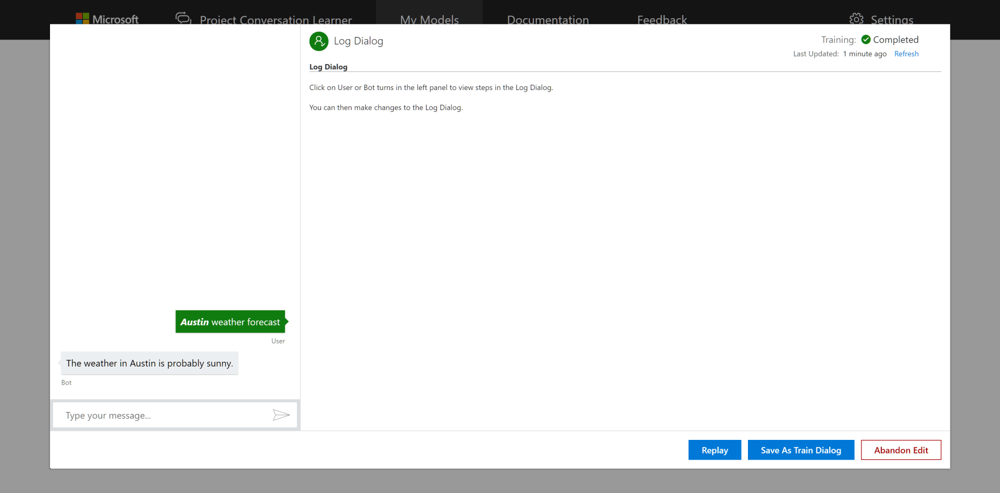

# How to log dialogs in a Conversation Learner model

This tutorial demonstrates how Log Dialogs are employed to better train Conversation Learner models from recorded interactions with real world users.

## Video

## Requirements
This tutorial requires that the general tutorial bot is running

	npm run tutorial-general

and the weather model created in previous tutorials.

## Details
Log Dialogs are recorded logs of your bot's interaction with end users. By harnessing these Log Dialogs you can fix entity labels and action selections to improve the model's performance and overall system performance.

## Steps

In the web UI, click on "Import Tutorials" and select the model named "Tutorial-11-LogDialogs".

This Model contains one Entity named "city", and Actions designed to respond to inquires about weather in that city. Two Train Dialogs were used to train the Model so performance expectations are somewhat low. The Model would improve with additional training and exposure to real world user interactions.

### Create a new Conversation

1. On the left panel, click "Log Dialogs", then the "New Log Dialog" button.
2. In the chat panel, where it says "Type your message...", type in "Austin weather forecast"
3. Click the "Done Testing" button.
4. Click the "Austin weather forecast" log dialog from the list.
5. Click the "Austin weather forecast" utterance in the chat panel.
6. Click "Austin", then click "city" from the Entity List.
7. Click the "Submit Changes" button.
	- This change in Entity value cause downstream changes to the conversation since we have new entity values in memory. Later actions have likely become invalid especially ones involving the "city" entity.
8. Click the "Which city?" utterance in the chat panel.
9. Select the response, "The weather in Austin is probably sunny."
10. Click the "Save As Train Dialog" button.
	- Training is kicked off immediately

One last note. Depending on business needs, the conversation logging feature can be turned off by going to Settings and unchecking “Log Conversations.”

## Next steps

> [!div class="nextstepaction"]
> [Entity detection callback](./12-entity-detection-callback.md)
