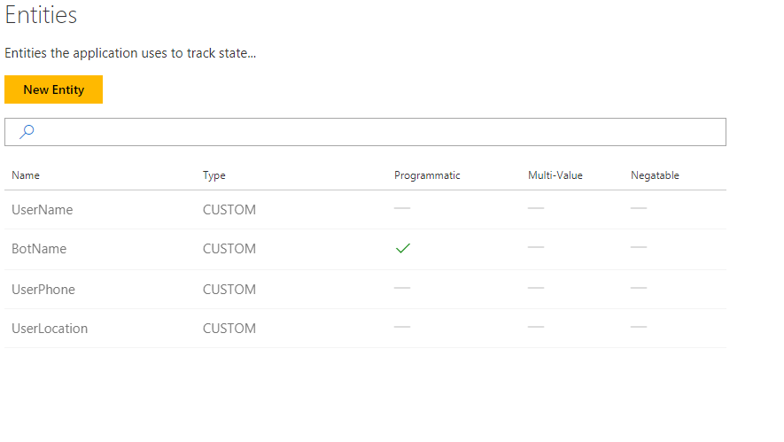
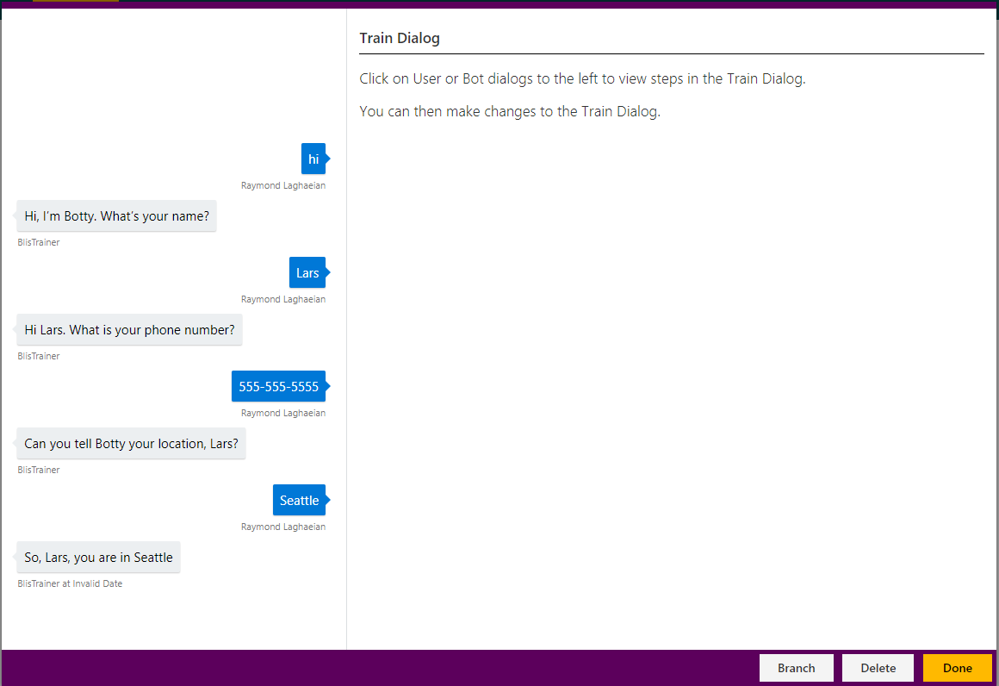
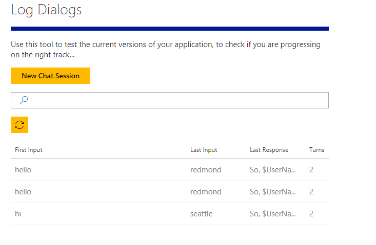

# How to use session callbacks with a Conversation Learner model

This tutorial illustrates the onSessionStart and onSessionEnd callbacks.

## Video

## Requirements
This tutorial requires that the `tutorialSessionCallbacks` bot is running.

	npm run tutorial-session-callbacks

## Details
This tutorial covers the concept of a session, how sessions are handled by default, and how you can override that behavior.

A session is one conversation with the bot. It can have multiple turns, but there are no long breaks in the conversation (for example, 30 minutes).  See the help page on "Limits" for the default session timeout duration.

If there are long breaks, then the bot will go to its next session.  Starting a new session puts the recurrent neural network into its initial state.  By default, it also clears all entity values, although this behavior can be changed (illustrated below).

### Open the demo

In the Model list, click on Tutorial-11-SessionCallbacks. 

### Entities

Four entities are defined in the model.

One thing to note is that BotName is a Programmatic Entity.  This entity will be set by the bot at session start time.

### Actions

Four actions are defined in the model.

First, this tutorial will show how to control entity values at the start of the session -- for example, setting the BotName entity before the user says anything.

Second, this tutorial will show how to persist values from one session to the next.  In this tutorial, we assume the user's name and phone number remain the same from one session to the next, but that their location may change.  We therefore persist name and phone number across sessions, but clear user location.

### Train Dialog

Here is an example dialog. This is one session - that is, there are no long breaks in this dialog.

### Code for the callbacks

The code for the callback methods is in the file: 
c:\<installedpath>\src\demos\tutorialSessionCallbacks.ts.

Both of these methods are optional.

- OnSessionStartCallback: this method sets the BotName entity.
- OnSessionEndCallback: you can specify what you want to preserve. This will clear all entities except user name and user phone.

### Try the bot

Switch to the Web UI, and click on Log Dialogs.

1. Enter 'hello'.
2. System: 'Hi, I'm Botty. What's your name?' which has the name Botty coming from the OnSessionStartCallback.
3. Enter 'jason'.
4. System: 'Hi jason. What's your phone number?'
5. Enter '555-555-5555'.
6. System: 'Can you tell Botty your location, jason?'
7. Type 'Redmond'.

This is one session. To start a new session, we need to end this session. 

1. Click Session Timeout. This will move you to the next session.
    - The "Session Timeout" button is provided for debugging purposes.  In an actual session, a long pause would need to occur, of approximately 30 minutes.  See the help page on "Limits" for the default session timeout duration.
1. Enter 'hi'.
2. System: 'Can you tell Botty your location, jason?'
	- The system has remembered the name and phone number.
2. Enter a new location: 'Seattle'.
3. System: 'So, jason you are in Seattle'.
4. Click Done Testing.

Let's switch back to Log Dialogs. Notice the last conversation has split into two because each log dialog corresponds to one session.  

- In the first interaction, Botty is set, but name and phone number are not.
- The second interaction shows the name and phone number.

You have now seen how sessions are handled by default, and how you can override the default behavior. 

## Next steps

> [!div class="nextstepaction"]
> [API calls](./12-api-calls.md)
