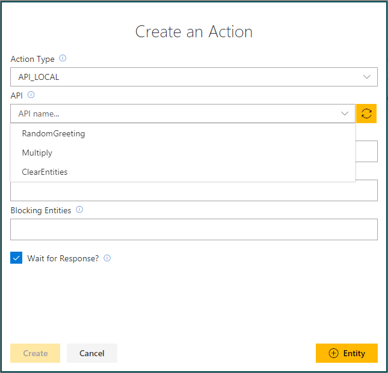
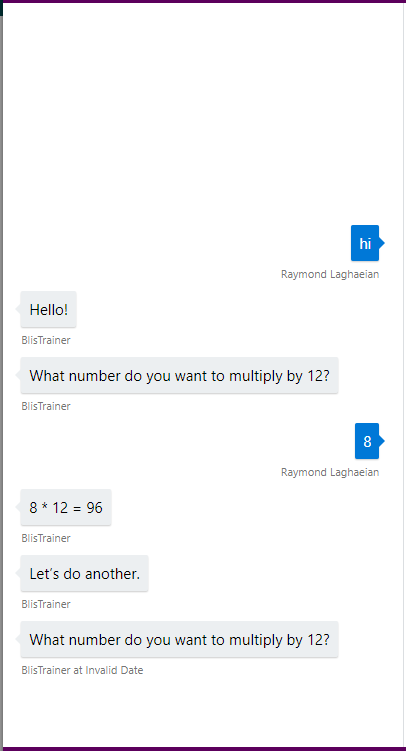

# How to add API calls to a Conversation Learner model

This tutorial shows how to add API calls to your model. API calls are functions that you define and write in your bot, and which Conversation Learner can call.

## Video

## Requirements
This tutorial requires that the "tutorialAPICalls.ts" bot is running.

	npm run tutorial-api-calls

## Details

- API calls can read and manipulate entities.
- API calls have access to the memory manager object.
- API calls can also take arguments -- this allows re-using the same API call to serve different purposes.

### Open the demo

In the Model list of the web UI, click on Tutorial-12-APICalls. 

### Entities

We have defined one entity in the model called number.

### API Calls
The code for the API calls is defined in the this file: C:\<installedpath\>\src\demos\tutorialAPICalls.ts.

- The first API Callback is RandomGreeting. It returns a random greeting defined in the greeting variable.
- The Multiply API callback: It will multiply two numbers provided by the user. It then returns the result of the multiplication of the two numbers. This shows that API callbacks can take inputs. Note that memory manager is the first argument. 
- The ClearEntities API callback: clears the number entity to let the user enter the next number. This illustrates how API calls can manipulate entities.

### Actions

We have created four actions. 

- In addition to 'What number do you want to multiply by 12?' which is a communicative action, there are three different API calls that illustrate the typical API call patterns.

- RandomGreeting: is a non-wait action. To set this up, in the Create Action Dialog, we selected the Action Type of API_LOCAL, then selected RandomGreeting. 

The refresh button next to the API is used if we were to stop the bot, and make any changes to the APIs. Clicking on refresh would pick up the latest changes.

Here's how we created the Multiply action: after selecting API_Local and API, we entered an entity ($number) for the first input value (num1string), and a value (12) for the second input value (num2string). This provides a level of indirection between the bot and the API calls so the same callback can be mapped to a few actions in the system and they differ on how the actions are assigned.

### Train Dialog

Let's walk through a teaching dialog.

1. Click Train Dialogs, then New Train Dialog.
1. Enter 'hi'.
2. Click Score Action.
3. Click to Select RandomGreeting. This will execute the Random Greeting API call.
3. Click to Select 'What number to do you want to multiply by 12?'
4. Enter '8'. Then click Score Actions.
4. Select 'Multiply $number 12'. Note the result of the multiplication.
5. Select 'Clear Entities'.
	- The `number` entity's value has been cleared.
3. Click to Select 'What number to do you want to multiply by 12?'
4. Click Done Testing.

You have now seen how to register API callbacks, their common patterns, and how to define arguments and associate values and entities in them.

## Next steps

> [!div class="nextstepaction"]
> [Cards part 1](./13-cards-1.md)
