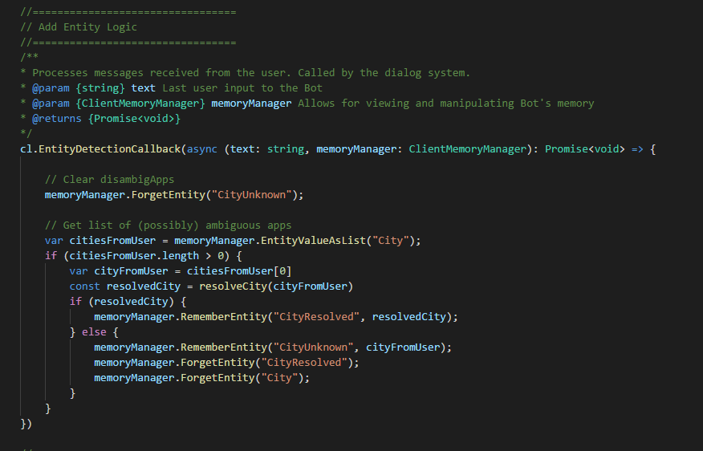
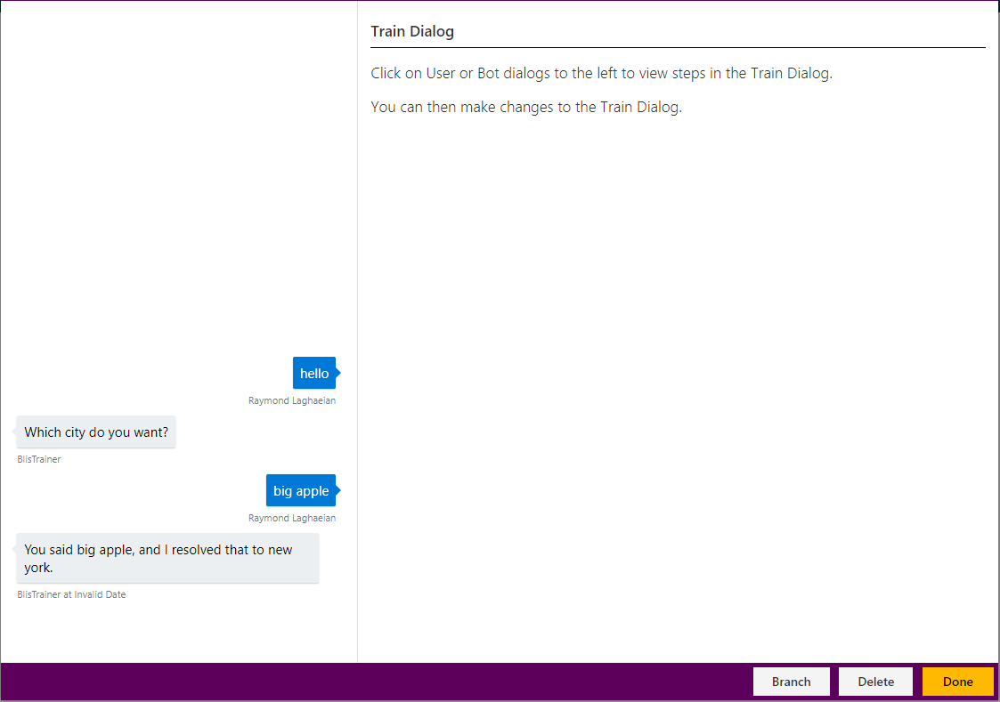

# How to use entity detection callback

This tutorial shows the entity detection callback, and illustrates a common pattern for resolving entities.

## Video

## Requirements
This tutorial requires that the `tutorialEntityDetectionCallback` bot is running.

	npm run tutorial-entity-detection

## Details
Entity Detection callbacks enable modification of the entity recognition behavior and entity manipulation through code. We will demonstrate this functionality by walking through a typical entity detection callback design pattern. For example, resolving "the big apple" to "new york".

## Steps

### Create the Model

1. In the Web UI, click "New Model."
2. In the "Name" field, type "EntityDetectionCallback" and hit enter.
3. Click the "Create" button.

Three entities are needed in this example, so let’s create the three.

### Create the Custom Trained Entity

1. On the left panel, click "Entities", then the "New Entity" button.
2. Select "Custom Trained" for the "Entity Type."
3. Type "City" for the "Entity Name."
4. Click the "Create" button.

### Create the first Programmatic Entity

1. Click the "New Entity" button.
2. Select "Programmatic" for the "Entity Type."
3. Type "CityUnknown" for the "Entity Name."
4. Click the "Create" button.

### Create the first Programmatic Entity

1. Click the "New Entity" button.
2. Select "Programmatic" for the "Entity Type."
3. Type "CityResolved" for the "Entity Name."
4. Click the "Create" button.

Now, create three actions.

### Action Creation

1. On the left panel, click "Actions", then the "New Action" button.
2. In the "Bot's response..." field, type "Which city do you want?"
3. In the "Expected Entity in User reply..." field, type "City."
4. In the "Disqualifying Entities" field, type "City."
5. Click the "Create" button.
6. Click the "New Action" button.
7. In the "Bot's response..." field, type "Which city do you want?"
8. In the "Expected Entity in User reply..." field, type "I don't know this city."
9. Click the "Create" button.
10. Click the "New Action" button.
11. In the "Bot's response..." field, type "$CityResolved is very nice."
12. Click the "Create" button.

Here's the callback code:

### Train the Model

1. On the left panel, click "Train Dialogs", then the "New Train Dialog" button.
2. In the chat panel, where it says "Type your message...", type in "hi"
3. Click the "Score Actions" button.
4. Select the response, "Which city do you want?"
5. In the chat panel, where it says "Type your message...", type in "big apple"
6. Click the "Score Actions" button.
	- Clicking the button triggers the entity detection callback
	- The callback code sets the CityResolved Entity value correctly to "new york"
7. Select the response, "new york is very nice."

This pattern is typical of many bot scenarios. User utterances and extracted entities are supplied to your business logic, and that logic transforms the utterance into canonical form, which is then saved into programmatic entities, for subsequent turns of the dialog.

## Next steps

> [!div class="nextstepaction"]
> [Session callbacks](./13-session-callbacks.md)
