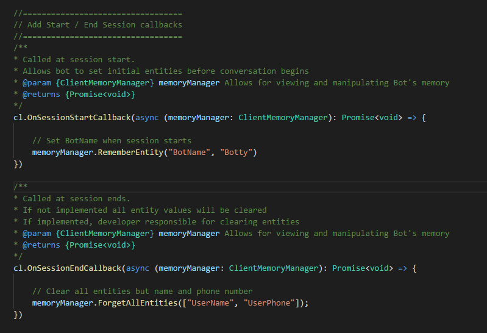
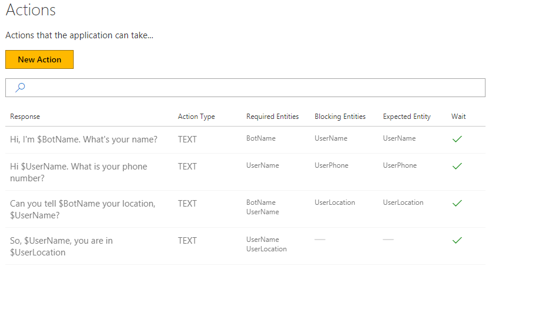

# How to use session callbacks with a Conversation Learner model

This tutorial introduces sessions, how they are handled and Conversation Learner's onSessionStart and onSessionEnd callbacks.

## Video

## Requirements
This tutorial requires that the "tutorialSessionCallbacks" bot is running.

	npm run tutorial-session-callbacks

## Details
This tutorial covers the concept of a session, how sessions are handled by default, and how you can override that behavior.

In Conversation Learner a session represents one, uninterrupted interactive exchange with the bot. Sessions can have multiple turns, but be programmatically ended due to inactivity if greater than thirty minutes has lapsed.  See the help page on "Limits" for information on changing this default session timeout duration.

This long period of inactivity will cause the bot to create a new session and reset the recurrent neural network to its initial state. By default all entity values will be cleared. This default behavior of clearing entity values can be changed as seen below.

### Load the Demo Model

In the web UI, click on "Import Tutorials" and select the model named "Tutorial-13-SessionCallbacks".

### Code for the callbacks

Sample code for this Model's two callbacks can be found in: `c:\<installedpath>\src\demos\tutorialSessionCallbacks.ts`.

- OnSessionStartCallback: this method sets the BotName entity.
- OnSessionEndCallback: you can specify what you want to preserve. This will clear all entities except user name and user phone.

Each callback is optional.

### Actions

Four Actions are defined in the Model. The existing Actions are displayed in the grid view for "Actions"

### Creating An End Session Action (for callback invocation)

1. On the left panel, click "Actions", then the "New Action" button.
2. Select "ENDSESSION" for the "Entity Type."
3. In the "Data..." field, type "Done"
4. Click the "Create" button.

### Edit an Existing Action

1. Select the "So, $UserName, you are in $UserLocation" Action from the grid view.
2. Un-check the "Wait for Response" check-box.
3. Click the "Save" button.

### Chaining Actions

1. On the left panel, click "Train Dialogs", then the "New Train Dialog" button.
2. In the chat panel, where it says "Type your message...", type in "hi."
3. Click the "Score Actions" button.
4. Select the response, "Hi, I'm Botty. What's your name?"
5. In the chat panel, where it says "Type your message...", type in "Lars"
6. Select the response, "Hi Lars. What is your phone number?"
7. In the chat panel, where it says "Type your message...", type in "555-555-5555"
8. Click the "Score Actions" button.
9. Select the response, "Can you tell Botty your location, Lars?"
10. In the chat panel, where it says "Type your message...", type in "Seattle"
11. Click the "Score Actions" button.
12. Select the response, "So, Lars, you are in Seattle"
13. Select the response, "Done"
14. Click the "Save" button.

### Testing the Model

1. On the left panel, click "Log Dialogs", then the "New Log Dialog" button.
2. In the chat panel, where it says "Type your message...", type in "hi"
3. In the chat panel, where it says "Type your message...", type in "Lars"
4. In the chat panel, where it says "Type your message...", type in "555-555-5555"
5. In the chat panel, where it says "Type your message...", type in "Seattle"
	- At this point all entity values excluding location should have been preserved.
6. In the chat panel, where it says "Type your message...", type in "hello"
7. In the chat panel, where it says "Type your message...", type in "Detroit"
8. Click the "Session Timeout" button.
	- Clicking this button exercises the bot's response to long periods of inactivity
9. Click the "OK" button.
10. Click the "Done Testing" button.

## Next steps

> [!div class="nextstepaction"]
> [API calls](./14-api-calls.md)
