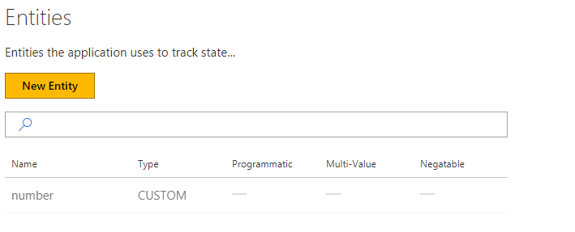
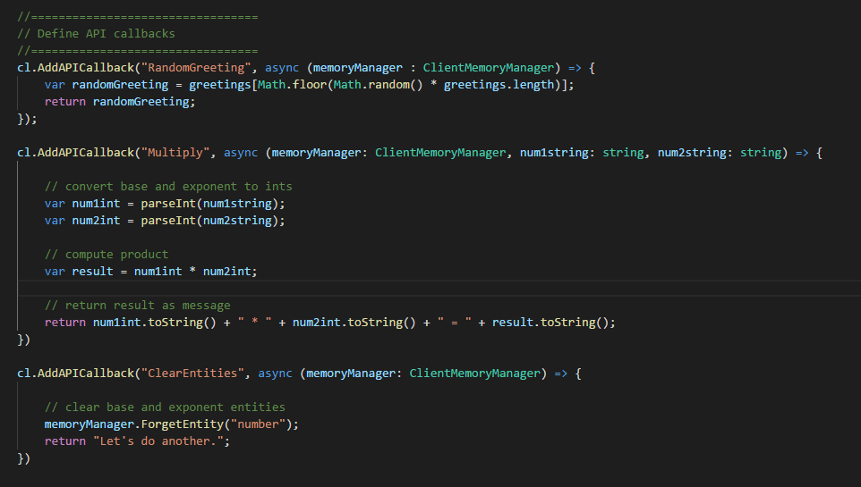
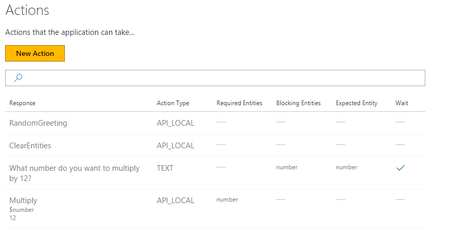

# How to add API calls to a Conversation Learner model

This tutorial shows how to add API calls to your model. API calls are functions that you define and write in your Bot, and which Conversation Learner can call.

## Video

## Requirements
This tutorial requires that the "tutorialAPICalls.ts" bot is running.

	npm run tutorial-api-calls

## Details

- API calls can read and manipulate entities.
- API calls have access to the memory manager object.
- API calls can take arguments.

### Open the demo

In the web UI, click on "Import Tutorials" and select the model named "Tutorial-14-APICalls".

### Entities

We have defined one entity in the Model called `number`.

### API Calls
The code for the API calls is defined in the this file: `C:\<installedpath>\src\demos\tutorialAPICalls.ts`.

- The `RandomGreeting` callback returns a random greeting defined in the `greeting` array.
- The `Multiply` callback will multiply two numbers passed in by the Action that calls it and returns a result that can be rendered in the UI.
	- Notice that memory manager is the first argument. 
	- Notice that API callbacks can take multiple inputs, in this case `num1string` and `num2string`.
- The `ClearEntities` callback clears the number Entity so that the user can enter another number. 
	- Illustrates how API calls can manipulate Entities.

### Actions
We have created four Actions. Three of them are "Non-Wait" API Actions, with the fourth is a "Text" Action that asks the user a question similar to what we have seen in other tutorials. To see how each was created do the following:
1. On the left panel, click "Actions", then click on one of the four actions listed in the grid.
2. Notice the values of each field on the form that pops up.
3. Notice the `Refresh` button next to the API field.
	- If we were to stop the Bot and make change to the APIs while the UI page is up, then you can click the `Refresh` button to pick up the latest changes.

#### ClearEntities, Multiply and RandomGreeting
All three of these Actions are API Type. They each rely on the API callback functions to perform some work and possibly return a value to be presented to the user.

#### "What number do you want to multiply by 12"
This is the "Text" Action and it simply asks a question of the user. While this Action does not actually interact with one of the API callbacks, it prompts the user to respond with a number that will go into the memory of an Entity that can then be used by the "Multiply" Action which does use one of the API callbacks.

### Train Dialog

Let's walk through a "Training Dialog".

1. On the left panel, click `Train Dialogs`, then the `New Train Dialog` button.
2. Type "hello".
3. Click the `Score Actions` button.
4. Select `RandomGreeting`. 
	- This will execute the Random Greeting API call.
	- This will NOT wait for a user response.
5. Select `What number to do you want to multiply by 12?`
6. Type in a number, any number and only a number.
	- Notice that your number was automatically labeled as the `number` entity.
7. Click the `Score Actions` button.
8. Select the `Multiply` Action.
	- Notice the result of the multiplication by 12.
	- Notice that memory still contains the value you entered for `number`
9. Select the `ClearEntities` Action.
	- Notice that the Entity value for `number` has been cleared from memory.
10. Click the `Save` button.

You have now seen how to register API callbacks, their common patterns, and how to define arguments and associate values and entities in them.

## Next steps

> [!div class="nextstepaction"]
> [Cards part 1](./15-cards.md)
