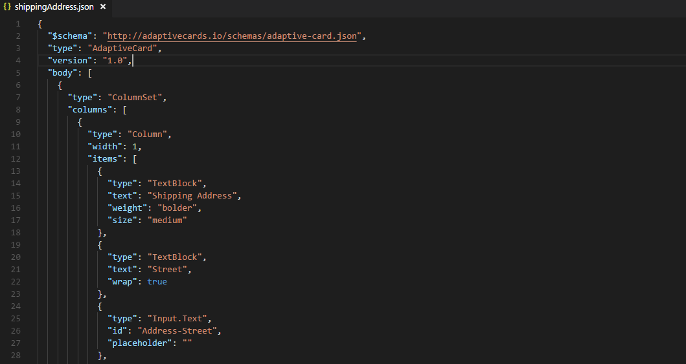
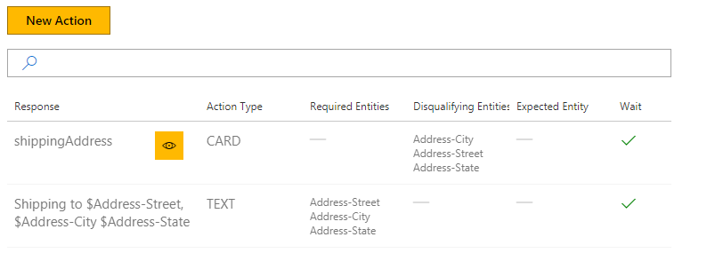
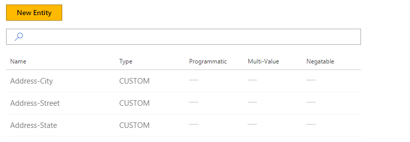
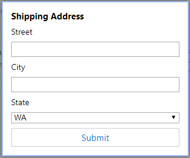
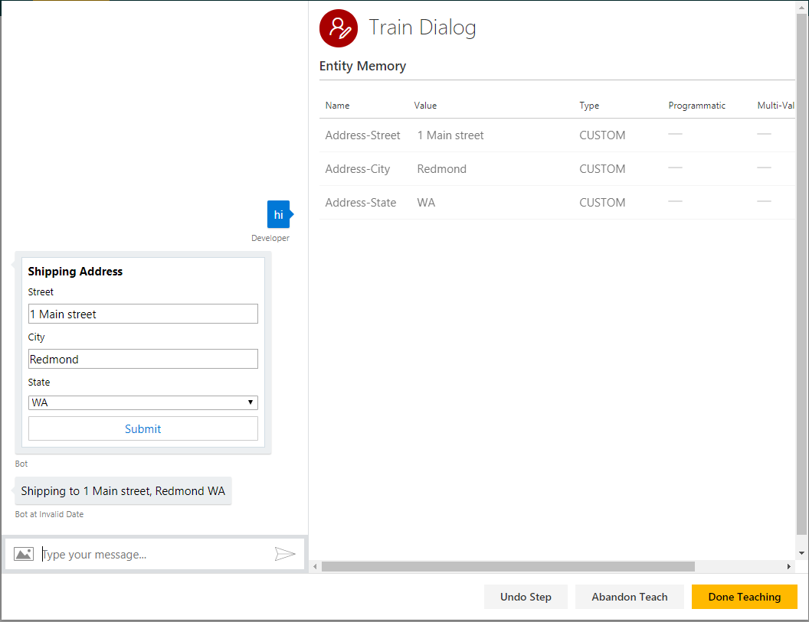

# How to use cards (part 1 of 2)
This tutorial shows how to add a fillable form card to your bot. It will show how form fields move into entities.

Conversation Learner expects your card definition files to be located in a directory called "cards", which is present in the directory where the bot is started.

## Video

## Requirements
This tutorial requires that the general tutorial bot is running

	npm run tutorial-general

## Details

Cards are UI elements that allow the user to select an option in the conversation. 

### Open the demo

In the Model list of the web UI, click on Tutorial-14-Cards-2. 

### The Card

The card definition is at the following location: C:\<installedpath\>\src\cards\shippingAddress.json.

This card collects three fields of the shipping address: city, street, and state.

### Actions

We have created three actions. As you see below, the first action is a card.

Let's see how the card action type was created:

- Notice Address-Street, where the type is of Input.text and its ID.
- Similarly, there is Address-City and a drop-down with ID of Address-State.

The Ids are important as when the fields are populated and submitted, those are the entity names that will receive those values in the bot.

## Entities
We have defined three entities matching the card as we saw above.

## Actions

We have defined two actions.

- The first is the shipping address card where the Action Type is CARD and Template is selected from the dropdown as shippingAddress.
- The second is a simple action to read back the shipping address.

### Train Dialog

Let's walk through a teaching dialog.

1. Click Train Dialogs, then New Train Dialog.
1. Enter 'hi'.
2. Click Score Action.
3. Click to Select 'Shipping Address'.
4. Fill in the card and submit.
	- Notice those values have now been moved into the entity memory. No parsing is needed as the form already partitioned the inputs.
5. Click Score Actions.
3. Click to Select 'Shipping to $Address...".
4. Click Done Testing.

You have now seen how to get values from the card that has fillable fields and dropdowns, and to capture and collect them in bot entities.

## Next steps

> [!div class="nextstepaction"]
> [Branching and undo](./15-branching-and-undo.md)
