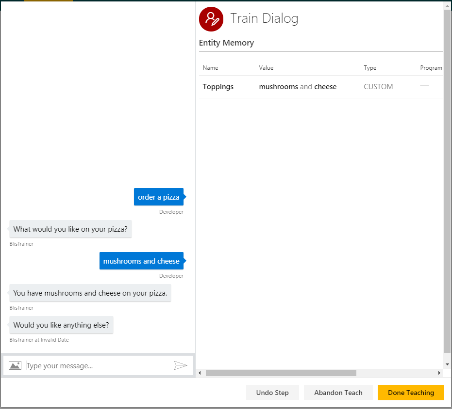

# How to use branching and undo operations
In this tutorial, we will go over undo and branching operations.

## Details
- Undo: allows the developer to “undo” a user input or action choice. Behind the scenes, “undo” actually creates a new dialog and re-plays it up to the previous step.  This means that the entity detection callback and API calls in the dialog will be called again.

- Branch: creates a new train dialog which begins in the same way as an existing train dialog – this saves the effort of manually re-entering dialog turns. Behind the scenes, “branch” creates a new dialog and re-plays the existing train dialog up to the selected step.  This means that the entity detection callback and API calls in the dialog will be called again.

## Requirements
This tutorial requires that the pizza order bot is running:

	npm run demo-pizza

### Open the demo

In the Model list of the web UI, click on TutorialDemo Pizza Order. 

For details on the Pizza Order demo, see the Pizza order tutorial.

## Undo

We will undo part of the dialog, and recreate it from that step.

### Training Dialogs
Let's start a training session. 

1. Click Train Dialogs, then New Train Dialog.
1. Enter 'order a pizza'.
2. Click Score Action.
3. Click to Select 'what would you like on your pizza?'
4. Enter 'mushrooms and cheese'.
5. Click Score Actions.
3. Click to Select 'you have $Toppings on your pizza'.
6. Select 'Would you like anything else?'
7. Enter 'remove mushrooms and add peppers'.
	- Select mushrooms and un-check the Toppings entity. We are creating an action that we will undo.
2. Click Undo Step.
	- The last entry is removed, and we are back at 'Would you like anything else?'  (screenshot below)
2. Enter 'remove mushrooms and add peppers'.
8. Click to Select 'you have $Toppings on your pizza'
	- Make sure both entities are selected correctly.
2. Click Score Action. You can continue with the corrected dialog now.
4. Click Done Teaching.

You have now seen how to use undo to remove a user input and action.

## Branch

As an example, let's open an existing train dialog, and create another train dialog by branching.

1. Click Train Dialogs, then 'new order' to open the existing dialog. 
2. Click on the last 'no' in the dialog (see screenshot below).
3. Click Branch.
	- 'no' gets removed, and the entire dialog up to that point is copied into a new one. 
	- This saves you re-entering the preceding turns to explore a new "branch" from this point.
1. Enter 'yes'.
2. Click Score Action.
3. Select 'You have $Toppings on your pizza'.
6. Select 'Would you like anything else?'
7. Enter 'no'.
4. Click Done Teaching.

## Next steps

> [!div class="nextstepaction"]
> [Versioning and tagging](./16-versioning-and-tagging.md)
