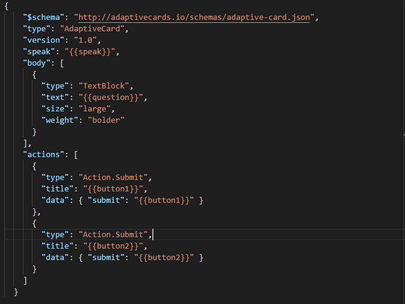
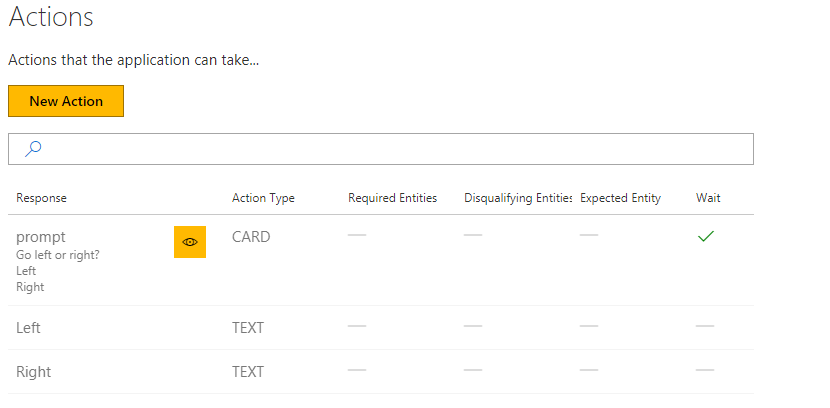
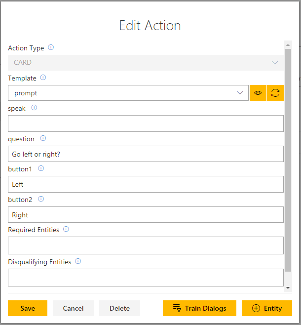

# How to use cards (part 1 of 2)

This tutorial shows how to add and use a simple card in your bot.

> [!NOTE]
> Conversation Learner currently expects your card definition files to be located in a directory called "cards" which is present in the directory where the Bot is started.

## Video

## Requirements
This tutorial requires that the general tutorial bot is running

	npm run tutorial-general

## Details

Cards are UI elements that allow the user to select an option in the conversation. 

### Open the demo

In the web UI, click on "Import Tutorials" and select the model named "Tutorial-15-Cards".

### The Card

The card definition is at the following location: C:\<installedpath\>\src\cards\prompt.json.

The system expects to find your card definitions in this "cards" directory.

> [!NOTE]
> Notice the body type "TextBlock" and the "{{question}}" placeholder in the text field.
> There are two submit buttons and the text that gets submitted for each.

### Actions

We have created three Actions. As you see below, the first Action is a card.

Let's see how the card Action type was created:

> [!NOTE]
> The card contains three different parameters - question input, button 1 and button 2. These elements are template references in the card where you enter the question and the respective answers. You can also reference and use Entities or a mixture of text and Entities.

The eye icon shows you what the card looks like.

### Practicing Creating Card Actions

1. On the left panel, click "Actions", then the "New Action" button.
2. Select "CARD" for the "Action Type."
3. Select "prompt" from the "Template" list.
4. In the "question" field, type "Go left or right"
5. In the "button1" field, type "left"
6. In the "button2" field, type "right"
7. Click the "Cancel" button.

### Train Dialog using an Adaptive Card

1. On the left panel, click "Train Dialogs", then the "New Train Dialog" button.
2. In the chat panel, where it says "Type your message...", type in "hi"
3. Click the "Score Actions" button.
4. Select the response, "prompt: question: Go left or right?"
	- The eye icon can be used to preview the card
5. In the chat panel click the "Left" button in the rendered prompt.
6. Click the "Score Actions" button.
7. Select the response, "Left"
8. Click the "Save" button.
9. Select the response, "prompt: question: Go left or right?"
10. In the chat panel click the "Right" button in the rendered prompt.
11. Click the "Score Actions" button.
12. Select the response, "Right"

## Next steps

> [!div class="nextstepaction"]
> [Hybrid Bots](./16-hybrid-bots.md)
