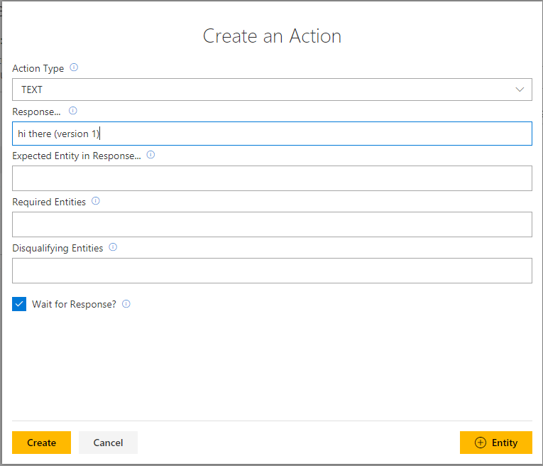
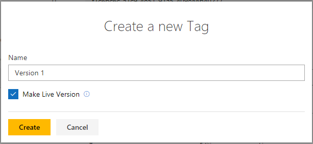
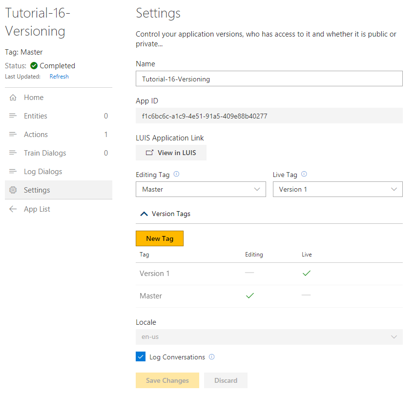
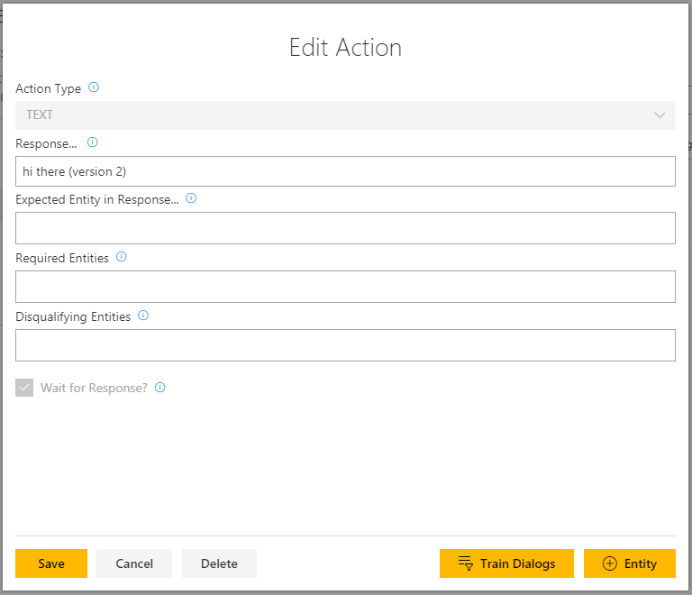
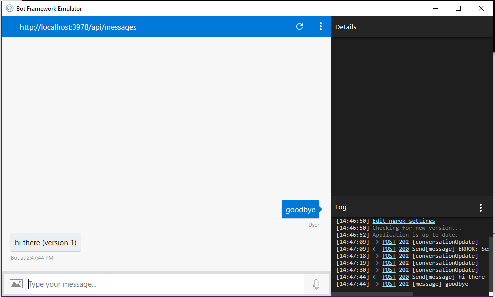

# How to use versioning and tagging

This tutorial illustrates how to tag versions of your Conversation Learner model, and set which version is “live”.  

## Requirements
This tutorial requires using the bot emulator to create log dialogs, not the Log Dialog Web UI.  

This tutorial requires that the general tutorial bot is running:

	npm run tutorial-general

## Details

When editing, you are always editing the tag called “master” -- you can create tagged versions from master (which essentially take a snapshot of master), but you cannot edit tagged versions.

## Steps

### Install the Bot framework emulator

- Go to [https://github.com/Microsoft/BotFramework-Emulator](https://github.com/Microsoft/BotFramework-Emulator).
- Download and install the emulator.

### Create an model

1. Click New Model
2. In the Name field, enter Tutorial-16-Versioning
3. Click Create 
4. Click Settings
5. Copy the Model ID

### Configure the emulator

- In the Conversation Learner root folder, open the .env file.
- Paste the Model ID as the value of CONVERSATION_LEARNER_MODEL_ID
- Restart the Conversation Learner service by exiting from the command prompt, and rerunning:
 
	npm run tutorial-general 

### Actions

Let's create an action:

1. Switch to the Web UI.
1. Click Actions, then New Action.
2. In Response, enter “hi there (version 1)”.
3. Click Save.

Create a new tag:

3. Click on “settings” and create a new “tag”.
	- Call it “version 1”
4. Set “version 1” to be “live”.  
	- The effect of setting the live tag to "version 1" is that channels using this bot will use the “version 1” tag.
	- Tagged versions of models are not affected by edits (changing actions, entities, adding train dialogs).  
	- Edits to an model (changing actions, entities, adding train dialogs) are always made on the "master" tag.  In other words, "master" is the only tag that can change; other tags are fixed snapshots.
	- Log dialogs in the Conversation Learner UI always use master (not the live tag).

The version has been created in settings:

Let's add a second action:

1. Click Actions, then New Action.
2. In Response, enter “bye bye (version 2)”.

Edit the first action:

1. Click Actions.
2. Under Actions, click on "hi there (version 1)".
3. Change the Response to "hi there (version 2)".

### Switch to the bot emulator

1. In the bot UI, enter "goodbye".
2. The bot responds with "hi there (version 1)".
	- This shows the version 1 is "live". 

### Switch to the Web UI

1. Click on Log Dialogs (If you don't see any dialogs, click the refresh button).
2. Click on "hi there (version 2)"

> [!NOTE]
> We can make corrections by choosing from all currently available actions. These edits will be made to the master.

You have now seen how versioning works, and how you can interact with the bot using the Bot framework emulator.

## Next steps

> [!div class="nextstepaction"]
> [Demo - password reset](./demo-password-reset.md)
