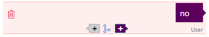

# How to use Branching and Undo Operations
In this tutorial, we will go over undo and branching operations.

## Details
### Undo
Allows the developer to “undo” the last user input or action choice. Behind the scenes, “undo” actually creates a new dialog and replays it up to the previous step.  This means that the entity detection callback and API calls in the dialog will be called again.

### Branch
Creates a new train dialog, which begins in the same way as an existing train dialog – this saves the effort of manually re-entering dialog turns. Behind the scenes, “branch” creates a new dialog and replays the existing train dialog up to the selected step.  This means that the entity detection callback and API calls in the dialog will be called again.

## Requirements
This tutorial requires that the Bot that takes pizza orders is running:

	npm run demo-pizza

### Open or Import the Demo

If you've already worked through the pizza ordering tutorial, then simply open that Model from the list in the web UI. Otherwise you will need to click on "Import Tutorials" and select the model named "Demo-PizzaOrder".

## Undo

Here is an example of how to see the `Undo` feature in action:

### Training Dialogs
1. On the left panel, click "Train Dialogs", then click the `New Train Dialog` button.
2. Type "Order a pizza".
3. Click the `Score Actions` button.
4. Click to Select "What would you like on your pizza?"
5. Type "anything".
6. Click the `Undo` button.
	- The last entry is removed, leaving the last Bot response of "What would you like on your pizza?"

## Branch

For this demo, we'll open an existing Train Dialog and create a new Train Dialog from it by branching.

1. On the left panel, click "Train Dialogs".
2. Notice the grid, you should see only one training that starts with "new order".
3. In the grid, click "new order" to open the existing Train Dialog.
4. Click on the last "no" in the dialog.
5. Click the "Branch" icon, it is circled in red in this image:
	- 
	- The entire Train Dialog prior to the "no" is copied into a new Train Dialog.
	- This saves you re-entering the preceding turns to explore a new conversation "branch" from this point.
6. Type "yes", hit enter.
7. Click the `Score Actions` button.
	- At this point the Bot automatically picks a response, but we don't like the response so we are going to change it.
8. Click on the last Bot response.
	- This will let us select a different response.
9. Select "UseLastToppings".
10. Click the `Score Actions` button.
	- Again the Bot automatically picks a response. It should say, "You have sausage, cheese and mushrooms on your pizza.". 
	- This time we like the response so we will keep it.
11. Click the `Score Actions` button.
	- Again the Bot automatically picks a response, It should say, "Would you like anything else?"
12. Type "no".
13. Click the `Save Branch` button.
14. Notice that the grid now has two trainings that starts with "new order".
	- One of them is the one you used to branch off of.
	- And the other one is the branched version that you just saved.
	- Click on each of them to verify these expectations.

## Next steps

> [!div class="nextstepaction"]
> [Versioning and tagging](./18-version-tag.md)
