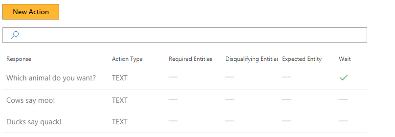
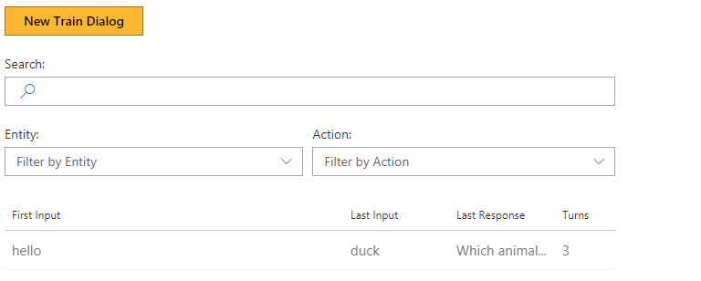

# Wait and non-wait actions

This tutorial shows the difference between wait actions and non-wait actions in the Conversation Learner.

## Video

## Requirements
This tutorial requires that the general tutorial bot is running

	npm run tutorial-general

## Details

- Wait action: After the system takes a "wait" action, it will stop taking actions and wait for user input.
- Non-wait action: After the system takes a "non-wait" action, it will immediately choose another action (without waiting for user input first).

## Steps

### Create a new model

1. In the Web UI, click New Model
2. In Name, enter WaitNonWait. Then click Create.

### Create the first Wait action

1. Click Actions, then New Action.
2. In Response, enter 'Which animal do you want?'.
	- This is a Wait action, so leave the Wait for Response box checked.
3. Click Create.

### Create a Non-Wait action

1. Click New Action
2. In Response, type 'Cows say moo'.
3. Un-check the Wait for Response check-box.
4. Click Create

### Create a second Non-Wait action

1. Click New Action
2. In Response, type 'Ducks say quack'.
3. Un-check the Wait for Response check-box.
4. Click Create

### Train the bot

1. Click Train Dialogs, then New Train Dialog.
2. Type 'hello'
3. Click Score Actions, and Select 'Which animal do you want?'.
4. Enter 'cow'
5. Click Score Actions, and Select 'Cows say moo'.
	- The bot will not wait for input, and will take the next action.
2. Select 'Which animal do you want?'.
3. Enter 'duck'
5. Click Score Actions, and Select 'Ducks say quack'.

> [!NOTE]
> The sequence of the bot responses with regards to wait and non-wait actions.

## Next steps

> [!div class="nextstepaction"]
> [Introduction to entities](./3-introduction-to-entities.md)
