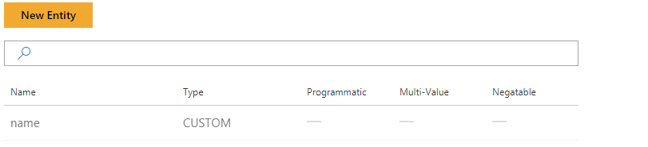
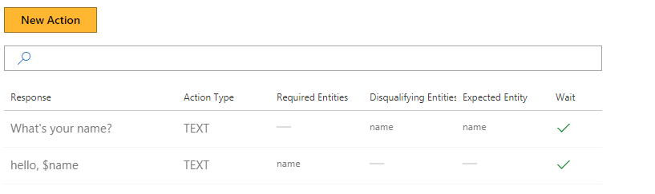
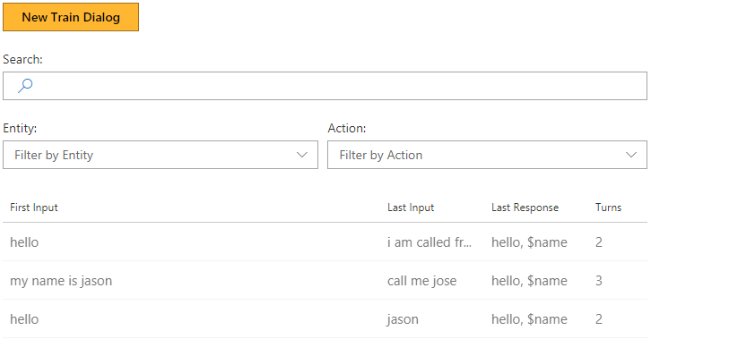

# How to use the "Expected entity" property of actions

This tutorial demonstrates the "expected entity" field of actions.

## Video

## Requirements
This tutorial requires that the general tutorial bot is running

	npm run tutorial-general

## Details
Use the "expected entity" field of an action to communicate to the system that you expect the user's response to an action will be to state an entity.

Concretely, if the "expected entity" field of an action is set to $entity, then on the next user utterance, the system will:

1. First, as usual, attempt to find entities using the machine-learning based entity extraction model
2. If no entities are found in step 1, then -- as a heuristic -- assign the whole user utterance to $entity.
3. Call `EntityDetectionCallback` as usual, and proceed to action selection.

## Steps

### Create the model

1. In the Web UI, click New Model
2. In Name, enter ExpectedEntities. Then click Create.

### Create an entity

1. Click Entities, then New Entity.
2. In Entity Name, enter name.
3. Click Create

> [!NOTE]
> The entity type is 'custom'. This value means that the entity can be trained.  There are also pre-built entities, meaning that their behavior cannot be adjusted.  These entities are covered in the [Pre-Built Entities tutorial](./7-built-in-entities.md).

### Create two actions

1. Click Actions, then New Action.
2. In Response, type 'What's your name?'.
3. In Expected Entities, enter $name. Click Save.
	- This value means that if this question is asked, and the user response does not have any entities detected, the bot should assume the whole of the user's response is this entity.
	- The entity is automatically added as a disqualifying entity. 
2. Click Actions, then New Action to create a second action.
3. In Response, type 'Hello $name'.
	- The entity is automatically added as a required entity.
4. Click Save.

Now you have two actions.

### Train the bot

1. Click Train Dialogs, then New Train Dialog.
2. Type 'hello'.
3. Click Score Actions, and Select 'What's your name?'
	- The response 'Hello $name' cannot be selected, because it requires the entity $name to be defined, and $name is not in the bot's memory.
2. Enter 'david'. 
	- The name is highlighted as an entity. This is because of the heuristic we set up above to select the response as the entity.
5. Click Score Actions
	- The name value is now in the bot's memory.
	- 'Hello $name' is now available as a response. 
6. Select 'Hello $name'.
7. Click Done Teaching.

Here are two examples where the machine-learning entity extraction model identifies a name, so the "expected entity" heuristic isn't triggered.

1. Click New Train Dialog.
2. Enter 'my name is david'.
	- The model identifies david as the name entity because it has seen this word before.
2. Click Score Actions
3. Select 'Hello $name'.
4. Enter 'my name is susan'.
	- The model identifies susan as the name since it has seen this pattern already.
2. Click Score Actions.
2. Select 'Hello susan'.
3. Click Done Teaching.

In the following examples, the "expected entity" heuristic triggers, but is incorrect. The examples then show how to make a correction.

1. Type in 'call me jose'.
	- The model does not recognize the name as an entity.
2. Click on jose, and select name.
3. Click Score Actions.
4. Select hello $name.
5. Click Done Teaching.
1. Click New Train Dialog.
2. Enter 'hello'.
3. In response to 'what's your name', enter 'I am called frank'.
	- The entire phrase is highlighted. This is because the statistical model did not find a name, so the heuristic fired and selected the entire answer as the name entity.
2. To correct it, click on the highlighted phrase, then click on the red trash can icon. 
3. Click to select frank, then click on name.
2. Click Score Actions
3. Select 'Hello $name'.
4. Click Done Teaching.

## Next steps

> [!div class="nextstepaction"]
> [Negatable entities](./5-negatable-entities.md)
