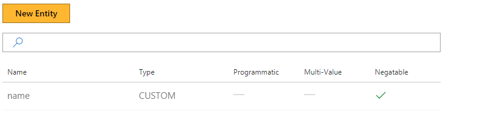
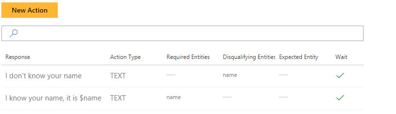
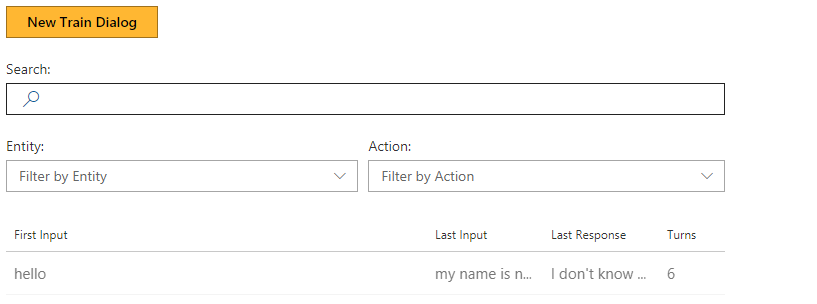

# How to use negatable entities with a Conversation Learner model

This tutorial demonstrates the "negatable" property of entities.

## Video

## Requirements
This tutorial requires that the general tutorial bot is running

	npm run tutorial-general

## Details
Mark an action as "negatable" if the user can "clear" an entity value, as in "No, I do not want $entity" or "no, not $entity." For example, "no, I do not want to leave from Boston."

Concretely, if the "negatable" property of an entity is set:

- When labeling entity mentions, allow you to label both normal (positive) instances of an entity, and a "negative" instances of the entity
- LUIS learns two entity models: one for positive instances, and a second for negative instances
- The effect of a negative instance of an entity is to clear that value from the entity variable (if it exists)

## Steps

### Create the model

1. In the Web UI, click New Model
2. In Name, enter NegatableEntity. Then click Create.

### Create an entity

1. Click Entities, then New Entity.
2. In Entity Name, enter name.
3. Check Negatable.
	- This property indicates the user will be able to provide a value for the entity, or say something is *not* the value of the entity. In the latter case, this will result in deleting a matching value of the entity.
3. Click Create.

### Create two actions

1. Click Actions, then New Action
2. In Response, type 'I don't know your name'.
3. In Disqualifying Entities, enter name.
3. Click Create

Then create the second action.

1. Click Actions, then New Action to create a second action.
3. In Response, type 'I know your name. It is $name'.
4. Click Create

Now you have two actions.

### Train the bot

1. Click Train Dialogs, then New Train Dialog.
2. Type 'hello'.
3. Click Score Actions, and Select 'I don't know your name'
	- The score is 100% because it is the only valid action.
2. Enter 'my name is david'
3. Select 'david', and choose the label '+name'
	- There are two instances of 'name': '+name' and '-name'.  (+) Plus adds or overwrites the value. (-) Minus removes the value.
5. Click Score Actions
	- The name value is now in the bot's memory.
	- 'I know your name. It is $name' is the only available response. 
6. Select 'I know your name. It is $name'.

Let's try clearing the negatable entity:

7. Enter 'my name is not david'.
	- Notice 'not' is selected as name based on the previous pattern. This label is incorrect.
2. Click on 'not', then the red x. 
3. Click on 'david'.
	- This is now a negative entity communicating that this is not the value of the name entity.
2. Select '-name'.
3. Click Score Actions.
	- Notice the value has been cleared from memory.
2. Select 'I don't know your name', which is the only action.

Next we show how a new value for the name can be entered.

3. Enter 'john' as the name. Then select 'john' and click on name.
4. Click Score Actions.
5. Select 'I know your name. It is $name'.

Now try replacing the entered name.

6. Enter 'my name is susan'.
7. Select 'I know your name. It is $name'.
7. Click Score Actions.
8. Notice **susan** has overwritten **john** in the entity values.
9. Enter 'my name is not susan'.
	- Notice the system has labeled this as a negative instance.
2. Click Score Actions.
3. Select 'I don't know your name', which is the only action.
7. Click Done Teaching.

## Next steps

> [!div class="nextstepaction"]
> [Multi-value entities](./6-multi-value-entities.md)
