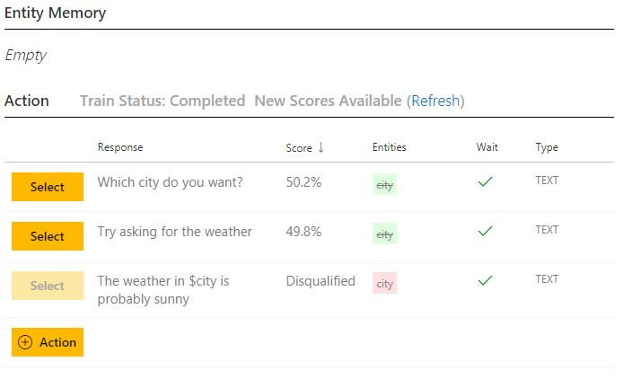
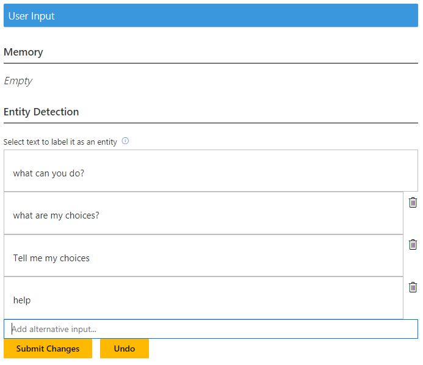
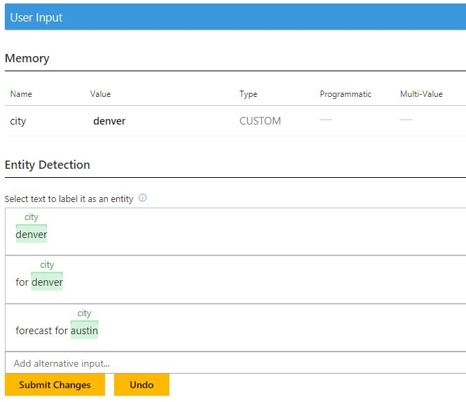

# How to use alternative inputs

This tutorial shows how to use the "alternative inputs" field for user input in the teaching interface.

## Video

## Requirements
This tutorial requires that the general tutorial bot is running

	npm run tutorial-general

## Details
"Alternative inputs" are alternate user utterances which the user could have said at a particular point in a training dialog. Alternative inputs allow you to more compactly specify variations of what a user might say, without having to list each variation in a separate training dialog.

## Steps

### Create the model

1. In the Web UI, click New Model
2. In Name, enter AlternativeInputs. Then click Create.

### Create an entity

1. Click Entities, then New Entity.
2. In Entity Name, enter city.
3. Click Create.

### Create three actions

1. Click Actions, then New Action
2. In Response, type 'Which city do you want?'.
3. In Disqualifying Entities, enter $city.
3. Click Create

Then create the second action:

1. Click Actions, then New Action.
3. In Response, type 'The weather in $city is probably sunny'.
4. Required Entities, enter $city.
4. Click Create.

Create the third action:

1. Click Actions, then New Action.
3. In Response, type 'Try asking for the weather'.
	- This would be in response to user's question such as 'what can the system do?'
4. In Disqualifying Entities, enter $city.
4. Click Create

You now have three actions.

### Train the bot

1. Click Train Dialogs, then New Train Dialog.
2. Type 'what's the weather'.
3. Click Score Actions, and Select 'Which city do you want?'
2. Enter 'denver'.
3. Double-click on 'denver', and select city.
	- This marks it as a city entity.
5. Click Score Actions
	- 'denver' is now present in the city entity. 
6. Select 'The weather in $city is probably sunny'.
7. Click Done Teaching.

Add another example dialog:

1. Click New Action, then New Train Dialog.
2. Type 'what can you do?'.
3. Click Score Actions, and Select 'Try asking for the weather'
2. Enter 'What's the weather in seattle'.
3. Double-click on 'seattle', and select city.
	- This marks it as a city entity.
5. Click Score Actions
	- 'seattle' is now present in the city entity. 
6. Select 'The weather in $city is probably sunny'.
7. Click Done Teaching.

Let's see what happens if the user says something semantically similar to the above:

1. Click New Action, then New Train Dialog.
2. Type 'help'.
3. Click Score Actions.
	- The scores for the two potential responses are very close. This tells us the model is confused about the boundary between the two actions.
6. Click Abandon Teaching and Confirm.

In this case, it would help to add alternative inputs to dialogs. You can add them as you are doing the teaching. You can also go back and add them later.

2. Click on 'What can you do?' in Train Dialogs.
2. In the dialog, click on 'what can you do?' to select it.
	1. In the right pane, under Entity Detection, in the Add alternative input enter a couple of alternatives:
	1. Enter 'what are my choices?'
	2. Enter 'Tell me my choices'.
	3. Enter 'help'
	1. click Submit Changes.

2. Now click on 'what's the weather in seattle'.
	1. In Add alternative input, enter 'forecast for seattle'.
	2. Double-click on 'seattle', and select city. The entities for alternative inputs should be present and have the same set of entities. It is fine if the content of the entities is different.
	3. In Add alternative input, enter 'will it rain today in denver'.
	4. Click on 'denver', and select city.
	5. click Submit Changes and Done.

Let's add alternate inputs to the first dialog:

1. Click Train Dialogs.
2. Click on the dialog starting with 'what's the weather'.
2. Click to select 'what's the weather' in the left pane:
	1. In Add alternative input, enter 'weather forecast'.
	2. Enter 'will it rain?'
	3. Click Submit Changes.
4. Click to select 'denver' in the left pane:
	1. In Add alternative input, enter 'for denver'.
	2. Enter 'forecast for austin'.
		- The full phrase is highlighted. Click on the phrase, then red x. Then select austin, and click on city.
		- Click Submit Changes
	1. Click Done which will cause the model to retrain.

Let's try the variations:

1. Click New Train Dialog.
2. Type 'what are you capabilities'.
3. Click Score Actions.
	- The scores are now more decisive on the next action which indicates the certainty of the model.
2. Select 'Try asking for weather'.
6. Click Done Teaching

You have now seen how alternative inputs can be used to indicate other things the user might have said. They help you avoid creating many dialogs, which in many ways are the same, by collapsing them into a single dialog and enumerating what the user can say.

## Next steps

> [!div class="nextstepaction"]
> [Log dialogs](./9-log-dialogs.md)
