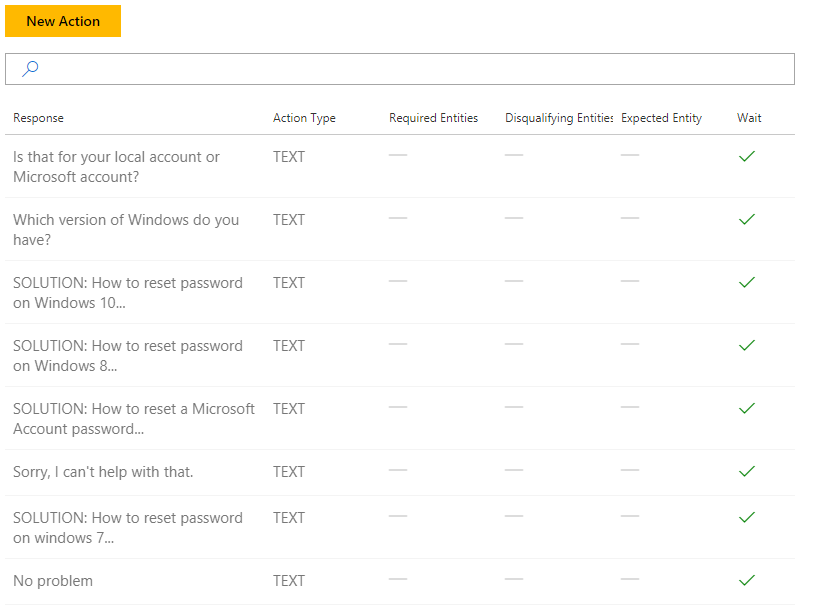
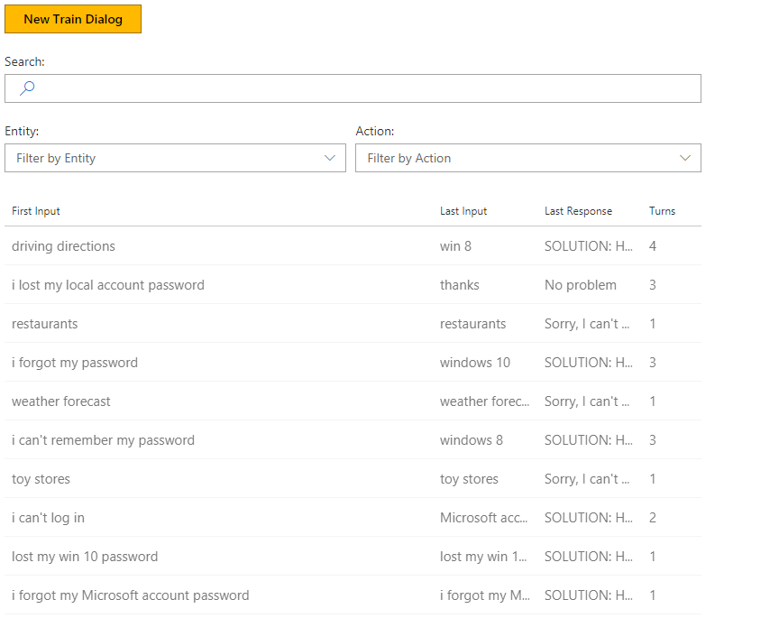

# Demo: Password reset
This tutorial showcases a simple technical support bot that can help with password resets powered by Conversation Learner. The bot's model can learn non-trivial dialog flows and multi-turn sequences including an out-of-domain classes. The task can be accomplished without code or Entities.

## Video

## Requirements
This tutorial requires that the password reset bot is running

	npm run demo-password

### Open the demo

In the Model list of the web UI, click on Tutorial Demo Password Reset. 

### Actions

The Model contains a set of Actions designed to help users solve common password problems.

### Training Dialogs

The Model also contains several Train Dialogs, including some that demonstrate out of domain class training. For example, users who might request like driving directions. The sample bot has been trained on a few for demonstration purposes, and simply responds by stating it "can't help with that." The list of existing Train Dialogs is found under "Train Dialogs" in the left panel.

1. On the left panel, click "Train Dialogs", then the "New Train Dialog" button.
2. In the chat panel, where it says "Type your message...", type in "i lost my password."
3. Click the "Score Actions" button.
4. Select the response, "Is that for your local account or Microsoft account?"
5. In the chat panel, where it says "Type your message...", type in "local account please"
6. Click the "Score Actions" button.
7. Select the response, "Which version of Windows do you have?"
8. In the chat panel, where it says "Type your message...", type in "windows xp"
9. Click the "Score Actions" button.
10. Click the "+Action" button.
11. In the "Bot's response..." field, type "SOLUTION: How to reset password on Windows XP.."
12. Click the "Create" button.

### Training Dialogs For Out-of-Domain Scenarios

1. On the left panel, click "Train Dialogs", then the existing "toy stores" Train Dialog.
2. In the chat panel, click the "toy stores" utterance.
3. In the "Add alternative input..." field, type "web search" and hit enter.
4. In the "Add alternative input..." field, type "flight booking" and hit enter.
5. Click the "Save Changes" button.
6. Click the "Save Edit" button.
7. On the left panel, click "Log Dialogs", then the "New Log Dialog" button.
8. In the chat panel, where it says "Type your message...", type in "i can't find my password"
9. In the chat panel, where it says "Type your message...", type in "Microsoft account"
10. In the chat panel, where it says "Type your message...", type in "thanks"
11. Click the "Done Testing" button.
12. Click the "i can't find my password" log dialog from the grid view.
13. In the chat panel, click the incorrectly rendered "Solution: How to reset a Microsoft Account Password" response.
14. Click the "+Action" button.
15. In the "Bot's response..." field, type "You are welcome"
16. Click the "Create" button.
17. Click the "Save As Train Dialog" button.

## Next steps

> [!div class="nextstepaction"]
> [Demo - pizza order](./demo-pizza-order.md)
