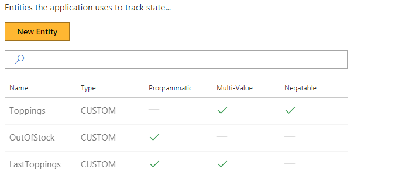
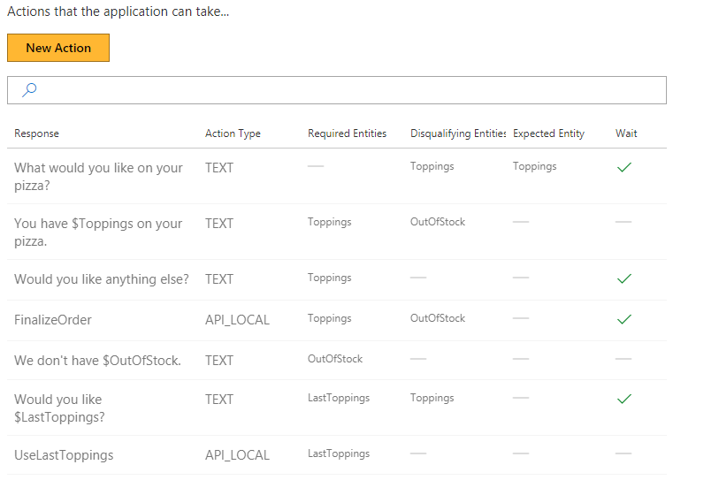
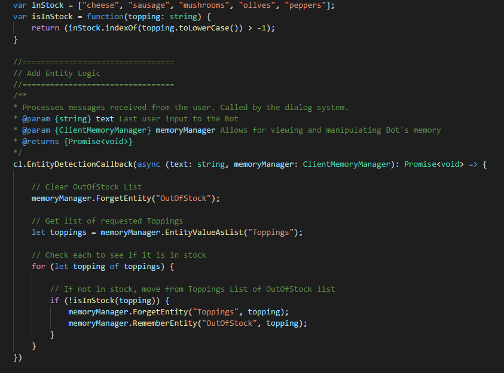
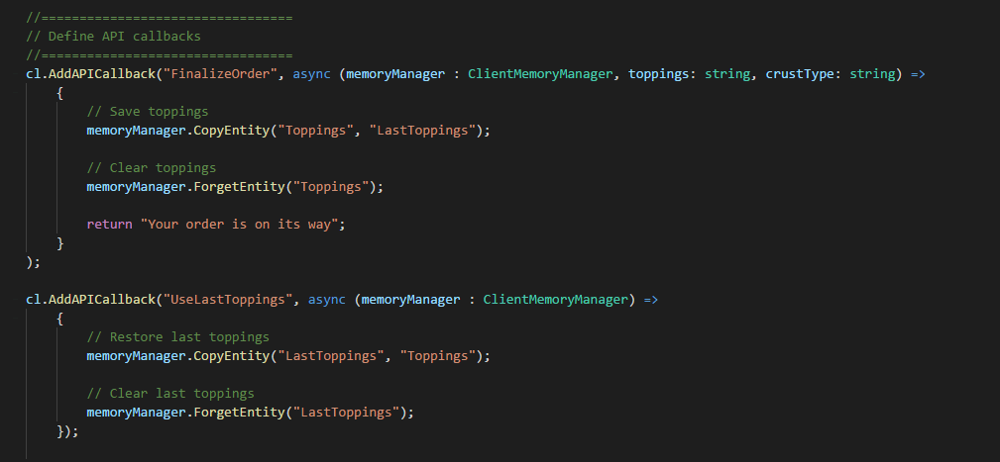

# Demo: Pizza order
This demo illustrates a pizza ordering bot, supporting single pizza ordering by:

- recognizing pizza toppings from user utterances
- managing toppings inventory and responding appropriately
- remembering previous orders and speeding reordering of an identical pizza

## Video

## Requirements
This tutorial requires that the pizza order bot is running

	npm run demo-pizza

### Open the demo

In the Model list of the web UI, click on TutorialDemo Pizza Order. 

## Entities

The model contains three Entities:

- "Toppings" accumulates the user's specified toppings, if available.
- "OutofStock" signals the user the selected topping is out of stock
- "LastToppings" contains the historical toppings from their previous order

### Actions

The model contains a set of Actions that asks the user's for their topping selection, accumulated toppings and more.

Two API calls are provided as well:

- "FinalizeOrder" handles order fulfillment
- "UseLastToppings" processes historical toppings information

### Training Dialogs

Several Training Dialogs are found in the Model.

Let's train the Model a bit more by creating another Train Dialog.

1. On the left panel, click "Train Dialogs", then the "New Train Dialog" button.
2. In the chat panel, where it says "Type your message...", type in "Order a pizza with cheese"
	- The word "cheese" was extracted by the entity extractor.
3. Click the "Score Actions" button.
4. Select the response, "You have cheese on your pizza."
5. Select the response, "Would you like anything else?"
6. In the chat panel, where it says "Type your message...", type in "add mushrooms and peppers"
7. Click the "Score Actions" button.
8. Select the response, "You have cheese, mushrooms and peppers on your pizza."
9. Select the response, "Would you like anything else?"
10. In the chat panel, where it says "Type your message...", type in "remove peppers and add sausage"
11. Click the "Score Actions" button.
12. Select the response, "You have cheese, mushrooms and sausage on your pizza."
13. Select the response, "Would you like anything else?"
14. In the chat panel, where it says "Type your message...", type in "add yam"
15. Click the "Score Actions" button.
	- The "yam" value was added to "OutofStock" by the entity detection callback code, as the text did not match any supported ingredients.
16. Select the response, "OutOfStock"
17. Select the response, "Would you like anything else?"
18. In the chat panel, where it says "Type your message...", type in "no"
	- The "no" is not marked as any type of intent. Rather, we'll be selecting the relevant Action based on the current context.
19. Click the "Score Actions" button.
20. Select the response, "FinalizeOrder"
	- Selecting this Action resulted in the customer's current toppings getting saved to the "LastToppings" Entity, and deletion of the "Toppings" Entity by the FinalizeOrder callback code.
21. In the chat panel, where it says "Type your message...", type in "order another"
22. Click the "Score Actions" button.
23. Select the response, "Would you like cheese, mushrooms and sausage?"
	- This Action is available now due to the "LastToppings" Entity being set.
24. In the chat panel, where it says "Type your message...", type in "yes"
25. Click the "Score Actions" button.
26. Select the response, "UseLastToppings"
27. Select the response, "You have cheese, mushrooms and sausage on your pizza."
28. Select the response, "Would you like anything else?"

## Next steps

> [!div class="nextstepaction"]
> [Deploying a Conversation Learner bot](../deploy-to-bf.md)
