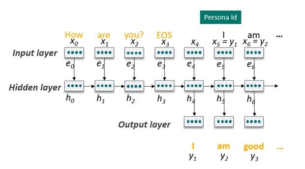
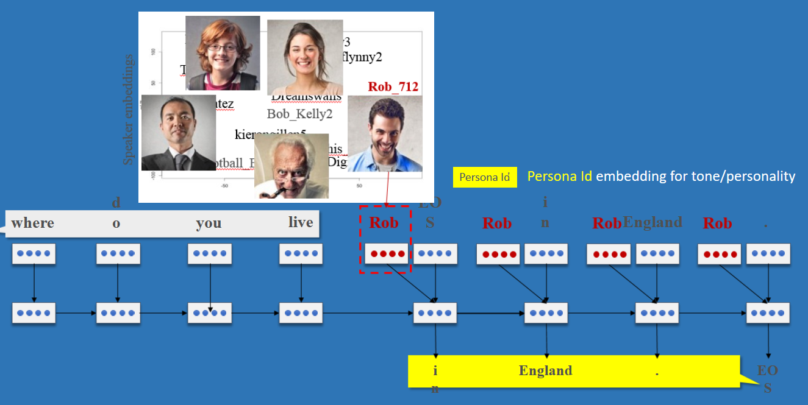

# What is Project Personality Chat?

Project Personality Chat enhances your bot’s conversational capabilities, by handling small talk & chit chat, in line with a distinct chosen personality. Personality Chat uses intent classifiers to identify small talk intents, and generates responses consistent with the personality. There are two types of Personality Chat responses:
- **Editorial responses**: A set of curated chit-chat queries and their responses.
- **Generated responses**: Responses to small talk intents, that are automatically generated in real-time. 

## How are responses generated?

- Personality Chat uses deep neural nets to learn and generate responses.
- It learns using twitter data, absorbs and understands patterns of human speech. Now for any new query, it generates a brand new response 
    - Different from response RETRIEVAL, and is more controlled.
- While generating responses, it picks n-best words each time and uses beam search to keep searching for the next word.
    - It ends a responses once it finds the special "EOS" (end of sentence) word.
- Has a read vocabulary of 50K words and a write vocabulary of 10K words.

## What is personality modeling? 

- Learns from large volumes of users and speaker IDs to cluster people into certain personas (100K).
- For any new data, it matches to the closest "persona" cluster.
- Can be further customized by re-training a model with data for a very specific person.

## How are the intents identified?

- Important to ensure that we are only responding for small talk intents, and not getting in the way of tasks/ information queries.
- A high level chat classifier determines if the query is a small talk intent- using lexical and semantic based classifiers & combining the scores.
    - Further sub-intent classifier uses deep learning - CDSSM to match any given query with existing identified intents.
