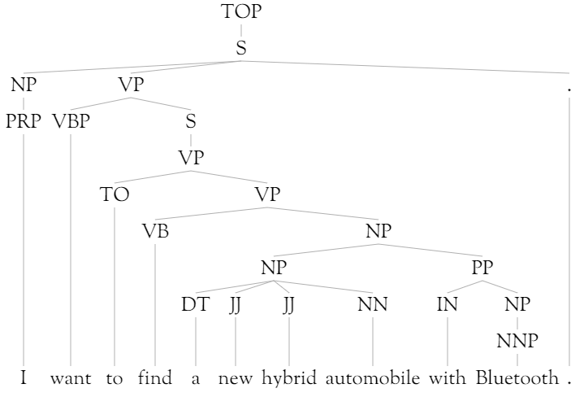

# Constituency Parsing

> [!IMPORTANT]
> The Linguistic Analysis preview was decommissioned on August 9, 2018. We recommend using [Azure Machine Learning text analytics modules](https://docs.microsoft.com/azure/machine-learning/studio-module-reference/text-analytics) for text processing and analysis.

The goal of constituency parsing (also known as "phrase structure parsing") is to identify the phrases in the text.
This can be useful when extracting information from text.
Customers might want to find feature names or key phrases from a big body of text, and to see the modifiers and actions surrounding each such phrase.

## Phrases

To a linguist, a *phrase* is more than just a sequence of words.
To be a phrase, a group of words has to come together to play a specific role in the sentence.
That group of words can be moved together or replaced as a whole, and the sentence should remain fluent and grammatical.

Consider the sentence

> I want to find a new hybrid automobile with Bluetooth.

This sentence contains the noun phrase: "a new hybrid automobile with Bluetooth".
How do we know that this is a phrase?
We can rewrite the sentence (somewhat poetically) by moving that whole phrase to the front:

> A new hybrid automobile with Bluetooth I want to find.

Or we could replace that phrase with a phrase of similar function and meaning, like "a fancy new car":

> I want to find a fancy new car.

If instead we picked different subset of words, these replacement tasks would lead to strange or unreadable sentences.
Consider what happens when we move "find a new" to the front:

> Find a new I want to hybrid automobile with Bluetooth.

The results is very difficult to read and understand.

The goal of a parser is to find all such phrases.
Interestingly, in natural language, the phrases tend to be nested inside one another.
A natural representation of these phrases is a tree, such as the following:

In this tree, the branches marked "NP" are noun phrases.
There are several such phrases: *I*, *a new hybrid automobile*, *Bluetooth*, and *a new hybrid automobile with Bluetooth*.

## Phrase Types

| Label | Description | Example |
|-------|-------------|---------|
|ADJP	| Adjective Phrase | "so rude" |
|ADVP	| Adverb Phrase | "clear through" |
|CONJP	| Conjunction Phrase | "as well as" |
|FRAG	| Fragment, used for incomplete or fragmentary inputs | "Highly recommended..." |
|INTJ	| Interjection | "Hooray" |
|LST	| List marker, including punctuation | "#4)" |
|NAC	| Not A Constituent, used to indicate scoping of a non-constituent phrase |  "and for a good deal" in "you get things and for a good deal" |
|NP	| Noun Phrase | "a tasty potato pancake" |
|NX	| Used within certain complex NPs to mark the head| |
|PP	| Prepositional Phrase| "in the pool" |
|PRN	| Parenthetical| "(so called)" |
|PRT	| Particle| "out" in "ripped out" |
|QP	| Quantity Phrase (i.e., complex measure/amount) within a Noun Phrase| "around $75" |
|RRC	| Reduced Relative Clause.| "still unresolved" in "many issues still unresolved" |
|S	| Sentence or clause. | "This is a sentence."
|SBAR	| Subordinate clause, often introduced by a subordinating conjunction | "as I left" in "I looked around as I left."|
|SBARQ	| Direct question introduced by a wh-word or -phrase | "What was the point?" |
|SINV	| Inverted declarative sentence | "At no time were they aware." (note how the normal subject "they" was moved to after the verb "were") |
|SQ	| Inverted yes/no question, or main clause of a wh- question | "Did they get the car?" |
|UCP	| Unlike Coordinated Phrase| "small and with bugs" (note how an adjective and a preposition phrase are conjoined with "and")|
|VP	| Verb Phrase | "ran into the woods" |
|WHADJP	| Wh-adjective Phrase | "how uncomfortable" |
|WHADVP	| Wh-adverb Phrase| "when" |
|WHNP	| Wh-noun Phrase| "which potato", "how much soup"|
|WHPP	| Wh-prepositional Phrase| "in which country"|
|X	| Unknown, uncertain, or unbracketable.| first "the" in "the... the soup" |

## Specification

Trees here use the S-expressions from the [Penn Treebank](https://catalog.ldc.upenn.edu/ldc99t42).
