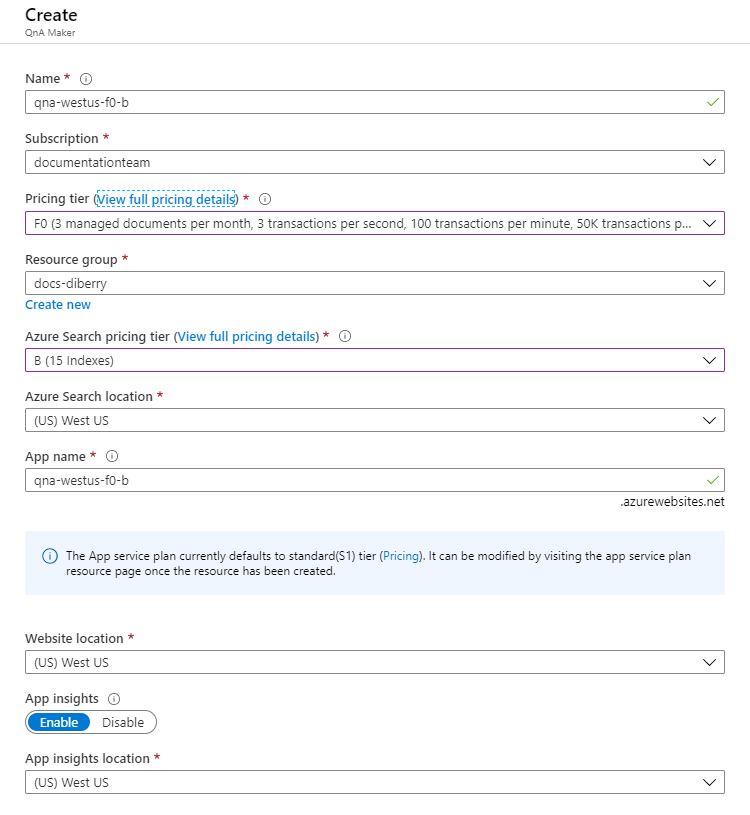
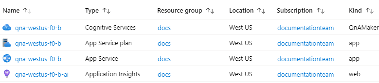
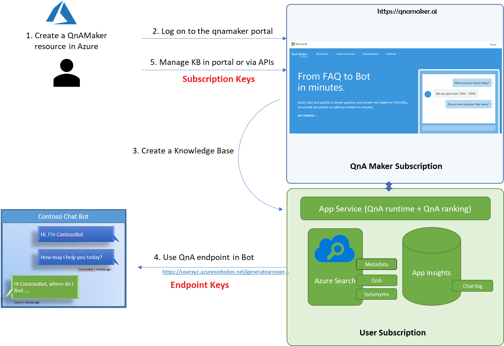

# Azure resources for QnA Maker

QnA Maker uses several Azure sources, each with a different purpose. Understanding how they are used individually allows you to plan for and select the correct pricing tier or know when to change your pricing tier. Understanding how they are used _in combination_ allows you to find and fix problems when they occur.

## Resource planning

When you first develop a QnA Maker knowledge base, in the prototype phase, it is common to have a single QnA Maker resource for both testing and production.

When you move into the development phase of the project, you should consider:

* how many languages your knowledge base system will hold
* how many regions you need your knowledge base to be available in/from
* how many documents in each domain your system will hold

Plan to have a single QnA Maker resource hold all knowledge bases that have the same language, the same region and the same subject domain combination.

## Pricing tier considerations

Typically there are three parameters you need to consider:

* **The throughput you need from the service**:
    * Select the appropriate [App Plan](https://azure.microsoft.com/pricing/details/app-service/plans/) for your App service based on your needs. You can [scale up](https://docs.microsoft.com/azure/app-service/manage-scale-up) or down the App.
    * This should also influence your Azure **Cognitive Search** SKU selection, see more details [here](https://docs.microsoft.com/azure/search/search-sku-tier). Additionally, you may need to adjust Cognitive Search [capacity](../../../search/search-capacity-planning.md) with replicas.

* **Size and the number of knowledge bases**: Choose the appropriate [Azure search SKU](https://azure.microsoft.com/pricing/details/search/) for your scenario. Typically, you decide number of knowledge bases you need based on number of different subject domains. Once subject domain (for a single language) should be in one knowledge base.

    You can publish N-1 knowledge bases in a particular tier, where N is the maximum indexes allowed in the tier. Also check the maximum size and the number of documents allowed per tier.

    For example, if your tier has 15 allowed indexes, you can publish 14 knowledge bases (1 index per published knowledge base). The fifteenth index is used for all the knowledge bases for authoring and testing.

* **Number of documents as sources**: The free SKU of the QnA Maker management service limits the number of documents you can manage via the portal and the APIs to 3 (of 1 MB size each). The standard SKU has no limits to the number of documents you can manage. See more details [here](https://aka.ms/qnamaker-pricing).

The following table gives you some high-level guidelines.

|                        | QnA Maker Management | App Service | Azure Cognitive Search | Limitations                      |
| ---------------------- | -------------------- | ----------- | ------------ | -------------------------------- |
| Experimentation        | Free SKU             | Free Tier   | Free Tier    | Publish Up to 2 KBs, 50 MB size  |
| Dev/Test Environment   | Standard SKU         | Shared      | Basic        | Publish Up to 14 KBs, 2 GB size    |
| Production Environment | Standard SKU         | Basic       | Standard     | Publish Up to 49 KBs, 25 GB size |

## Recommended Settings

|Target QPS | App Service | Azure Cognitive Search |
| -------------------- | ----------- | ------------ |
| 3             | S1, 1 Instance   | S1, 1 Instance    |
| 50         | S3, 10 Instances       | S1, 12 Instances         |
| 80         | S3, 10 Instances      |  S3, 12 Instances  |
| 100         | P3V2, 10 Instances  | S3, 12 Instances, 3 Partitions   |
| 200 to 250         | P3V2, 20 Instances | S3, 12 Instances, 3 Partitions    |

## When to change a pricing tier

|Upgrade|Reason|
|--|--|
|[Upgrade](../How-to/set-up-qnamaker-service-azure.md#upgrade-qna-maker-sku) QnA Maker management SKU|You want to have more QnA pairs or document sources in your knowledge base.|
|[Upgrade](../How-to/set-up-qnamaker-service-azure.md#upgrade-app-service) App Service SKU and check Cognitive Search tier and [create Cognitive Search replicas](../../../search/search-capacity-planning.md)|Your knowledge base needs to serve more requests from your client app, such as a chat bot.|
|[Upgrade](../How-to/set-up-qnamaker-service-azure.md#upgrade-the-azure-cognitive-search-service) Azure Cognitive Search service|You plan to have many knowledge bases.|

Get the latest runtime updates by [updating your App Service in the Azure portal](../how-to/set-up-qnamaker-service-azure.md#get-the-latest-runtime-updates).

## Resource naming considerations

The resource name for the QnA Maker resource, such as `qna-westus-f0-b`, is also used to name the other resources.

The Azure portal create window allows you to create a QnA Maker resource and select the pricing tiers for the other resources.

> [!div class="mx-imgBorder"]
> 

After the resources are created, they have the same name, except for the optional Application Insights resource, which postpends characters to the name.

> [!div class="mx-imgBorder"]
> 

> [!TIP]
> Create a new resource group when you create a QnA Maker resource. That allows you to see all resources associated with the QnA Maker resource when searching by resource group.

> [!TIP]
> Use a naming convention to indicate pricing tiers within the name of the resource or the resource group. When you receive errors from creating a new knowledge base, or adding new documents, the Cognitive Search pricing tier limit is a common issue.

## Resource purposes

Each Azure resource created with QnA Maker has a specific purpose:

* QnA Maker resource
* Cognitive Search resource
* App Service
* App Plan Service
* Application Insights Service

### Cognitive Search resource

The [Cognitive Search](../../../search/index.yml) resource is used to:

* Store the QnA pairs
* Provide the initial ranking (ranker #1) of the QnA pairs at runtime

#### Index usage

The resource keeps one index to act as the test index and the remaining indexes correlate to one published knowledge base each.

A resource priced to hold 15 indexes, will hold 14 published knowledge bases, and one index is used for testing all the knowledge bases. This test index is partitioned by knowledge base so that a query using the interactive test pane will use the test index but only return results from the specific partition associated with the specific knowledge base.

#### Language usage

The first knowledge base created in the QnA Maker resource is used to determine the _single_ language set for the Cognitive Search resource and all its indexes. You can only have _one language set_ for a QnA Maker service.

### QnA Maker resource

The QnA Maker resource provides access to the authoring and publishing APIs as well as the natural language processing (NLP) based second ranking layer (ranker #2) of the QnA pairs at runtime.

The second ranking applies intelligent filters that can include metadata and follow-up prompts.

#### QnA Maker resource configuration settings

When you create a new knowledge base in the [QnA Maker portal](https://qnamaker.ai), the **Language** setting is the only setting that is applied at the resource level. You select the language when you create the first knowledge base for the resource.

### App service and App service plan

The [App service](../../../app-service/index.yml) is used by your client application to access the published knowledge bases via the runtime endpoint.

To query the published knowledge base, all published knowledge bases use the same URL endpoint,  but specify the **knowledge base ID** within the route.

`{RuntimeEndpoint}/qnamaker/knowledgebases/{kbId}/generateAnswer`

### Application Insights

[Application Insights](../../../azure-monitor/app/app-insights-overview.md) is used to collect chat logs and telemetry. Review the common [Kusto queries](../how-to/get-analytics-knowledge-base.md) for information about your service.

## Share services with QnA Maker

QnA Maker creates several Azure resources. To reduce management and benefit from cost sharing, use the following table to understand what you can and can't share:

|Service|Share|Reason|
|--|--|--|
|Cognitive Services|X|Not possible by design|
|App Service plan|✔|Fixed disk space allocated for an App Service plan. If other apps that sharing the same App Service plan use significant disk space, the QnAMaker App Service instance will encounter problems.|
|App Service|X|Not possible by design|
|Application Insights|✔|Can be shared|
|Search service|✔|1. `testkb` is a reserved name for the QnAMaker service; it can't be used by others. 2. Synonym map by the name `synonym-map` is reserved for the QnAMaker service. 3. The number of published knowledge bases is limited by Search service tier. If there are free indexes available, other services can use them.|

### Using a single Cognitive Search service

If you create a QnA service and its dependencies (such as Search) through the portal, a Search service is created for you and linked to the QnA Maker service. After these resources are created, you can update the App Service setting to use a previously existing Search service and remove the one you just created.

Learn [how to configure](../How-To/set-up-qnamaker-service-azure.md#configure-qna-maker-to-use-different-cognitive-search-resource) QnA Maker to use a different Cognitive Service resource than the one created as part of the QnA Maker resource creation process.

## Management service region

The management service of QnA Maker is used only for the QnA Maker portal and for initial data processing. This service is available only in the **West US** region. No customer data is stored in this West US service.

## Keys in QnA Maker

Your QnA Maker service deals with two kinds of keys: **authoring keys** and **query endpoint keys** used with the runtime hosted in the App service.

If you are looking for your **subscription key**, [the terminology has changed](#subscription-keys).

Use these keys when making requests to the service through APIs.

|Name|Location|Purpose|
|--|--|--|
|Authoring key|[Azure portal](https://azure.microsoft.com/free/?WT.mc_id=A261C142F)|These keys are used to access the [QnA Maker management service APIs](https://go.microsoft.com/fwlink/?linkid=2092179). These APIs let you edit the questions and answers in your knowledge base, and publish your knowledge base. These keys are created when you create a new QnA Maker service.  Find these keys on the **Cognitive Services** resource on the **Keys** page.|
|Query endpoint key|[QnA Maker portal](https://www.qnamaker.ai)|These keys are used to query the published knowledge base endpoint to get a response for a user question. You typically use this query endpoint in your chat bot or in the client application code that connects to the QnA Maker service. These keys are created when you publish your QnA Maker knowledge base.  Find these keys in the **Service settings** page. Find this page from the user's menu in the upper right of the page on the drop-down menu.|

### Subscription keys

The terms authoring and query endpoint key are corrective terms. The previous term was **subscription key**. If you see other documentation referring to subscription keys, these are equivalent to authoring and query endpoint keys (used in the runtime).

You must know what the key is accessing, knowledge base management or knowledge base querying, to know which key you need to find.

## Recommended settings for network isolation

* Protect  Cognitive Service Resource from public access by [configuring the virtual network](https://docs.microsoft.com/azure/cognitive-services/cognitive-services-virtual-networks?tabs=portal).
* Protect App Service (QnA Runtime) from public access:
    * Allow traffic only from Cognitive Service IPs. These are already included in Service Tag "CognitiveServicesManagement". This is required for Authoring APIs (Create/Update KB) to invoke the app service and update Azure Search service accordingly.
    * Make sure you also allow other entry points like Bot service, QnA Maker portal (may be your corpnet) etc. for prediction "GenerateAnswer" API access.
    * Check out [more information about service tags.](https://docs.microsoft.com/azure/virtual-network/service-tags-overview)

## Next steps

* Learn about the QnA Maker [knowledge base](knowledge-base.md)
* Understand a [knowledge base life cycle](development-lifecycle-knowledge-base.md)
* Review service and knowledge base [limits](../limits.md)

