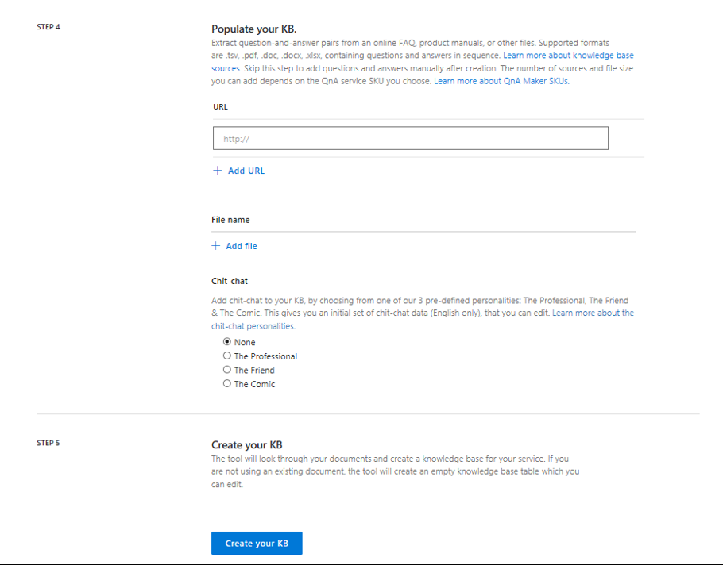
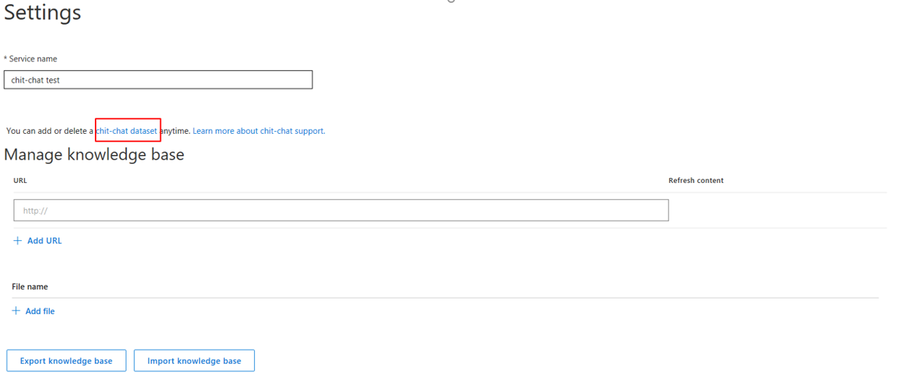
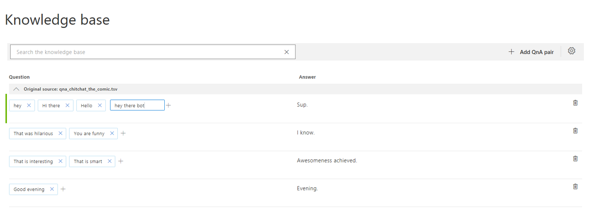
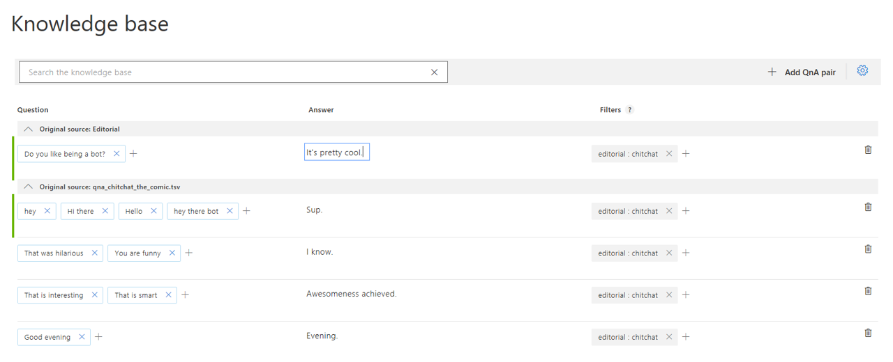
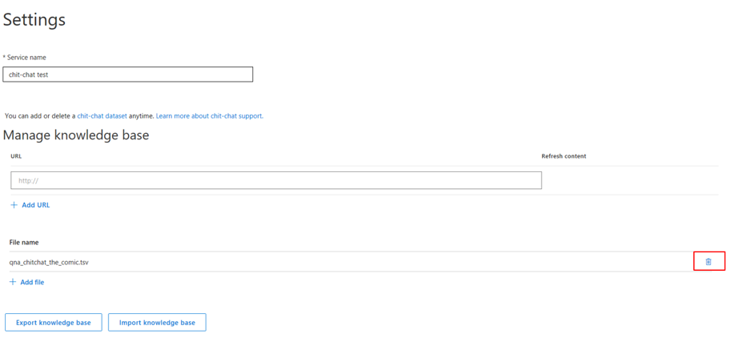

# Adding Chit-chat personas to knowledgebase answers

Adding chit-chat to your bot makes it more conversational and engaging. QnA Maker allows you to easily add a pre-populated set of the top chit-chat personas, into your knowledgebase. This can be a starting point for your bot's conversational chit-chat, which saves you the time and cost of writing them yourself. 

Th Chit-chat dataset has about 100 scenarios of chit-chat in **three base personas**:

* The Professional
* The Friend
* The Comic 

Choose the persona that most closely resembles your bot's desired tone. Consider the following statements from users and the corresponding responses from QnA Maker:

|User Query|The Professional|The Friend| The Comic|
|--|--|--|--|
|*Thank you*|You are quite welcome. |Anytime! | No prob. |
|*Will you marry me?*|I think it's best if we stick to a professional relationship.|I'm flattered, but I'm digital.|Sure. Take me to City Hall. See what happens.|
|*who made you*|There wouldn't be time to list everyone.|Lots and lots of people!|Nerds.

> [!NOTE]
> Chit-chat support is currently available in English only. 

## Add chit-chat during the KB creation process
After adding your source URLs and files, you see an option for adding chit-chat. Choose the personality that you want as your chit-chat base. If you do not want to add chit-chat, or if you already have chit-chat support in your data sources, choose **None**. 
   

## Add Chit-chat to an existing KB
Select your KB, and navigate to the **Settings** page. You will find a link to all the chit-chat datasets in the appropriate .tsv format. Download the personality you want, then upload it as a file source. Make sure not to edit the format or the metadata when you download and upload the file. 
  

## Edit your chit-chat questions and answers
When you edit your KB, you will see a new source for chit-chat, based on the personality you selected. You can now add alternated questions or edit the responses, just like with any other source. 

## Add additional chit-chat questions and answers
You can add new chit-chat QnA that is not in the predefined set. Ensure that you are not duplicating a QnA pair that is already covered in the chit-chat set. When you add any new chit-chat QnA, it gets added to your **Editorial** source. To ensure the ranker understands that this is chit-chat, add the metadata key/value pair "Editorial: chitchat", as seen below:
   

## Delete chit-chat from an existing KB
Select your KB, and navigate to the "Settings" page. You see your specific chit-chat source listed as a file, with the selected personality name. You can delete this as a source file.

## Next steps

> [!div class="nextstepaction"]
> [Data sources supported](./data-sources-supported.md)

## See also 

[QnA Maker overview](../Overview/overview.md)
