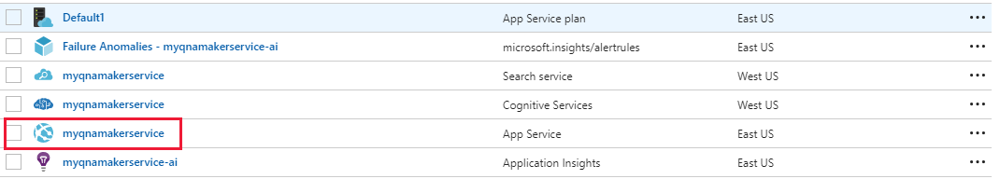
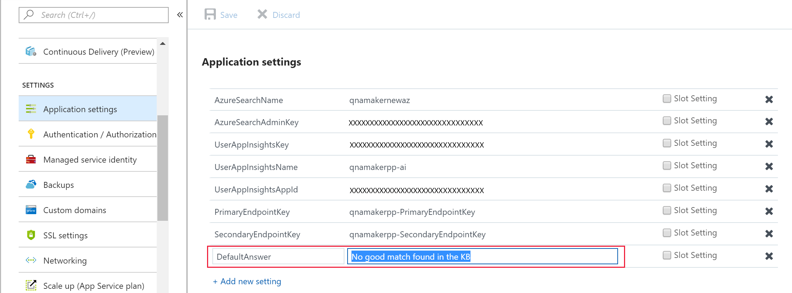

# Confidence Score

A confidence score indicates the degree of match between the user question and the response returned.

When a user query is matched against knowledge base content, there can be more than one response returned. The responses are returned in a ranked order of decreasing confidence score.

A confidence score is between 0 and 100.

|Score value|Confidence|
|--|--|
|100|An exact match of user query and a KB question|
|90|High confidence - most of the words match|
|40-60|Fair confidence - important words match|
|10|Low confidence - important words don't match|
|0|No word match|

## Similar confidence scores
When multiple responses have a similar confidence score, it is likely that the query was too generic and therefore matched with equal likelihood with multiple answers. Try to structure your QnAs better so that every QnA entity has a distinct intent.

## Improving confidence scores
To improve the confidence score of a particular response to a user query, you can add the user query to the knowledge base as an alternate question on that response.
   
## Confidence score differences
The confidence score of an answer may change negligibly between the test and published version of the knowledge base even if the content is the same. This is because the content of the test and the published knowledge base are located in different Azure Search indexes.

See here how the [publish](../How-To/publish-knowledge-base.md) operation works.

## No match found
When no good match is found by the ranker, the confidence score of 0.0 or "None" is returned and the default response is "No good match found in the KB". You can override this default response in the bot or application code calling the endpoint. Alternately, you can also set the override response in Azure and this changes the default for all knowledge bases deployed in a particular QnA Maker service.

1. Go to the [Azure portal](http://portal.azure.com) and navigate to the resource group that represents the QnA Maker service you created.

2. Click to open the **App Service**.

    

3. Click on **Application Settings** and edit the **DefaultAnswer** field to the desired default response. Click **Save**.

    

4. Restart your App service

    

## Next steps

> [!div class="nextstepaction"]
> [Data sources supported](./data-sources-supported.md)

## See also 

[QnA Maker overview](../Overview/overview.md)
