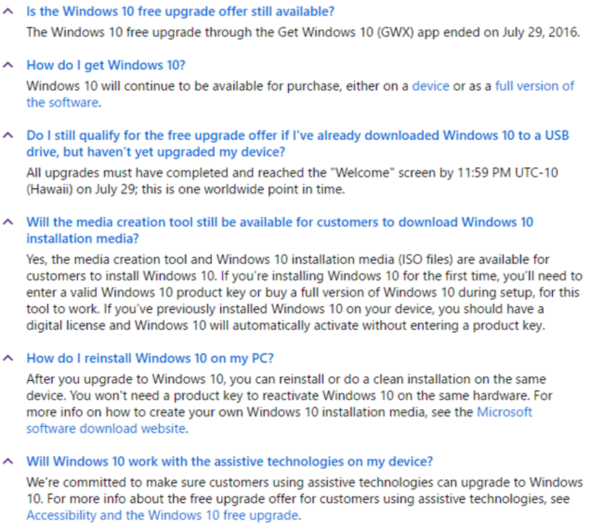
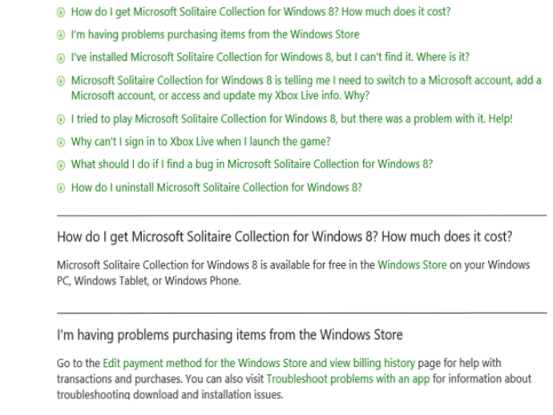
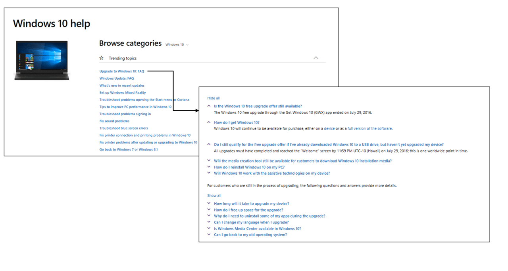
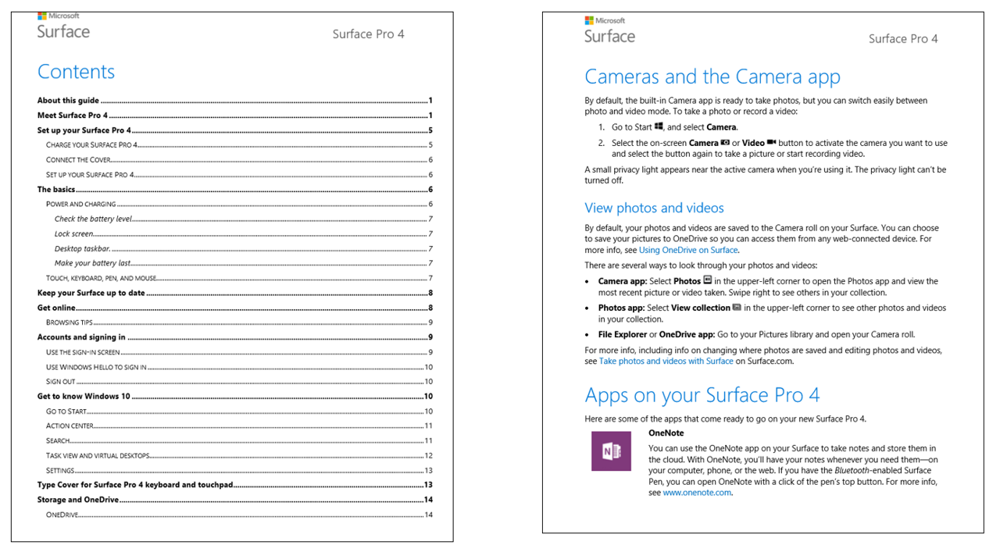
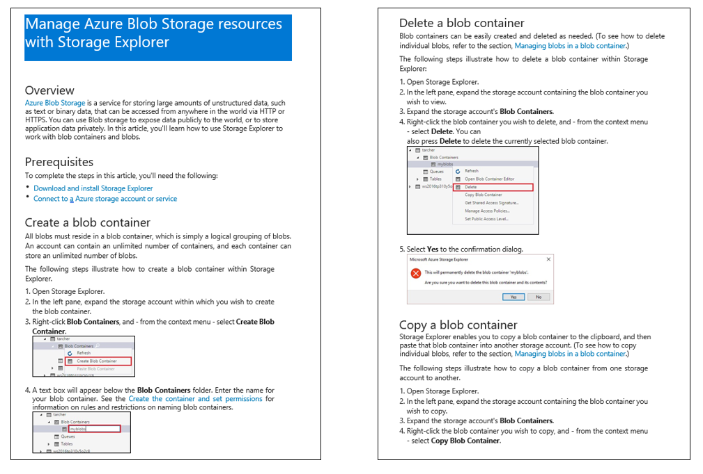
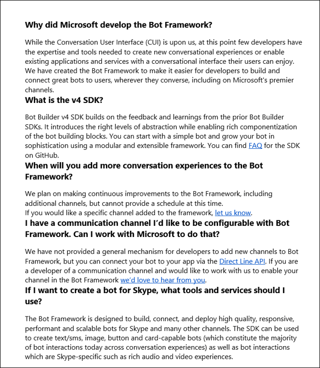
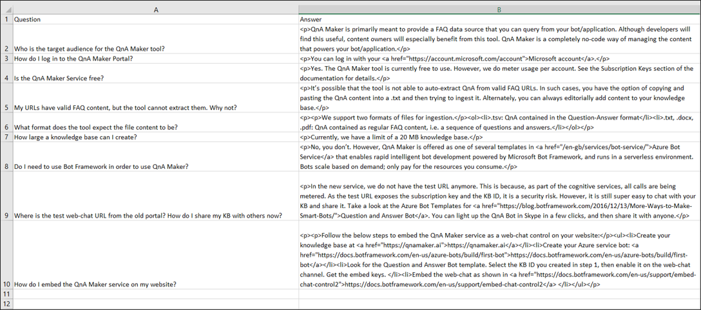

# Data sources for QnA Maker content

QnA Maker automatically extracts question-answer pairs from  semi-structured content such as FAQs, product manuals, guidelines, support documents, and policies stored as web pages, PDF files, or MS Word doc files. Content can also be added to the knowledge base from structured QnA content files. 

The table below summarizes the types of content and file formats that are supported by QnA Maker.

|Source Type|Content Type| Examples|
|--|--|--|
|URL|FAQs (Flat, with sections or with a topics homepage)|[Plain FAQ](https://docs.microsoft.com/azure/cognitive-services/qnamaker/faqs), [FAQ with links](https://www.microsoft.com/software-download/faq), [FAQ with topics homepage](https://support.microsoft.com/products/windows?os=windows-10)|
|PDF / DOC|FAQs, Product Manual, Brochures, Paper, Flyer Policy, Support guide, Structured QnA, etc.|[Structured QnA.doc](https://qnamakerstore.blob.core.windows.net/qnamakerdata/docs/Bot%20Service%20Sample%20FAQ.docx), [Sample Product Manual.pdf](https://download.microsoft.com/download/2/9/B/29B20383-302C-4517-A006-B0186F04BE28/surface-pro-4-user-guide-EN.pdf), [Sample semi-structured.doc](https://qnamakerstore.blob.core.windows.net/qnamakerdata/docs/Manage%20Azure%20Blob%20Storage.docx), [Sample white paper.pdf](https://azure.microsoft.com/mediahandler/files/resourcefiles/azure-stack-wortmann-bring-the-power-of-the-public-cloud-into-your-data-center/Azure_Stack_Wortmann_Bring_the_Power_of_the_Public_Cloud_into_Your_Data_Center.pdf)|
|Excel|Structured QnA file (including RTF, HTML support)|[Sample QnA FAQ.xls](https://qnamakerstore.blob.core.windows.net/qnamakerdata/docs/QnA%20Maker%20Sample%20FAQ.xlsx)|
|TXT/TSV|Structured QnA file|[Sample chit-chat.tsv](https://raw.githubusercontent.com/Microsoft/BotBuilder-PersonalityChat/master/CSharp/Datasets/Queries_Responses_Friendly_QnAMaker.tsv)|

## FAQ URLs

QnA Maker can support FAQ web pages in 3 different forms: Plain FAQ pages, FAQ pages with links, FAQ pages with a Topics Homepage.

### Plain FAQ pages

This is the most common type of FAQ page, in which the answers immediately follow the questions in the same page. 

Below is an example of a plain FAQ page:

 

 
### FAQ pages with links 

In this type of FAQ page, questions are aggregated together and are linked to answers that are either in different sections of the same page, or in different pages.

Below is an example of an FAQ page with links in sections that are on the same page:

  


### FAQ pages with a Topics homepage

This type of FAQ has a home page with the Topics where each Topic is a link to its relevant QnAs in a different page. Here, QnA Maker crawls all the linked pages to extract the corresponding questions & answers.

Below is an example of an FAQ page where a topics homepage has links to FAQ sections in different pages. 

  


## PDF/ DOC files

QnA Maker can process semi-structured content in a PDF or DOC file, and convert it into QnAs. A good file that can be extracted well is one where content is organized in some structured form, and is represented in well-defined sections. The sections can further be broken inTO subsections, or subtopics. Extraction works best on documents that have a clear structure with hierarchical headings.

QnA Maker identifies sections and subsections and relationships in the file based on visual clues like font size, font style, numbering, colors, etc. Semi-structured PDF or DOC files could be Manuals, FAQs, Guidelines, Policies, Brochures, Flyers, and many other types of files. Below are some example types of these files.

### Product manuals

A manual is typically guidance material that accompanies a product. It helps the user to set up, use, maintain, and troubleshoot the product. When QnA Maker processes a manual, it extracts the headings and subheadings as questions and the subsequent content as answers. See an example [here](https://download.microsoft.com/download/2/9/B/29B20383-302C-4517-A006-B0186F04BE28/surface-pro-4-user-guide-EN.pdf).

Below is an example of a manual with an index page, and hierarchical content

  

> [!NOTE]
> Extraction works best on manuals that have a table of contents and/or an index page, and a clear structure with hierarchical headings.

### Brochures, guidelines, papers, and other files

Many other types of documents can also be processed to generate QA pairs, provided they have a clear structure and layout. These include: Brochures, guidelines, reports, white papers, scientific papers, policies, books, etc. See an example [here](https://qnamakerstore.blob.core.windows.net/qnamakerdata/docs/Manage%20Azure%20Blob%20Storage.docx).

Below is an example of a semi-structured doc, without an index:

  

### Structured QnA Document

The format for structured Question-Answers in DOC files, is in the form of alternating Questions and Answers per line, one question per line followed by its answer in the following line, as shown below: 

```
Question1

Answer1

Question2

Answer2
```

Below is an example of a structured QnA word document:

  

## Structured *TXT*, *TSV* and *XLS* Files

QnAs in the form of structured *.txt*, *.tsv* or *.xls* files can also be uploaded to QnA Maker to create or augment a knowledge base.  These can either be plain text, or can have content in RTF or HTML. 

| Question  | Answer  | Metadata                |
|-----------|---------|-------------------------|
| Question1 | Answer1 | <code>Key1:Value1 &#124; Key2:Value2</code> |
| Question2 | Answer2 |      `Key:Value`           |

Any additional columns in the source file are ignored.

Below is an example of a structured QnA *.xls* file, with HTML content:

 

## Structured data format through import

Importing a knowledge base replaces the content of the existing knowledge base. Import requires a structured .tsv file that contains data source information. This information helps QnA Maker group the question-answer pairs and attribute them to a particular data source.

| Question  | Answer  | Source| Metadata                |
|-----------|---------|----|---------------------|
| Question1 | Answer1 | Url1 | <code>Key1:Value1 &#124; Key2:Value2</code> |
| Question2 | Answer2 | Editorial|    `Key:Value`       |

## Editorially add to knowledge base

If you do not have pre-existing content to populate the knowledge base, you can add QnAs editorially in QnA Maker Knowledge base. Learn how to update your knowledge base [here](../How-To/edit-knowledge-base.md).

## Next steps

> [!div class="nextstepaction"]
> [Set up a QnA Maker service](../How-To/set-up-qnamaker-service-azure.md)

## See also 

[QnA Maker overview](../Overview/overview.md)
