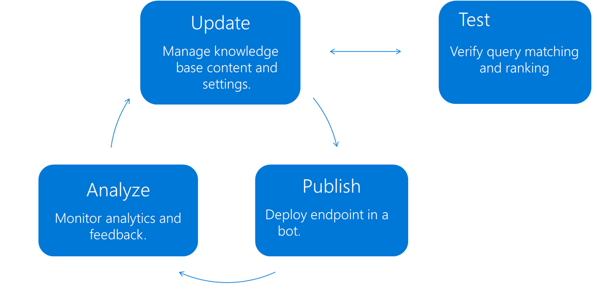

# Knowledge base lifecycle in QnA Maker
QnA Maker learns best in an iterative cycle of model changes, utterance examples, publishing, and gathering data from endpoint queries. 



## Creating a QnA Maker knowledge base
QnA Maker knowledge base (KB) endpoint provides a best-match answer to a user query based on the content of the KB. Creating a knowledge base is a one-time action to setting up a content repository of questions, answers and associated metadata. A knowledge base can be created by crawling pre-existing content such as FAQ pages, product manuals or structured Q-A pairs. Learn how to [create a knowledge base](../How-To/create-knowledge-base.md).

## Testing and updating the knowledge base

The knowledge base is ready for testing once it is populated with content, either editorially or through automatic extraction. Interactive testing can be done in the QnA Maker portal through the **Test** panel by entering common user queries and verifying that the responses returned with the correct response and sufficient confidence score. 

* **To fix low confidence scores**: add alternate questions. 
* **When a query incorrectly returns the [default response](confidence-score.md#change-default-answer)**: add new answers to the correct question. 

This tight loop of test-update continues until you are satisfied with the results. Learn how to [test your knowledge base](../How-To/test-knowledge-base.md).

For large KBs, use automated testing with the [generateAnswer API](../how-to/metadata-generateanswer-usage.md#get-answer-predictions-with-the-generateanswer-api) and the `isTest` body property which queries the `test` knowledge base instead of the published knowledge base. 

```json
{
  "question": "example question",
  "top": 3,
  "userId": "Default",
  "isTest": true
}
```

## Publish the knowledge base
Once you are done testing the knowledge base, you can publish it. Publish pushes the latest version of the tested knowledge base  to a dedicated Azure Search index representing the **published** knowledge base. It also creates an endpoint that can be called in your application or chat bot.

This way, any changes being made to the test version of the knowledge base do not affect the published version that might be live in a production application.

Each of these knowledge bases can be targeted for testing separately. Using the APIs, you can target the test version of the knowledge base with `isTest` body property in the generateAnswer call.

Learn how to [publish your knowledge base](../Quickstarts/create-publish-knowledge-base.md#publish-the-knowledge-base).

## Monitor usage
To be able to log the chat logs of your service, you would need to enable Application Insights when you [create your QnA Maker service](../How-To/set-up-qnamaker-service-azure.md).

You can get various analytics of your service usage. Learn more about how to use application insights to get [analytics for your QnA Maker service](../How-To/get-analytics-knowledge-base.md).

Based on what you learn from your analytics, make appropriate [updates to your knowledge base](../How-To/edit-knowledge-base.md).

## Next steps

> [!div class="nextstepaction"]
> [Confidence score](./confidence-score.md)

## See also 

[Knowledge base](./knowledge-base.md)
[QnA Maker overview](../Overview/overview.md)
