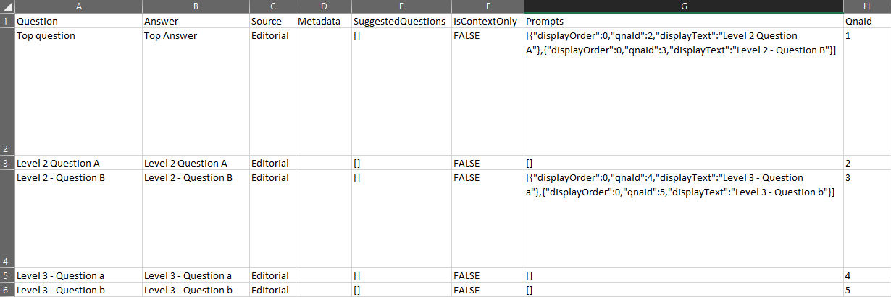

# Importing from data sources

A knowledge base consists of question and answer pairs brought in by public URLs and files.

## Data source locations

Content is brought into a knowledge base from a data source. Data source locations are **public URLs or files**, which do not require authentication.

[SharePoint files](../how-to/add-sharepoint-datasources.md), secured with authentication, are the exception. SharePoint resources must be files, not web pages. If the URL ends with a web extension, such as .ASPX, it will not import into QnA Maker from SharePoint.

## Chit chat content

The Chit chat QnA content set is offered as a complete content data source in several languages and conversational styles. This can be a starting point for your bot's personality, and it will save you the time and cost of writing them from scratch. Learn [how to add](../how-to/chit-chat-knowledge-base.md) this content set to your knowledge base.

## Structured data format through import

Importing a knowledge base replaces the content of the existing knowledge base. Import requires a structured `.tsv` file that contains questions and answer. This information helps QnA Maker group the question-answer pairs and attribute them to a particular data source.

| Question  | Answer  | Source| Metadata (1 key: 1 value) |
|-----------|---------|----|---------------------|
| Question1 | Answer1 | Url1 | <code>Key1:Value1 &#124; Key2:Value2</code> |
| Question2 | Answer2 | Editorial|    `Key:Value`       |

## Structured multi-turn format through import

You can creating the multi-turn conversations in a `.tsv` file format. The format provides you with the ability to create the multi-turn conversations by analyzing previous chat logs (with other processes, not using QnA Maker), then create the `.tsv` file through automation. Import the file to replace the existing knowledge base.

> [!div class="mx-imgBorder"]
> 

The column for a multi-turn `.tsv`, specific to multi-turn is **Prompts**. An example `.tsv`, shown in Excel, show the information to include to define the multi-turn children:

```JSON
[
    {"displayOrder":0,"qnaId":2,"displayText":"Level 2 Question A"},
    {"displayOrder":0,"qnaId":3,"displayText":"Level 2 - Question B"}
]
```

The **displayOrder** is numeric and the **displayText** is text that shouldn't include markdown.

> [!div class="mx-imgBorder"]
> 

## Export as example

If you are unsure how to represent your QnA pair in the `.tsv` file:
* Use this [downloadable example from GitHub](https://github.com/Azure-Samples/cognitive-services-sample-data-files/blob/master/qna-maker/data-source-formats/Structured-multi-turn-format.xlsx?raw=true)
* Or create the pair in the QnA Maker portal, save, then export the knowledge base for an example of how to represent the pair.

## Next steps

> [!div class="nextstepaction"]
> [Development lifecycle of a knowledge base](./development-lifecycle-knowledge-base.md)

## See also

Use the QnA Maker [Markdown reference](../reference-markdown-format.md) to help you format your answers.

[QnA Maker overview](../Overview/overview.md)

Create and edit a knowledge base with:
* [REST API](https://docs.microsoft.com/rest/api/cognitiveservices/qnamaker/knowledgebase)
* [.NET SDK](https://docs.microsoft.com/dotnet/api/microsoft.azure.cognitiveservices.knowledge.qnamaker.knowledgebase?view=azure-dotnet)

Generate an answer with:
* [REST API](https://docs.microsoft.com/rest/api/cognitiveservices/qnamakerruntime/runtime/generateanswer)
* [.NET SDK](https://docs.microsoft.com/dotnet/api/microsoft.azure.cognitiveservices.knowledge.qnamaker.runtime?view=azure-dotnet)
