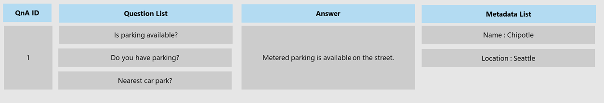
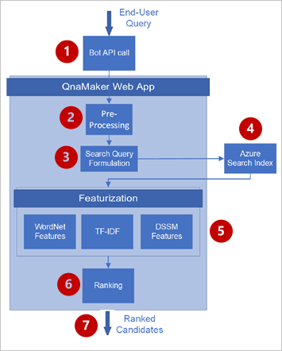

# What is a QnA Maker Knowledge base?

A QnA Maker knowledge base consists of a set of question/answer (QnA) pairs and optional metadata associated with each QnA pair.

## Key knowledge base concepts

* **Questions** - A question contains text that best represents a user query. 
* **Answers** - An answer is the response that is returned when a user query is matched with the associated question.  
* **Metadata** - Metadata are tags associated with a QnA pair and are represented as key-value pairs. Metadata tags are used to filter QnA pairs and limit the set over which query matching is performed.

A single QnA, represented by a numeric QnA ID, has multiple variants of a question (alternate questions) that all map to a single answer. Additionally, each such pair can have multiple metadata fields associated with it: one key, and one value.

 

## Knowledge base content format

When you ingest rich content into a knowledge base, QnA Maker attempts to convert the content to markdown. Read [this](https://aka.ms/qnamaker-docs-markdown-support) blog to understand the markdown formats understandable by most chat clients.

Metadata fields consist of key-value pairs separated by a colon **(Product:Shredder)**. Both key and value must be text-only. The metadata key must not contain any spaces. Metadata supports only one value per key.

## How QnA Maker processes a user query to select the best answer

The trained and [published](/azure/cognitive-services/qnamaker/quickstarts/create-publish-knowledge-base#publish-the-knowledge-base) QnA Maker knowledge base receives a user query, from a bot or other client application, at the [GenerateAnswer API](/azure/cognitive-services/qnamaker/how-to/metadata-generateanswer-usage). The following diagram illustrates the process when the user query is received.

The process is explained in the following table:

|Step|Purpose|
|--|--|
|1|The client application sends the user query to the [GenerateAnswer API](/azure/cognitive-services/qnamaker/how-to/metadata-generateanswer-usage).|
|2|Qna Maker preprocessing the user query with language detection, spellers, and word breakers.|
|3|This preprocessing is taken to alter user query for best search results.|
|4|This altered query is sent to Azure Search Index, receiving the `top` number of results. If the correct answer isn't in these results, increase the value of `top` slightly. Generally a value of 10 for `top` works in 90% of queries.|
|5|QnA Maker applies advanced featurization to determine the correctness of the fetched Azure Search results for user query. |
|6|The trained ranker model uses the feature score, from step 5, to rank the Azure Search results.|
|7|The new results are returned to the client application in ranked order.|
|||

Features used include but are not limited to word-level semantics, term-level importance in a corpus, and deep learned semantic models to determine similarity and relevance between two text strings.

## Next steps

> [!div class="nextstepaction"]
> [Development lifecycle of a knowledge base](./development-lifecycle-knowledge-base.md)

## See also

[QnA Maker overview](../Overview/overview.md)
