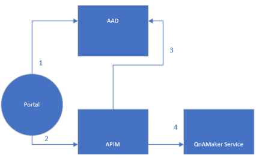

# Collaborate with other authors and editors

Collaborate with other authors and editors using role-based access control (RBAC) placed on your QnA Maker resource.

## Access is provided on the QnA Maker resource

All permissions are controlled by the permissions placed on the QnA Maker resource. These permissions align to read, write, publish, and full access.

This RBAC feature includes:
* Azure Active Directory (AAD) is 100% backward compatible with key-based authentication for owners and contributors. Customers can use either key-based authentication or RBAC-based authentication in their requests.
* Quickly add authors and editors to all knowledge bases in the resource because control is at the resource level, not at the knowledge base level.

## Access is provided by a defined role

[!INCLUDE [RBAC permissions table](../includes/role-based-access-control.md)]

## Authentication flow

The following diagram shows the flow, from the author's perspective, for signing into the QnA Maker portal and using the authoring APIs.

> [!div class="mx-imgBorder"]
> 

|Steps|Description|
|--|--|
|1|Portal Acquires token for QnA Maker resource.|
|2|Portal Calls the appropriate QnA Maker authoring API (APIM) passing the token instead of keys.|
|3|QnA Maker API validates the token.|
|4 |QnA Maker API calls QnAMaker Service.|

If you intend to call the [authoring APIs](../How-To/collaborate-knowledge-base.md), learn more about how to set up authentication.

## Authenticate by QnA Maker portal

If you author and collaborate using the QnA Maker portal, after you [add the appropriate role to the resource for a collaborator](../How-To/collaborate-knowledge-base.md), the QnA Maker portal manages all the access permissions.

## Authenticate by QnA Maker APIs and SDKs

If you author and collaborate using the APIs, either through REST or the SDKs, you need to [create a service principal](../../authentication.md#assign-a-role-to-a-service-principal) to manage the authentication.

## Next step

* Design a knowledge base for [languages](design-language-culture.md) and for [client applications](integration-with-other-applications.md)
