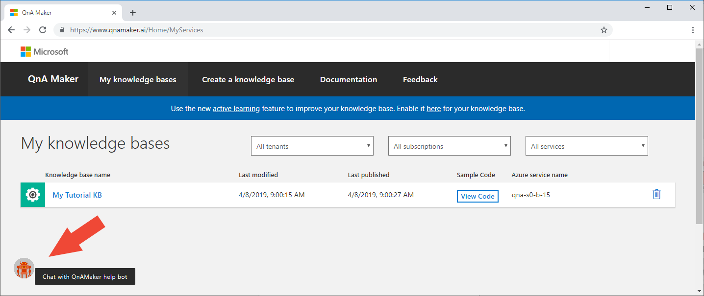
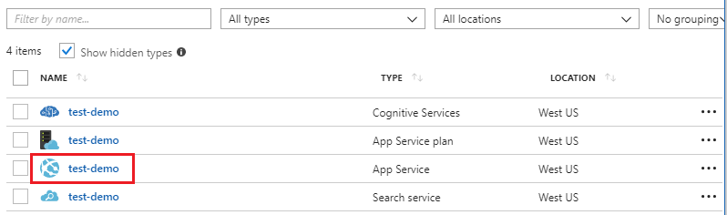
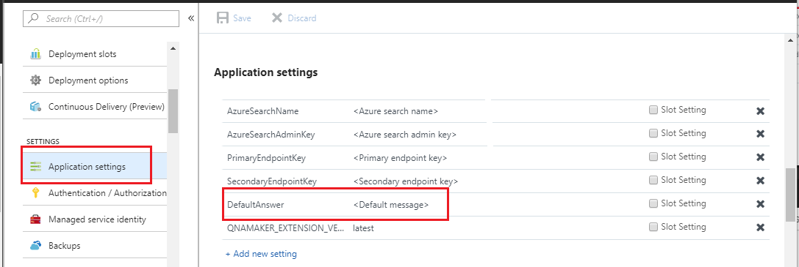
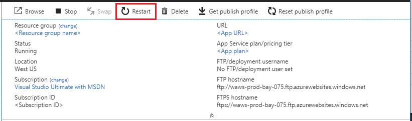

# Frequently Asked Questions for QnA Maker

The curated list of the most frequently asked questions regarding the QnA Maker service will help you adopt the service faster and with better results.

## Use the Help bot in the QnA Maker portal

QnA Maker provides a **Help** bot within the QnA Maker portal to help you. The help bot is available on every web page. The bot uses QnA Maker to provide answers and provides the [C# Bot Framework code project](https://github.com/Microsoft/BotBuilder-Samples/tree/master/experimental/csharp_dotnetcore/qnamaker-support-bot) to the bot so you can quickly get up and running with your own answer bot. 

](./media/qnamaker-faq/use-qna-maker-help-bot-to-learn-qna-maker-service.png#lightbox)

## Manage the knowledge base

### I accidentally deleted a part of my QnA Maker, what should I do? 

All deletes are permanent, including question and answer pairs, files, URLs, custom questions and answers, knowledge bases, or Azure resources. Make sure you export your knowledge base from the **Settings** page before deleting any part of your knowledge base. 

### Why is my URL(s)/file(s) not extracting question-answer pairs?

It's possible that QnA Maker can't auto-extract some question-and-answer (QnA) content from valid FAQ URLs. In such cases, you can paste the QnA content in a .txt file and see if the tool can ingest it. Alternately, you can editorially add content to your knowledge base through the [QnA Maker portal](https://qnamaker.ai).

### How large a knowledge base can I create?

The size of the knowledge base depends on the SKU of Azure search you choose when creating the QnA Maker service. Read [here](./Tutorials/choosing-capacity-qnamaker-deployment.md) for more details.

### Why can't I see anything in the drop-down when I try to create a new knowledge base?

You haven't created any QnA Maker services in Azure yet. Read [here](./How-To/set-up-qnamaker-service-azure.md) to learn how to do that.

### How do I share a knowledge base with others?

Sharing works at the level of a QnA Maker service, that is, all knowledge bases in the service will be shared. Read [here](./How-To/collaborate-knowledge-base.md) how to collaborate on a knowledge base.

### Can you share a knowledge base with a contributor that is not in the same AAD tenant, to modify a knowledge base? 

Sharing is based on Azure role-based access control (RBAC). If you can share _any_ resource in Azure with another user, you can also share QnA Maker.

### If you have an App Service Plan with 5 QnAMaker knowledge bases. Can you assign read/write rights to 5 different users so each of them can access only 1 QnAMaker knowledge base?

You can share an entire QnAMaker service, not individual knowledge bases.

### How can I change the default message when no good match is found?

The default message is part of the settings in your App service.
- Go to your App service resource in the Azure portal

- Click on the **Settings** option

- Change the value of the **DefaultAnswer** setting
- Restart your App service

### Why is my SharePoint link not getting extracted?

See [Data source locations](./Concepts/data-sources-supported.md#data-source-locations) for more information.

### The updates that I made to my knowledge base are not reflected on publish. Why not?

Every edit operation, whether in a table update, test, or setting, needs to be saved before it can be published. Be sure to click the **Save and train** button after every edit operation.

### Does the knowledge base support rich data or multimedia?

The knowledge base supports Markdown. However, the auto-extraction from URLs has limited HTML-to-Markdown conversion capability. If you want to use full-fledged Markdown, you can modify your content directly in the table, or upload a knowledge base with the rich content.

Multimedia, such as images and videos, is not supported at this time.

### Does QnA Maker support non-English languages?

See more details about [supported languages](./Overview/languages-supported.md).

If you have content from multiple languages, be sure to create a separate service for each language.

## Manage service

### When should I restart my app service? 

Refresh your app service when the caution icon is next to the version value for the knowledge base in the **Endpoint keys** table on the **User Settings** [page](https://www.qnamaker.ai/UserSettings).

### When should I refresh my endpoint keys?

Refresh your endpoint keys if you suspect that they have been compromised.

### Can I use the same Azure Search resource for knowledge bases using multiple languages?

To use multiple language and multiple knowledge bases, the user has to create an QnA Maker resource for each language. This will create a separate Azure search service per language. Mixing different language knowledge bases in a single Azure search service will result in degraded relevance of results.

### How can I change the name of the Azure Search resource used by QnA Maker?

The name of the Azure Search resource is the QnA Maker resource name with some random letters appended at the end. This makes it hard to distinguish between multiple Search resources for QnA Maker. Create a separate Azure Search service (naming it the way you would like to) and connect it to your QnA Service. The steps are similar to the steps you need to do to [upgrade an Azure Search](How-To/upgrade-qnamaker-service.md#upgrade-azure-search-service).

## Integrate with other services including Bots

### Do I need to use Bot Framework in order to use QnA Maker?

No, you do not need to use the [Bot Framework](https://github.com/Microsoft/botbuilder-dotnet) with QnA Maker. However, QnA Maker is offered as one of several templates in [Azure Bot Service](https://docs.microsoft.com/azure/bot-service/?view=azure-bot-service-4.0). Bot Service enables rapid intelligent bot development through Microsoft Bot Framework, and it runs in a server-less environment.

### How can I create a bot with QnA Maker?

Follow the instructions in [this](./Tutorials/create-qna-bot.md) documentation to create your Bot with Azure Bot Service.

### How do I embed the QnA Maker service in my website?

Follow these steps to embed the QnA Maker service as a web-chat control in your website:

1. Create your FAQ bot by following the instructions [here](./Tutorials/create-qna-bot.md).
2. Enable the web chat by following the steps [here](https://docs.microsoft.com/azure/bot-service/bot-service-channel-connect-webchat)

## Data storage

### What data is stored and where is it stored? 

When you create your QnA Maker service, you selected an Azure region. Your knowledge bases and log files are stored in this region. 
