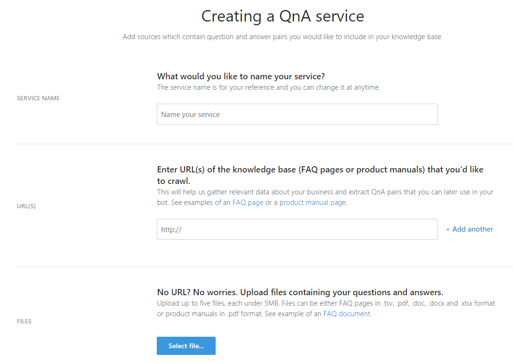

# Create your knowledge base
Creating your knowledge base is as simple as pointing the QnA Maker tool to the existing content. The tool then extracts questions and answers.

## Types of input
Currently, the tool can auto-extract question-and-answer (QnA) pairs from two types of input: FAQ pages and product manuals.

### FAQ pages
The tool supports extraction from the following types of FAQ URLs:
- Plain FAQ pages: Questions are immediately followed by answers. [See an example](https://support.microsoft.com/help/17133/windows-8-bitlocker-recovery-keys-frequently-asked-questions).
- FAQ pages with section links: Questions are aggregated and linked to answers on the same page. [See an example](http://support.xbox.com/my-account/microsoft-account/manage-your-microsoft-account-faq#0a16820105c847acb050fc1ba7dd2ad3).
- FAQ pages with linked answers: Questions are aggregated and linked to answers on a different page. [See an example](https://www.copyright.gov/help/faq/index.html). 

The tool also supports extraction from offline doc types (.docx, .doc, .pdf, .xlsx, and .tsv). Auto-extraction works best on FAQ pages that have a clear QnA structure and semantics such as:

- Questions that end with "?"
- Questions that contain interrogative words such as "why," "what," and "how"

### Product manuals
The tool supports extraction of QnA pairs from PDF-format product manuals. Manuals are typically guidance material that accompanies a product and helps the user set up, use, maintain, and troubleshoot it. QnA Maker extracts the headings and subheadings as questions and subsequent content as answers, thus creating a knowledge base from these large documents. 

Auto-extraction works best on manuals that have a table of contents and/or an index page, and a clear structure with hierarchical headings. Note that multimedia extraction is not supported at this time.

If QnA pairs are not auto-extracted, you can editorially add them later. 

## Steps to create a knowledge base
1. In QnA Maker, select **Create new service**.

   

2. Add sources for your knowledge base.

   

3. Select **Create**.

   

That’s it--your knowledge base has been created. Now you can choose to test, update, or publish.