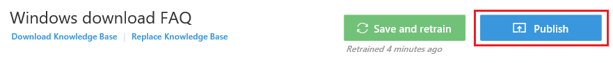

# Publish your knowledge base #
Once satisfied with the content and relevance of your knowledge base, you can proceed to publishing it as a service. Click on the Publish button.

## Step 1 - Preview ##
Before the final publish, you can preview the changes that will affect the knowledge base on final publish. Download the diff file to see what changes will be published.

## Step 2 - Publish ##
Once satisfied with the preview, click on Publish.

