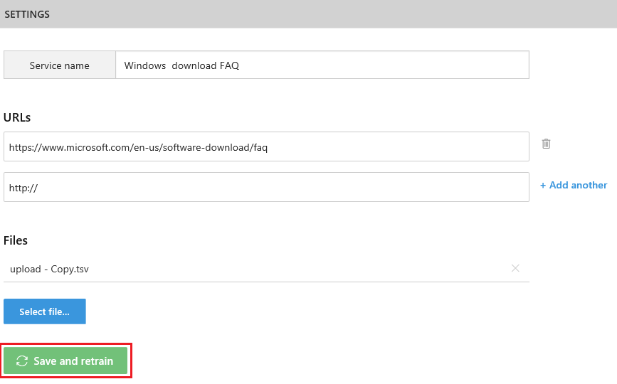

# Update your knowledge base
There are several ways you might want to update your knowledge base. Choose what is appropriate from the below methods.

## Editorial QnA updates
Edit the QnA table directly. In addition, you can add/delete a QnA Pair, or add an alteration of an existing QnA pair. This is ideal for quick editorial fixes to your knowledge base

To save your changes, press Save and retrain button.

## Update the sources ##
If you need to update the sources of data of your knowledge base, go to the settings tab and update the sources.

Once done with changes, click on Save and retrain

## Download and upload
There is also a way to replace your entire knowledge base at one go. This is ideal for bulk updates to your knowledge base. Upload KB expects file format of tab separated columns of Question, Answer and Source.

You have an option to download the entire knowledge base by clicking on Download Knowledge Base, make changes, and then upload the knowledge base.

>[!WARNING]
>Uploading a knowledge base overwrites the existing QnAs in the knowledge base.

To save your changes, press Save and retrain button.

