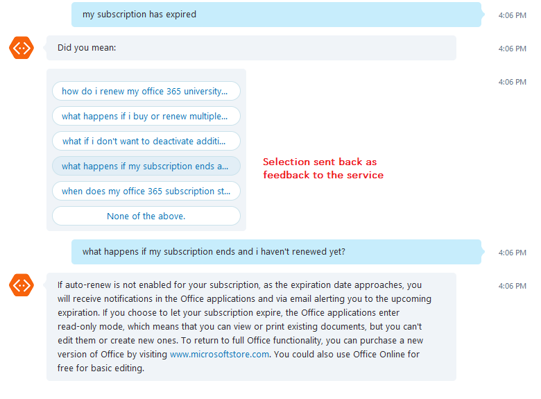

# Active Learning #
So far, figuring out the different ways users can ask a question has been the responsibility of the Bot developer.

With the new Active Learning feature, your users can now help you auto-learn question variations and get them added to your knowledge base.

Active learning uses two new additions to QnAMaker, the new QnAMakerDialog and the Train API.

## QnAMakerDialog ##
The new [QnAMakerDialog](https://github.com/Microsoft/BotBuilder-CognitiveServices) now does the following:
* Get the TopN matches from the QnA service for every query above the threshold set.
* If the top result confidence score is significantly more than the rest of the results, show only the top answer.
* If the TopN results have similar confidence scores, then show the [prompt dialog](https://docs.microsoft.com/en-us/bot-framework/nodejs/bot-builder-nodejs-dialog-prompt) with TopN questions.
* Once the user selects the right question that matches intent, show the answer for that corresponding question.
* This selection also triggers a feedback into the QnAMaker service via the  [Train API](https://westus.dev.cognitive.microsoft.com/docs/services/58994a073d9e04097c7ba6fe/operations/58edd31c3d9e041ffcef000f), described below.

## Train API ##
The [Train API](https://westus.dev.cognitive.microsoft.com/docs/services/58994a073d9e04097c7ba6fe/operations/58edd31c3d9e041ffcef000f) is used to register feedback from users.

It accepts the following inputs:
* **userId**:	A unique identifier to distinguish feedback from different users.
* **userQuestion**:	Question asked by user (user utterance).
* **kbQuestion**:	Question field from the correct question-answer pair for userQuestion. This field should exactly match the question present in the knowledge base.
* **kbAnswer**:	Answer field from the correct question-answer pair for userQuestion. This field should exactly match the answer present in the knowledge base.

## How it works ##
### Learning new alterations ###
Based on the training data provided, the service also learns new alterations (synonyms).

For example, words like "onedrive" "one drive" and "delete" "remove" can be grouped as synonyms by the active learning, based on the feedback given.

You can see the alterations learnt by the service by calling the [Download Alteration API](https://westus.dev.cognitive.microsoft.com/docs/services/58994a073d9e04097c7ba6fe/operations/597804332bcd591200beb3a1). You can also manage and add custom alterations to your KB via the [Update Alterations API](https://westus.dev.cognitive.microsoft.com/docs/services/58994a073d9e04097c7ba6fe/operations/597804082bcd591200beb3a0)

### Learning new QnAs ###
Once enough unique users give similar feedback, the service automatically adds a new learnt QnA pair to the KB. The bot developer can still review and edit these learnt QnAs before publishing to production.

To safeguard against fraud feedback, the system requires that similar feedback has been provided by a bunch of unique users (identified by userid in the Train API).

The active learning process kicks in after every 50 feedbacks sent to the service via the [Train API](https://westus.dev.cognitive.microsoft.com/docs/services/58994a073d9e04097c7ba6fe/operations/58edd31c3d9e041ffcef000f).

In both the above cases, the learnt QnAs and the alterations need to be published explicitly by the developer, to impact the production endpoint. This step gives you a change to review the active learning changes before impacting your users.

