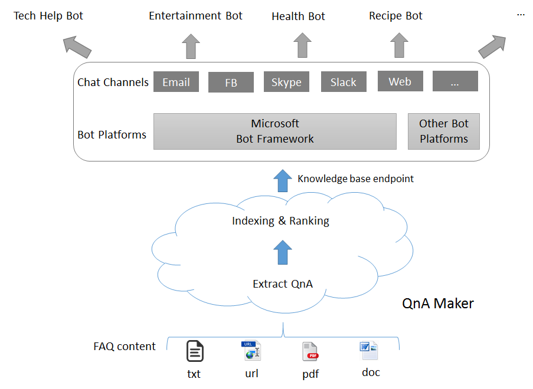

# QnA Maker Overview #
One of the basic requirements in writing your own Bot service is to seed it with questions and answers. In many cases, the questions and answers already exist in content like FAQ URLs/documents, etc.

Microsoft QnA Maker is a free, easy-to-use, REST API and web-based service that trains AI to respond to user's questions in a more natural, conversational way. Compatible across development platforms, hosting services, and channels, QnA Maker is the only question and answer service with a graphical user interface—meaning you don’t need to be a developer to train, manage, and use it for a wide range of solutions.

With optimized machine learning logic and the ability to integrate industry-leading language processing with ease, QnA Maker distills masses of information into distinct, helpful answers.

