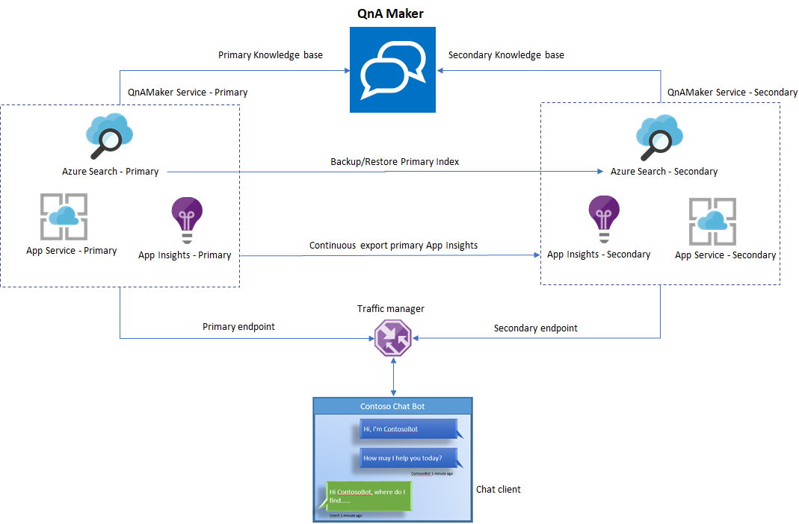

# Create a business continuity plan for your QnA Maker service

The primary objective of the business continuity plan is to create a resilient knowledge base endpoint, which would ensure no down time for the Bot or the application consuming it.

The high-level idea as represented above is as follows:

1. Set up two parallel [QnA Maker services](../How-To/set-up-qnamaker-service-azure.md) in [Azure paired regions](https://docs.microsoft.com/azure/best-practices-availability-paired-regions).

2. Keep the primary and secondary Azure search indexes in sync. Use the github sample [here](https://github.com/pchoudhari/QnAMakerBackupRestore) to see how to backup-restore Azure indexes.

3. Back up the Application Insights using [continuous export](https://docs.microsoft.com/azure/application-insights/app-insights-export-telemetry).

4. Once the primary and secondary stacks have been set up, use [traffic manager](https://docs.microsoft.com/azure/traffic-manager/) to configure the two endpoints and set up a routing method.

5. You would need to create an SSL certificate for your traffic manager endpoint. [Bind the SSL certificate](https://docs.microsoft.com/azure/app-service/app-service-web-tutorial-custom-ssl) in your App services.

6. Finally, use the traffic manager endpoint in your Bot or App.

## Next steps

> [!div class="nextstepaction"]
> [Choose capacity for your QnA Maker deployment](../Tutorials/choosing-capacity-qnamaker-deployment.md)
