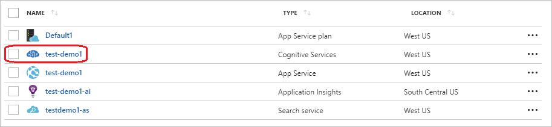
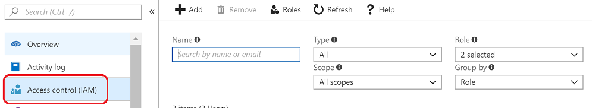
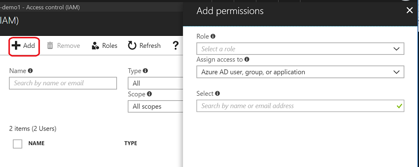

# Collaboration with authors and editors

Collaboration is provided at the QnA Maker resource level to allow you to restrict collaborator access based on the collaborator's role. Learn more about QnA Maker collaborator authentication [concepts](../Concepts/role-based-access-control.md).

## Add Azure role-based access control (Azure RBAC) to your QnA Maker resource

QnA Maker allows multiple people to collaborate on all knowledge bases in the same QnA Maker resource. This feature is provided with the [Azure role-based access control (Azure RBAC)](../../../active-directory/role-based-access-control-configure.md).

## Access at the QnA Maker resource level

You cannot share a particular knowledge base in a QnA Maker service. If you want more granular access control, consider distributing your knowledge bases across different QnA Maker resources, then add roles to each resource.

## Add role to resource

### Add a user account to the QnA Maker resource

The following steps use the collaborator role but any of the [roles](../reference-role-based-access-control.md) can be added using these steps

1. Sign in to the [Azure](https://portal.azure.com/) portal, and go to your QnA Maker resource.

    

1. Go to the **Access Control (IAM)** tab.

    

1. Select **Add**.

    

1. Select a role from the following list:

    |Role|
    |--|
    |Owner|
    |Contributor|
    |Cognitive Services QnA Maker Reader|
    |Cognitive Services QnA Maker Editor|
    |Cognitive Services User|

    :::image type="content" source="../media/qnamaker-how-to-collaborate-knowledge-base/qnamaker-add-role-iam.png" alt-text="QnA Maker IAM add role.":::

1. Enter the user's email address and press **Save**.

    

### View QnA Maker knowledge bases

When the person you shared your QnA Maker service with logs into the [QnA Maker portal](https://qnamaker.ai), they can see all the knowledge bases in that service based on their role.

When they select a knowledge base, their current role on that QnA Maker resource is visible next to the knowledge base name.

:::image type="content" source="../media/qnamaker-how-to-collaborate-knowledge-base/qnamaker-knowledge-base-role-name.png" alt-text="Screenshot of knowledge base in Edit mode with role name in parentheses next to knowledge base name in top-left corner of web page.":::

## Next steps

> [!div class="nextstepaction"]
> [Test a knowledge base](./test-knowledge-base.md)

Learn more about collaboration:
* [Azure](../../../active-directory/role-based-access-control-configure.md) role-based access control
* QnA Maker role-based access control [concepts](../Concepts/role-based-access-control.md)
