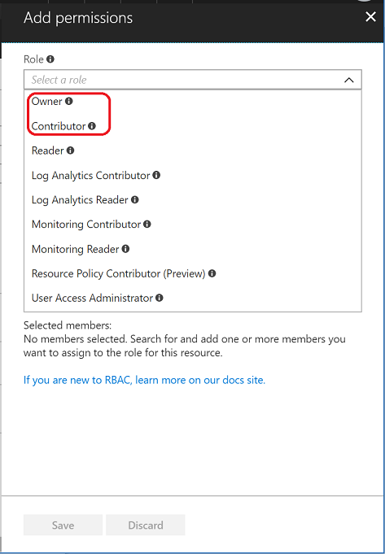
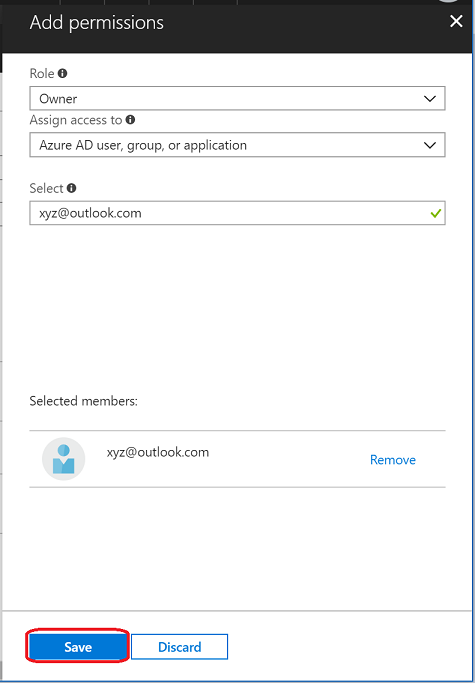

# Collaborate on your knowledge base

QnA Maker allows multiple people to collaborate on all knowledge bases in the same QnA Maker resource. This feature is provided with the Azure [Role-Based Access Control](https://docs.microsoft.com/azure/active-directory/role-based-access-control-configure).

Perform the following steps to share your QnA Maker service with someone:

1. Sign in to the Azure portal, and go to your QnA Maker resource.

    

1. Go to the **Access Control (IAM)** tab.

    

1. Select **Add**.

    

1. Select the **Owner** or the **Contributor** role. You cannot grant read-only access through Role-Based Access Control. Owner and Contributor roles have read-write access permissions to the QnA Maker service.

    

1. Enter the user's email address and press **Save**.

    

When the person, you shared your QnA Maker service with, logs into the [QnA Maker portal](https://qnamaker.ai) they can see all the knowledge bases in that service.

Remember, you cannot share a particular knowledge base in a QnA Maker service. If you want more granular access control, consider distributing your knowledge bases across different QnA Maker services.

## Next steps

> [!div class="nextstepaction"]
> [Test a knowledge base](./test-knowledge-base.md)
