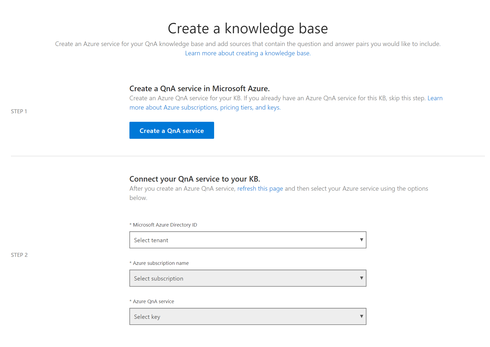
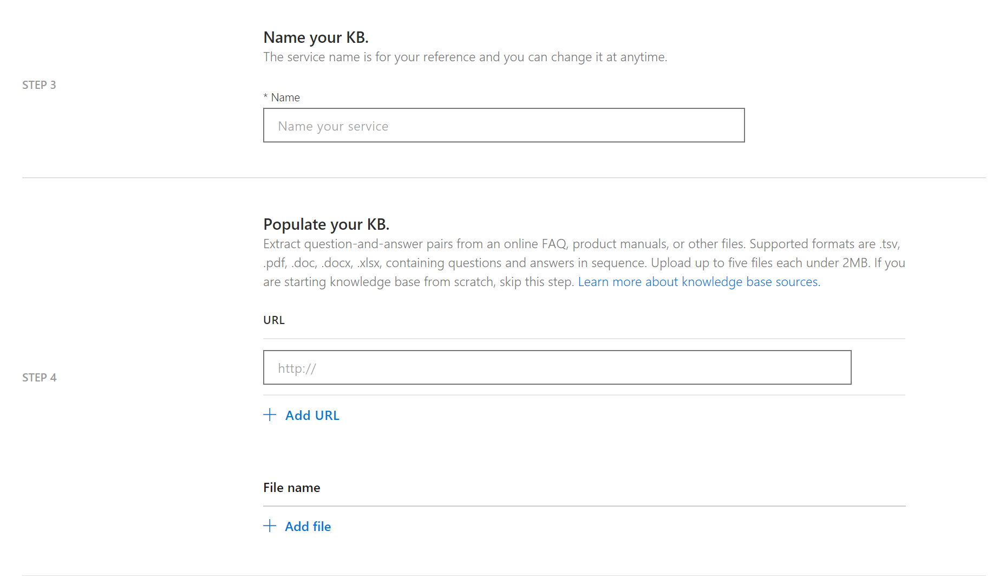
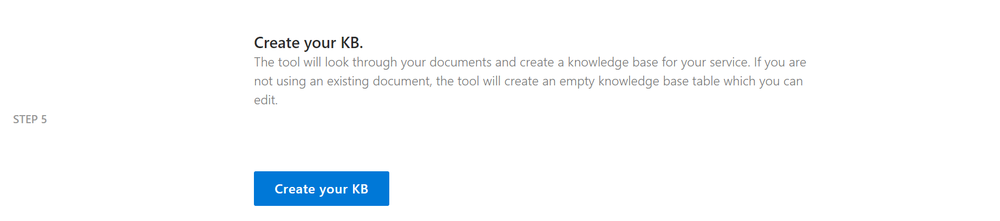
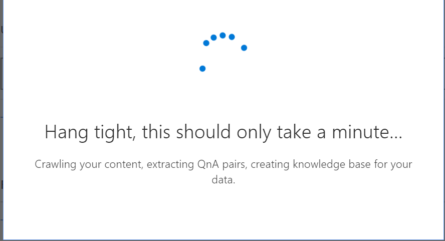

# Create a knowledge base

QnA Maker makes it simple to add your existing data sources when creating a knowledge base. You can create a new QnA Maker knowledge base from the following document types:

<!-- added for scanability -->
* FAQ pages
* Products manuals
* Structured documents

## Steps

1. Sign into to the [QnA Maker portal](https://qnamaker.ai) with your Azure credentials and select **Create a knowledge base**.

2. If you have not already created a QnA Maker service, select **Create a QnA service**. 

3. Select your Azure tenant, Azure subscription name, and Azure resource name associated with the QnA Maker service from the lists in **Step 2** in the QnA Maker portal. Select the Azure QnA Maker service that will host the Knowledge Base.

    

4. Enter the name of your knowledge base and the data sources for the new knowledge base.

    

    - Give your service a **name.** Duplicate names and special characters are supported.
    - Add URLs for data you want extracted. See more information on the types of sources supported [here](../Concepts/data-sources-supported.md).
    - Upload files for data you want extracted. See the [pricing information](https://aka.ms/qnamaker-pricing) to see how many documents you can add.
    - If you want to manually add QnAs, you can skip **Step 4** shown in the preceding image.

5. Add **Chit-chat** to your KB. Choose to add chit-chat support for your bot, by choosing from one of the 3 pre-defined personalities. 

    <!-- TBD: add back in when chit chat how-to is merged
    
    -->

6. Select **Create your KB**.

    

7. It takes a few minutes for data to be extracted.

    

8. When your Knowledge Base is successfully created, you are redirected to the **Knowledge base** page.

## Next steps

> [!div class="nextstepaction"]
> [Add chit-chat personal](./chit-chat-knowledge-base.md)
