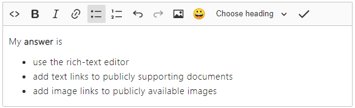

# Edit QnA sets in your knowledge base

QnA Maker allows you to manage the content of your knowledge base by providing an easy-to-use editing experience.

QnA sets are added from a datasource, such as a file or URL, or added as an editorial source. An editorial source indicates the QnA set was added in the QnA portal manually. All QnA sets are available for editing.

## Add an editorial QnA set

1. Sign in to the [QnA portal](https://www.qnamaker.ai/), then select the knowledge base to add the QnA set to.
1. On the **EDIT** page of the knowledge base, select **Add QnA set** to add a new QnA set.

    > [!div class="mx-imgBorder"]
    > 

1. In the new QnA set row, add the required question and answer fields. The other fields are optional. All fields can be changed at any time.

    > [!div class="mx-imgBorder"]
    > 

1. Use the rich-text editor to write and format text and save as markdown.

    > [!div class="mx-imgBorder"]
    > 

    |Rich-text editor features
    |--|
    |Toggle between rich-text editor and markdown. `<>`|
    |Bold. **B**|
    |Italics, indicated with an italicized **_I_**|
    |Link - add link to a public URL. |
    |Unordered list|
    |Ordered list|
    |Undo|
    |Redo|
    |Image - add an image available from a public URL.|
    |Emoticon - add from a selection of markdown emoticons.|
    |Header style|

1. Optionally, add **alternate phrasing**. Alternate phrasing is any form of the question that is significantly different from the original question but should provide the same answer.

    When your knowledge base is published, and you have active learning turned on, QnA Maker collects alternate phrasing choices for you to accept. These choices are selected in order to increase the prediction accuracy.

1. Optionally, add **metadata**. To view metadata, select **View options** in the context menu. Metadata provides filters to the answers that the client application, such as a chat bot, provides.

1. Optionally, add **follow-up prompts**. Follow-up prompts provide additional conversation paths to the client application to present to the user.

1. Select **Save and train** to see predictions including the new QnA set.

## Edit a QnA set

Any field in any QnA set can be edited, regardless of the original data source. Some fields may not be visible due to your current **View Options** settings, found in the context tool bar.

## Delete a QnA set

To delete a QnA, click the **delete** icon on the far right of the QnA row. This is a permanent operation. It can't be undone. Consider exporting your KB from the **Publish** page before deleting sets.

## Find the QnA set ID

If you need to find the QnA set ID, you can find it in two places:

* Hover on the delete icon on the QnA set row you are interested in. The hover text includes the QnA set ID.
* Export the knowledge base. Each QnA set in the knowledge base includes the QnA set ID.

## Add alternate questions

Add alternate questions to an existing QnA set to improve the likelihood of a match to a user query.

## Add metadata

Add metadata sets by first selecting **View options**, then selecting **Show metadata**. This displays the metadata column. Next, select the **+** sign to add a metadata set. This set consists of one key and one value.

## Save changes to the QnA sets

Periodically select **Save and train** after making edits to avoid losing changes.

## Next steps

> [!div class="nextstepaction"]
> [Collaborate on a knowledge base](./collaborate-knowledge-base.md)

* [Manage Azure resources used by QnA Maker](set-up-qnamaker-service-azure.md)