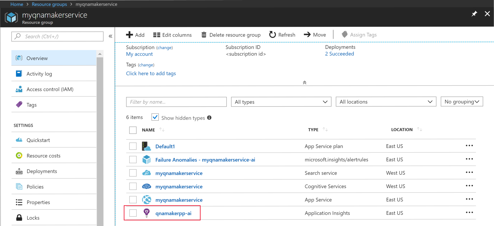
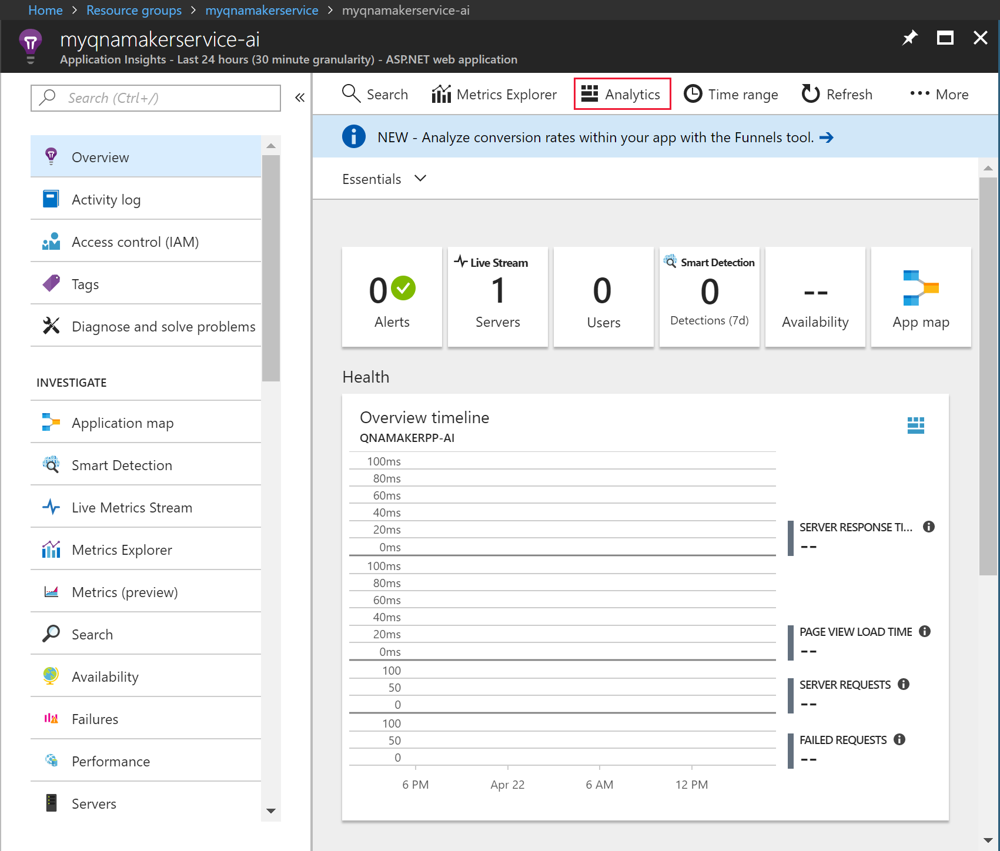

# Get analytics on your knowledge base

QnA Maker stores all chat logs and other telemetry, if you have enabled App Insights during the [creation of your QnA Maker service](./set-up-qnamaker-service-azure.md). Run the sample queries to get your chat logs from App Insights.

1. Go to your App Insights resource.

    

2. Select **Analytics**. A new window opens where you can query QnA Maker telemetry.

    

3. Paste in the following query and run it.

    ```query
        requests
        | where url endswith "generateAnswer"
        | project timestamp, id, name, resultCode, duration
        | parse kind = regex name with *"(?i)knowledgebases/"KbId"/generateAnswer"
        | join kind= inner (
        traces | extend id = operation_ParentId
        ) on id
        | extend question = tostring(customDimensions['Question'])
        | extend answer = tostring(customDimensions['Answer'])
        | project KbId, timestamp, resultCode, duration, question, answer
    ```

    Select **Run** to run the query.

    

## Run queries for other analytics on your QnA Maker knowledge base

### Total 90-day traffic

```query
    //Total Traffic
    requests
    | where url endswith "generateAnswer" and name startswith "POST"
    | parse kind = regex name with *"(?i)knowledgebases/"KbId"/generateAnswer" 
    | summarize ChatCount=count() by bin(timestamp, 1d), KbId
```

### Total question traffic in a given time period

```query
    //Total Question Traffic in a given time period
    let startDate = todatetime('2018-02-18');
    let endDate = todatetime('2018-03-12');
    requests
    | where timestamp <= endDate and timestamp >=startDate
    | where url endswith "generateAnswer" and name startswith "POST" 
    | parse kind = regex name with *"(?i)knowledgebases/"KbId"/generateAnswer" 
    | summarize ChatCount=count() by KbId
```

### User traffic

```query
    //User Traffic
    requests
    | where url endswith "generateAnswer"
    | project timestamp, id, name, resultCode, duration
    | parse kind = regex name with *"(?i)knowledgebases/"KbId"/generateAnswer"
    | join kind= inner (
    traces | extend id = operation_ParentId 
    ) on id
    | extend UserId = tostring(customDimensions['UserId'])
    | summarize ChatCount=count() by bin(timestamp, 1d), UserId, KbId
```

### Latency distribution of questions

```query
    //Latency distribution of questions
    requests
    | where url endswith "generateAnswer" and name startswith "POST"
    | parse kind = regex name with *"(?i)knowledgebases/"KbId"/generateAnswer"
    | project timestamp, id, name, resultCode, performanceBucket, KbId
    | summarize count() by performanceBucket, KbId
```

## Next steps

> [!div class="nextstepaction"]
> [Manage keys](./key-management.md)
