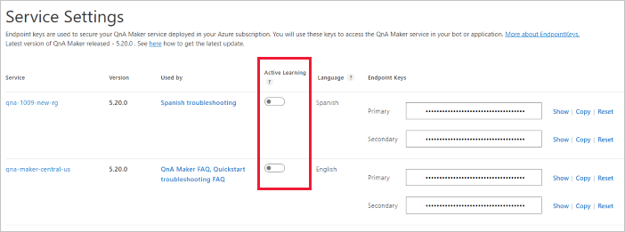
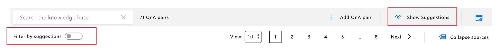
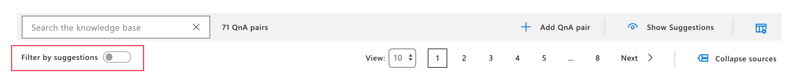
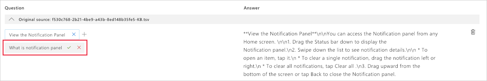

# Use active learning to improve your knowledge base

Active learning allows you to improve the quality of your knowledge base by suggesting alternative questions, based on user-submissions, to your question and answer pair. You review those suggestions, either adding them to existing questions or rejecting them. 

Your knowledge base doesn't change automatically. In order for any change to take effect, you must accept the suggestions. These suggestions add questions but don't change or remove existing questions.

## What is active learning?

QnA Maker learns new question variations with implicit and explicit feedback.
 
* [Implicit feedback](#how-qna-makers-implicit-feedback-works) – The ranker understands when a user question has multiple answers with scores that are very close and considers this as feedback. You don't need to do anything for this to happen.
* [Explicit feedback](#how-you-give-explicit-feedback-with-the-train-api) – When multiple answers with little variation in scores are returned from the knowledge base, the client application asks the user which question is the correct question. The user's explicit feedback is sent to QnA Maker with the [Train API](#train-api). 

Both methods provide the ranker with similar queries that are clustered.

## How active learning works

Active learning is triggered based on the scores of the top few answers returned by QnA Maker. If the score differences lie within a small range, then the query is considered a possible suggestion (as an alternate question) for each of the possible QnA pairs. Once you accept the suggested question for a specific QnA pair, it is rejected for the other pairs. You need to remember to save and train, after accepting suggestions.

Active learning gives the best possible suggestions in cases where the endpoints are getting a reasonable quantity and variety of usage queries. When 5 or more similar queries are clustered, every 30 minutes, QnA Maker suggests the user-based questions to the knowledge base designer to accept or reject. All the suggestions are clustered together by similarity and top suggestions for alternate questions are displayed based on the frequency of the particular queries by end users.

Once questions are suggested in the QnA Maker portal, you need to review and accept or reject those suggestions. There isn't an API to manage suggestions.

## How QnA Maker's implicit feedback works

QnA Maker's implicit feedback uses an algorithm to determine score proximity then make active learning suggestions. The algorithm to determine proximity is not a simple calculation. The ranges in the following example are not meant to be fixed but should be used as a guide to understand the impact of the algorithm only.

When a question's score is highly confident, such as 80%, the range of scores that are considered for active learning are wide, approximately within 10%. As the confidence score decreases, such as 40%, the range of scores decreases as well, approximately within 4%. 

## How you give explicit feedback with the Train API

It is important that QnA Maker gets explicit feedback about which of the answers was the best answer. How the best answer is determined is up to you and can include:

* User feedback, selecting one of the answers.
* Business logic, such as determining an acceptable score range.  
* A combination of both user feedback and business logic.

## Upgrade your runtime version to use active learning

Active Learning is supported in runtime version 4.4.0 and above. If your knowledge base was created on an earlier version, [upgrade your runtime](troubleshooting-runtime.md#how-to-get-latest-qnamaker-runtime-updates) to use this feature. 

## Turn on active learning to see suggestions

Active learning is off by default. Turn it on to see suggested questions. After you turn on active learning, you need to send information from the client app to QnA Maker. For more information, see [Architectural flow for using GenerateAnswer and Train APIs from a bot](#architectural-flow-for-using-generateanswer-and-train-apis-from-a-bot).

1. Select **Publish** to publish the knowledge base. Active learning queries are collected from the GenerateAnswer API prediction endpoint only. The queries to the Test pane in the QnA Maker portal do not impact active learning.

1. To turn active learning on in the QnA Maker portal, go to the top-right corner, select your **Name**, go to [**Service Settings**](https://www.qnamaker.ai/UserSettings).  

    


1. Find the QnA Maker service then toggle **Active Learning**. 

    [](../media/improve-knowledge-base/turn-active-learning-on-at-service-setting.png#lightbox)

    Once **Active Learning** is enabled, the knowledge base suggests new questions at regular intervals based on user-submitted questions. You can disable **Active Learning** by toggling the setting again.

## Accept an active learning suggestion in the knowledge base

1. In order to see the suggested questions, on the **Edit** knowledge base page, select **View Options**, then select **Show active learning suggestions**. 

    [](../media/improve-knowledge-base/show-suggestions-button.png#lightbox)

1. Filter the knowledge base with question and answer pairs to show only suggestions by selecting **Filter by Suggestions**.

    [](../media/improve-knowledge-base/filter-by-suggestions.png#lightbox)

1. Each QnA pair suggests the new question alternatives with a check mark, `✔` , to accept the question or an `x` to reject the suggestions. Select the check mark to add the question. 

    [](../media/improve-knowledge-base/accept-active-learning-suggestions.png#lightbox)

    You can add or delete _all suggestions_ by selecting **Add all** or **Reject all** in the contextual toolbar.

1. Select **Save and Train** to save the changes to the knowledge base.

1. Select **Publish** to allow the changes to be available from the [GenerateAnswer API](metadata-generateanswer-usage.md#generateanswer-request-configuration).

    When 5 or more similar queries are clustered, every 30 minutes, QnA Maker suggests the alternate questions for you to accept or reject.


<a name="#score-proximity-between-knowledge-base-questions"></a>

### Architectural flow for using GenerateAnswer and Train APIs from a bot

A bot or other client application should use the following architectural flow to use active learning:

* Bot [gets the answer from the knowledge base](#use-the-top-property-in-the-generateanswer-request-to-get-several-matching-answers) with the GenerateAnswer API, using the `top` property to get a number of answers.
* Bot determines explicit feedback:
    * Using your own [custom business logic](#use-the-score-property-along-with-business-logic-to-get-list-of-answers-to-show-user), filter out low scores.
    * In the bot or client-application, display list of possible answers to the user and get user's selected answer.
* Bot [sends selected answer back to QnA Maker](#bot-framework-sample-code) with the [Train API](#train-api).


### Use the top property in the GenerateAnswer request to get several matching answers

When submitting a question to QnA Maker for an answer, the `top` property of the JSON body sets the number of answers to return. 

```json
{
    "question": "wi-fi",
    "isTest": false,
    "top": 3
}
```

### Use the score property along with business logic to get list of answers to show user

When the client application (such as a chat bot) receives the response, the top 3 questions are returned. Use the `score` property to analyze the proximity between scores. This proximity range is determined by your own business logic. 

```json
{
    "answers": [
        {
            "questions": [
                "Wi-Fi Direct Status Indicator"
            ],
            "answer": "**Wi-Fi Direct Status Indicator**\n\nStatus bar icons indicate your current Wi-Fi Direct connection status:  \n\nWhen your device is connected to another device using Wi-Fi Direct, '$  \n\n+ •+ ' Wi-Fi Direct is displayed in the Status bar.",
            "score": 74.21,
            "id": 607,
            "source": "Bugbash KB.pdf",
            "metadata": []
        },
        {
            "questions": [
                "Wi-Fi - Connections"
            ],
            "answer": "**Wi-Fi**\n\nWi-Fi is a term used for certain types of Wireless Local Area Networks (WLAN). Wi-Fi communication requires access to a wireless Access Point (AP).",
            "score": 74.15,
            "id": 599,
            "source": "Bugbash KB.pdf",
            "metadata": []
        },
        {
            "questions": [
                "Turn Wi-Fi On or Off"
            ],
            "answer": "**Turn Wi-Fi On or Off**\n\nTurning Wi-Fi on makes your device able to discover and connect to compatible in-range wireless APs.  \n\n1.  From a Home screen, tap ::: Apps > e Settings .\n2.  Tap Connections > Wi-Fi , and then tap On/Off to turn Wi-Fi on or off.",
            "score": 69.99,
            "id": 600,
            "source": "Bugbash KB.pdf",
            "metadata": []
        }
    ]
}
```

## Client application follow-up when questions have similar scores

Your client application displays the questions with an option for the user to select _the single question_ that most represents their intention. 

Once the user selects one of the existing questions, the client application sends the user's choice as feedback using QnA Maker's Train API. This feedback completes the active learning feedback loop. 

## Train API

Active learning feedback is sent to QnA Maker with the Train API POST request. The API signature is:

```http
POST https://<QnA-Maker-resource-name>.azurewebsites.net/qnamaker/knowledgebases/<knowledge-base-ID>/train
Authorization: EndpointKey <endpoint-key>
Content-Type: application/json
{"feedbackRecords": [{"userId": "1","userQuestion": "<question-text>","qnaId": 1}]}
```

|HTTP request property|Name|Type|Purpose|
|--|--|--|--|
|URL route parameter|Knowledge base ID|string|The GUID for your knowledge base.|
|Host subdomain|QnAMaker resource name|string|The hostname for your QnA Maker in your Azure subscription. This is available on the Settings page after you publish the knowledge base. |
|Header|Content-Type|string|The media type of the body sent to the API. Default value is: `application/json`|
|Header|Authorization|string|Your endpoint key (EndpointKey xxxxxxxx-xxxx-xxxx-xxxx-xxxxxxxxxxxx).|
|Post Body|JSON object|JSON|The training feedback|

The JSON body has several settings:

|JSON body property|Type|Purpose|
|--|--|--|--|
|`feedbackRecords`|array|List of feedback.|
|`userId`|string|The user ID of the person accepting the suggested questions. The user ID format is up to you. For example, an email address can be a valid user ID in your architecture. Optional.|
|`userQuestion`|string|Exact text of the user's query. Required.|
|`qnaID`|number|ID of question, found in the [GenerateAnswer response](metadata-generateanswer-usage.md#generateanswer-response-properties). |

An example JSON body looks like:

```json
{
    "feedbackRecords": [
        {
            "userId": "1",
            "userQuestion": "<question-text>",
            "qnaId": 1
        }
    ]
}
```

A successful response returns a status of 204 and no JSON response body. 

### Batch many feedback records into a single call

In the client-side application, such as a bot, you can store the data, then send many records in a single JSON body in the `feedbackRecords` array. 

An example JSON body looks like:

```json
{
    "feedbackRecords": [
        {
            "userId": "1",
            "userQuestion": "How do I ...",
            "qnaId": 1
        },
        {
            "userId": "2",
            "userQuestion": "Where is ...",
            "qnaId": 40
        },
        {
            "userId": "3",
            "userQuestion": "When do I ...",
            "qnaId": 33
        }
    ]
}
```


<a name="active-learning-is-saved-in-the-exported-apps-tsv-file"></a>

## Bot framework sample code

Your bot framework code needs to call the Train API, if the user's query should be used for active learning. There are two pieces of code to write:

* Determine if query should be used for active learning
* Send query back to QnA Maker's Train API for active learning

In the [Azure Bot sample](https://aka.ms/activelearningsamplebot), both of these activities have been programmed. 

### Example C# code for Train API with Bot Framework 4.x

The following code illustrates how to send information back to QnA Maker with the Train API. This [complete code sample](https://github.com/microsoft/BotBuilder-Samples/tree/master/experimental/qnamaker-activelearning/csharp_dotnetcore) is available on GitHub.

```csharp
public class FeedbackRecords
{
    // <summary>
    /// List of feedback records
    /// </summary>
    [JsonProperty("feedbackRecords")]
    public FeedbackRecord[] Records { get; set; }
}

/// <summary>
/// Active learning feedback record
/// </summary>
public class FeedbackRecord
{
    /// <summary>
    /// User id
    /// </summary>
    public string UserId { get; set; }

    /// <summary>
    /// User question
    /// </summary>
    public string UserQuestion { get; set; }

    /// <summary>
    /// QnA Id
    /// </summary>
    public int QnaId { get; set; }
}

/// <summary>
/// Method to call REST-based QnAMaker Train API for Active Learning
/// </summary>
/// <param name="host">Endpoint host of the runtime</param>
/// <param name="FeedbackRecords">Feedback records train API</param>
/// <param name="kbId">Knowledgebase Id</param>
/// <param name="key">Endpoint key</param>
/// <param name="cancellationToken"> Cancellation token</param>
public async static void CallTrain(string host, FeedbackRecords feedbackRecords, string kbId, string key, CancellationToken cancellationToken)
{
    var uri = host + "/knowledgebases/" + kbId + "/train/";

    using (var client = new HttpClient())
    {
        using (var request = new HttpRequestMessage())
        {
            request.Method = HttpMethod.Post;
            request.RequestUri = new Uri(uri);
            request.Content = new StringContent(JsonConvert.SerializeObject(feedbackRecords), Encoding.UTF8, "application/json");
            request.Headers.Add("Authorization", "EndpointKey " + key);

            var response = await client.SendAsync(request, cancellationToken);
            await response.Content.ReadAsStringAsync();
        }
    }
}
```

### Example Node.js code for Train API with Bot Framework 4.x 

The following code illustrates how to send information back to QnA Maker with the Train API. This [complete code sample](https://github.com/microsoft/BotBuilder-Samples/blob/master/experimental/qnamaker-activelearning/javascript_nodejs) is available on GitHub.

```javascript
async callTrain(stepContext){

    var trainResponses = stepContext.values[this.qnaData];
    var currentQuery = stepContext.values[this.currentQuery];

    if(trainResponses.length > 1){
        var reply = stepContext.context.activity.text;
        var qnaResults = trainResponses.filter(r => r.questions[0] == reply);

        if(qnaResults.length > 0){

            stepContext.values[this.qnaData] = qnaResults;

            var feedbackRecords = {
                FeedbackRecords:[
                    {
                        UserId:stepContext.context.activity.id,
                        UserQuestion: currentQuery,
                        QnaId: qnaResults[0].id
                    }
                ]
            };

            // Call Active Learning Train API
            this.activeLearningHelper.callTrain(this.qnaMaker.endpoint.host, feedbackRecords, this.qnaMaker.endpoint.knowledgeBaseId, this.qnaMaker.endpoint.endpointKey);
            
            return await stepContext.next(qnaResults);
        }
        else{

            return await stepContext.endDialog();
        }
    }

    return await stepContext.next(stepContext.result);
}
```

## Active learning is saved in the exported knowledge base

When your app has active learning enabled, and you export the app, the `SuggestedQuestions` column in the tsv file retains the active learning data. 

The `SuggestedQuestions` column is a JSON object of information of implicit, `autosuggested`, and explicit, `usersuggested` feedback. An example of this JSON object for a single user-submitted question of `help` is:

```JSON
[
    {
        "clusterHead": "help",
        "totalAutoSuggestedCount": 1,
        "totalUserSuggestedCount": 0,
        "alternateQuestionList": [
            {
                "question": "help",
                "autoSuggestedCount": 1,
                "userSuggestedCount": 0
            }
        ]
    }
]
```

When you reimport this app, the active learning continues to collect information and recommend suggestions for your knowledge base. 

## Best practices

For best practices when using active learning, see [Best practices](../Concepts/best-practices.md#active-learning).

## Next steps
 
> [!div class="nextstepaction"]
> [Use metadata with GenerateAnswer API](metadata-generateanswer-usage.md)
