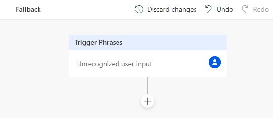
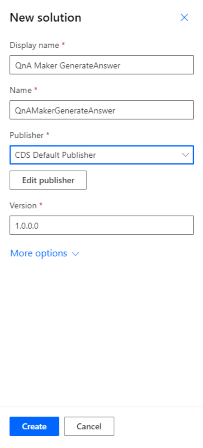
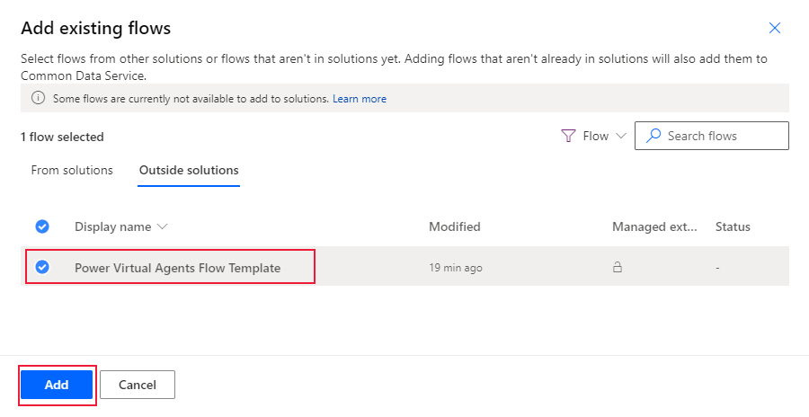
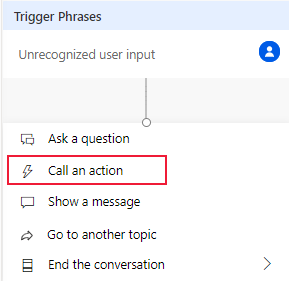
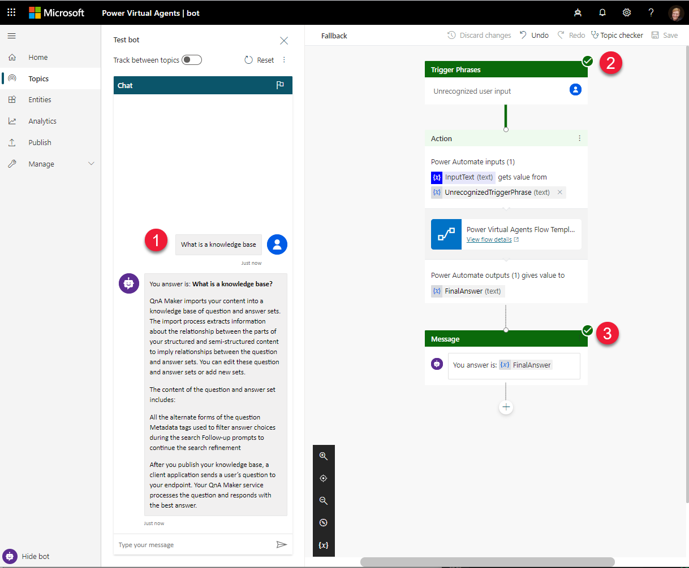

# How to add a QnA Maker knowledge base to Power Virtual Agent as the fallback action

Extend your [Power Virtual Agent](https://powervirtualagents.microsoft.com/) bot to provide the bot's fallback answer from your knowledge base. Use Power Automate to send the user's question to your knowledge base, and receive the knowledge base answer. Configure your bot's fallback action as part of your conversation flow from within the Power portal.

## Use QnA Maker knowledge base with a Power Virtual Agent

QnA Maker is a cloud-based API service that lets you create a conversational question-and-answer layer over your existing data. Use it to build a knowledge base by extracting questions and answers from your semi-structured content, including FAQs, manuals, and documents. Answer questions from the QnA sets in your knowledge base. Your knowledge base gets smarter, too, as it continually learns from user behavior.

## Power Virtual agent

A Power Virtual Agent is created with a series of topics (subject areas), in order to answer user questions by performing actions. If an answer can't be found, a system fallback can return an answer.

You can send the question to your knowledge base as part of a topic's action or as the fallback action. They both use the same mechanism (action) to connect to your knowledge base and return an answer.

## Power Automate connects to GenerateAnswer action

To connect your agent to your knowledge base, use Power Automate. Power Automate provides a process **flow** which connects to QnA Maker's GenerateAnswer API.

Once the **flow** is designed and saved, it is available from a Power Automate **Solution**.  Once the GenerateAnswer flow is added to a solution, use that solution as an action in your agent.

## Process steps to connect an agent to your knowledge base
Steps to use a Power Virtual agent with QnA Maker:
* In QnA Maker portal
    * Build and publish knowledge base
    * Copy knowledge base details
* In Power Virtual Agent
    * Build agent topic
    * Call an action (to Power Automate Flow)
* In Power Automate
    * Build a flow with connector to QnA
    Maker's GenerateAnswer
        * Input - user query
        * Output - knowledge base answer
    * Create solution and add flow
* Return to Power Virtual Agent
    * Select solution's output as message for topic

## Get your published knowledge base information

Before you build your agent, create and publish your knowledge base. Next, find the endpoint key, endpoint host, and knowledge base Id on the **Settings** page in the QnA Maker portal.

You will need this information for the Power Automate step to configure your QnA Maker GenerateAnswer connection.

## Create Power Virtual Agent's System fallback topic

The first step is to configure an agent topic. While it can be any topic, this procedure uses the System **fallback** topic. If the agent can't find an answer, it should pass the answer to QnA Maker's GenerateAnswer API.

1. In the [Power Virtual Agents](https://powerva.microsoft.com/#/) portal, on the top-right corner of the navigation, select the **Settings** page. The icon for this page is the gear.

1. Select **System Fallback**.

    

1. On the pop-up **Settings** window, select **+ Add** to add a System fallback topic to your default list of topics.

    

1. After the topic is added, select the button  **Go to fallback topic** to author the fallback topic on the authoring canvas.

    > [!TIP] If you need to return to the fallback topic, the fallback topic is under **Topics** section, as part of the **System** topics.

## Use authoring canvas to add an action

Use the Power Virtual agent's authoring canvas to connect the fallback topic to your knowledge base. The topic starts with the **unrecognized user text**. You need to add an action that passes that text to QnA Maker, then displays the answer as a message. The last step of displaying an answer is handled as a separate step later.

1. The new fallback action may already have a flow designed. Delete all items in the flow except for the first item, **Trigger Phrases**, with the `Unrecognized user input`.

    

1. Select the **+** connector under the **Trigger Phrases** box, then select **Call an action**.

    

1. Select **Create a flow**. The process takes you to **Power Automate**, a different browser-based portal.

    

## Create Power Automate Flow to connect to your knowledge base

1. In **Power Automate**, the **Flow Template** is started. On the **Power Virtual agents** item, select **Edit** to configure the input variable coming from your agent to your knowledge base. The text-based input variable is the user-submitted text question from your agent.

    

1. Add a text input and name the variable `InputText` with a description of `IncomingUserQuestion`.

    

1. Select the **+** connector under the **Power Virtual Agents** box, to insert a new step in the flow (before the **Return value(s) to Power Virtual Agent**), then select **Add an action**.

1. Search for `Qna` to find the **QnA Maker** actions, then select **Generate answer**.

    

    The connections settings for QnA Maker appear in the action.

    

1. Configures the action to take the InputText, and pass it to the GenerateAnswer API.

    Enter your published knowledge base settings found on the **Settings** page in the [QnA Maker](https://www.qnamaker.ai/) portal.

     portal.](../media/how-to-integrate-power-virtual-agent/published-knowledge-base-settings.png)

   Select the **Question** text area. This displays a list of choices. Select `InputText`.

1. Select the **+** connector under the **Generate answer** action box to insert a new step in the flow, then select **Add an action**.

1. To add a variable to capture the answer text returned from GenerateAnswer, search for and select the`Initialize variable` action.

    Set the name of the variable to `OutgoingQnAAnswer`, and select the type as **String**.

    

1. Select the **+** connector under the **Initialize variable** action box to insert a new step in the flow, then select **Add an action**.

1. To set the knowledge base answer to the variable, search for and select the`Apply to each` action.

    Select the GenerateAnswer `answers`, which is the entire JSON from the GenerateAnswer API call. In the same **Apply to each** box, select **Add an action**. This subsequent action gets only the top answer and sets that to the variable.

1. In the **Set variable** box, select the text box for name, then select **OutgoingQnAAnswer** from the list.

    Select the text box for value, then select **Answers Answer** from the list.

    

1. To return the variable (and its value), select the **Return value(s) to Power Virtual Agent** then select **Add an output**. Select a **Text** output type then select a **Title** you will see in the Power Virtual Agent, such as `FinalAnswer`. Select the text box for the value, then select the `OutgoingQnAAnswer` variable.

    

1. Select **Save** to save the Flow.

## Create solution and add flow

In order for the Power Virtual Agent to find and connect to the flow, the flow must be included in a Power Automate Solution.

1. While still in Power Automate, select **Solutions** from the left-side navigation.

1. Select **+ New solution** and configure the solution. Select **Create** to finish the process.

    

1. In the list of solutions, select the solution you just created.

1. In the solution, select **+ Add existing**, then select **Flow** from the list.

1. Select the **Outside solutions** tab, then select the flow you just created. Select **Add** to finish the process.

## Add solution's flow to Power Virtual Agent

1. Return to the browser tab with your Power Virtual agent. The authoring canvas should still be open.

1. Select the **+** connector under the **Trigger Phrases** action box to insert a new step in the flow, then select **Call an action**.

    

1. In the new action, select the input value of **UnrecognizedTriggerPhrase**.

    

1. Select the **+** connector under the **Action** box to insert a new step in the flow, then select **Show a message**.

1. Enter the message text and the `FinalAnswer` from the Power Automate Flow.

    

1. Select **Save** from the context toolbar to save the authoring canvas details for the topic.

The final canvas is shown below.

## Test Power Virtual Agent

Test the agent by typing in a question that your knowledge base can answer. The authoring canvas reports the successful steps with a green checkmark.

](../media/how-to-integrate-power-virtual-agent/power-virtual-agent-test.png#lightbox)

## Next step