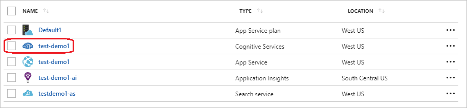
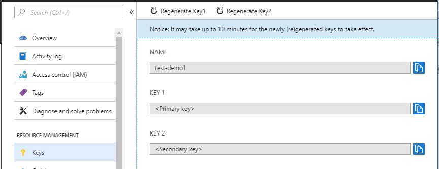
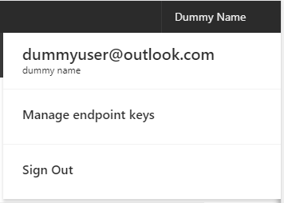
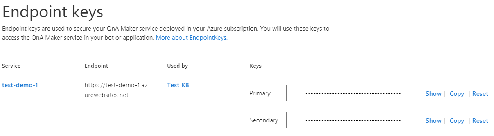

# Key Management

Your QnA Maker service deals with two kinds of keys, **subscription keys** and **endpoint keys**.

1. **Subscription Keys**: These keys are used to access the [QnA Maker management service APIs](https://westus.dev.cognitive.microsoft.com/docs/services/5a93fcf85b4ccd136866eb37/operations/5ac266295b4ccd1554da75ff). These APIs let you perform various CRUD operations on your knowledge base.  

2. **Endpoint Keys**: These keys are used to access the knowledge base endpoint to get a response for a user question. You would typically use this endpoint in your chat bot/App code that consumes the QnA Maker service.
 
## Subscription Keys
You can view and reset your subscription keys from the Azure portal where you created the QnA Maker resource. 
1. Go to the QnA Maker resource in the Azure portal.

    

2. Go to **Keys**.

    

## Endpoint Keys

Endpoint keys can be managed from the [QnA Maker portal](https://qnamaker.ai).

1. Log in to the [QnA Maker portal](https://qnamaker.ai), and go to **Manage keys**.

    

2. View or reset your keys.

    

    >[!NOTE]
    >Refresh your keys if you feel they have been compromised. This may require corresponding changes to your App/Bot code.

## Next steps

> [!div class="nextstepaction"]
> [Create a knowledge base in a different language](./language-knowledge-base.md)
