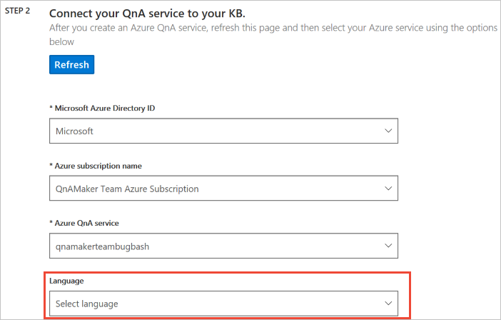
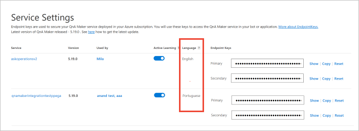

# Language support of knowledge base content for QnA Maker

Language for the service is selected when you create the first knowledge base in the resource. All additional knowledge bases in the resource must be in the same language.

The language determines the relevance of the results QnA Maker provides in response to user queries.

## One language for all knowledge bases in resource

QnA Maker allows you to select the language for your QnA service, while creating the first knowledge base. For all the knowledge bases in a QnA Maker resource, they all must be in the same language. This language can't be changed.

Creating knowledge bases in different languages in one resource negatively affects the relevance of the results QnA Maker provides in response to user queries.

Review a list of [supported languages](../overview/language-support.md#languages-supported) and how languages impact [matching and relevance](#query-matching-and-relevance).

## Select language when creating first knowledge base

Language selection is part of the steps to create the first knowledge base in a resource.

## Query matching and relevance
QnA Maker depends on [Azure Cognitive Search language analyzers](https://docs.microsoft.com/rest/api/searchservice/language-support) for providing results.

While the Azure Cognitive Search capabilities are on par for supported languages, QnA Maker has an additional ranker that sits above the Azure search results. In this ranker model, we use some special semantic and word-based features in the following languages.

|Languages with additional ranker|
|--|
|Chinese|
|Czech|
|Dutch|
|English|
|French|
|German|
|Hungarian|
|Italian|
|Japanese|
|Korean|
|Polish|
|Portuguese|
|Spanish|
|Swedish|

This additional ranking is an internal working of the QnA Maker's ranker.

## Verify language

You can verify the language of your QnA Maker resource from the service settings page in the QnA Maker.

## Next steps

> [!div class="nextstepaction"]
> [Migrate a knowledge base](../Tutorials/migrate-knowledge-base.md)
