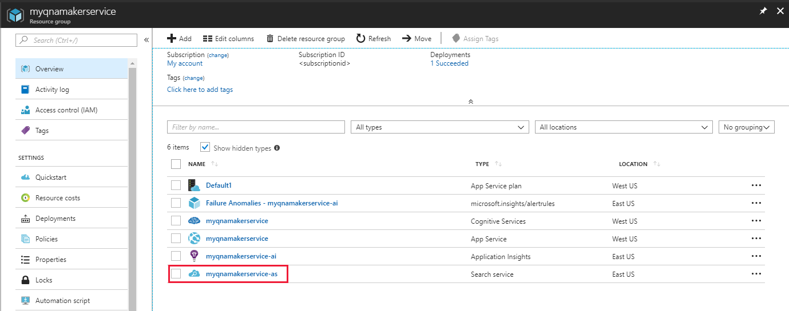
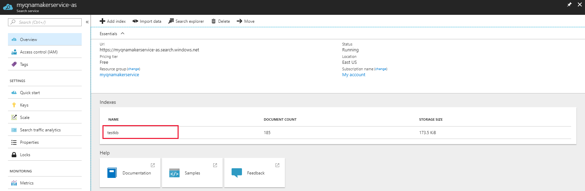
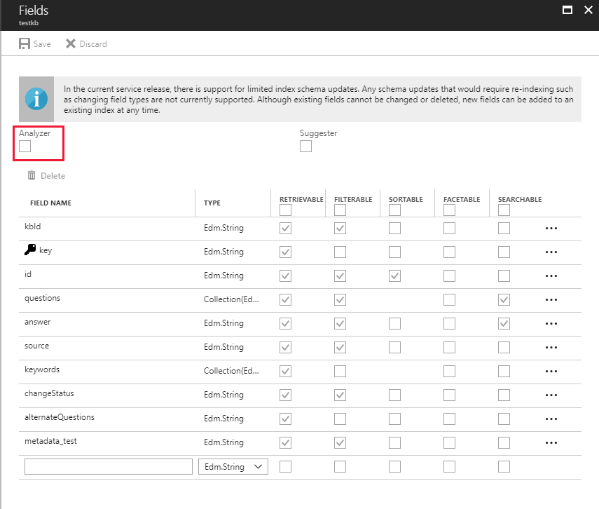
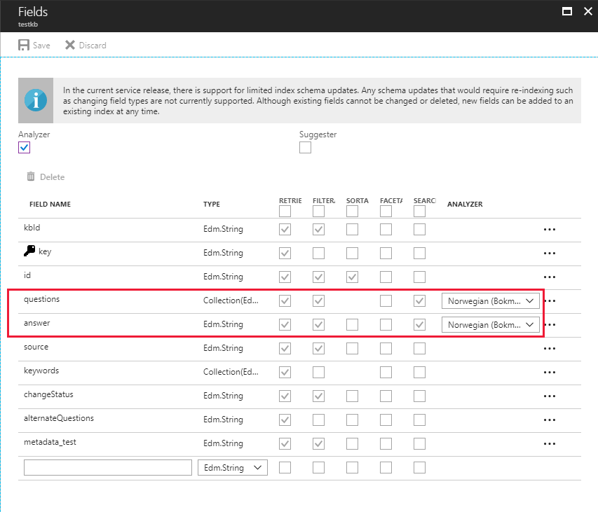

# Language support of knowledge base content for QnA Maker
QnA Maker supports knowledge base content in many languages. However, each QnA Maker service should be reserved for a single language. The first knowledge base created targeting a particular QnA Maker service sets the language of that service. See [here](../Overview/languages-supported.md) for the list of supported languages.

The language is automatically recognized from the content of the data sources being extracted. Once you create a new QnA Maker Service and a new Knowledge Base in that service, you can verify that the language has been set correctly.

1. Navigate to the [Azure Portal](https://portal.azure.com/).

2. Select **resource groups** and navigate to the resource group where the QnA Maker service is deployed and select the **Azure Search** resource.

    

3. Select the **testkb** index. This Azure Search index is always the first one created and it contains the saved content of all the knowledge bases in that service. 

    

4. Select **Fields** section showing the testkb details.

    

5. Check the box for **Analyzer** to see language details.

    

6. You should find that the Analyzer is set to a particular language. This language was automatically detected during the knowledge base creation step. This language cannot be changed once the resource is created.

    

## Next steps

> [!div class="nextstepaction"]
> [Create a QnA bot with Azure Bot Service](../Tutorials/create-qna-bot.md)
