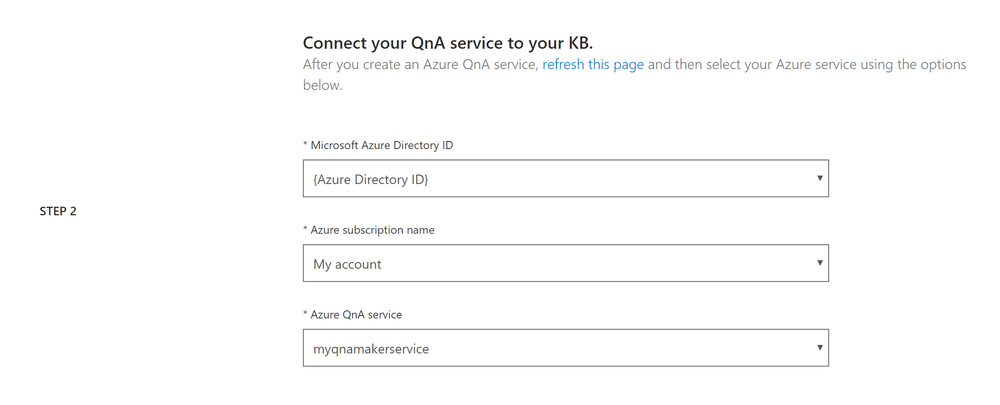
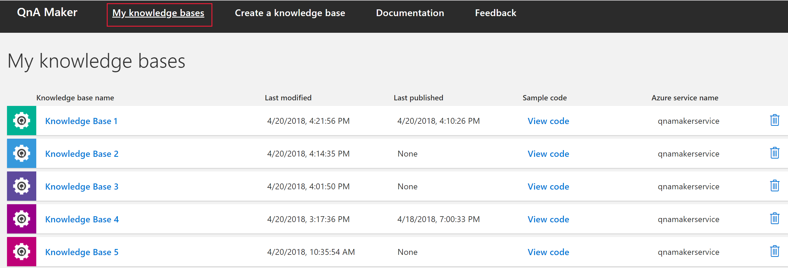
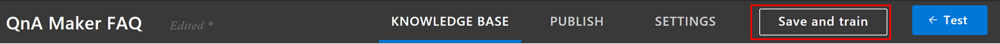
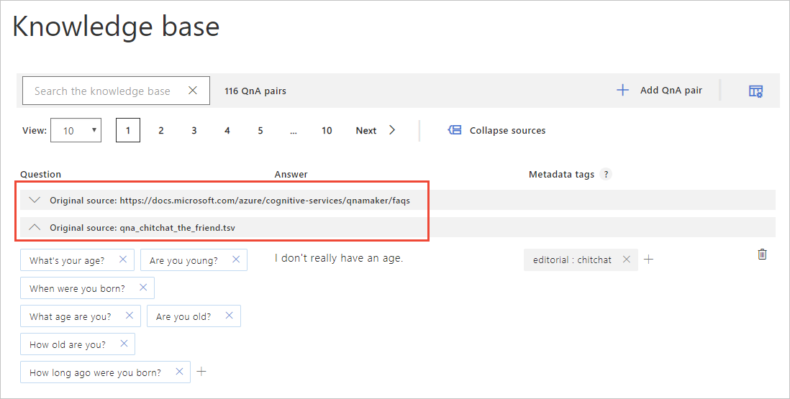
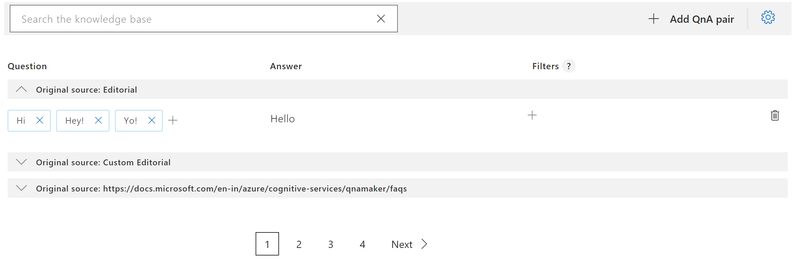
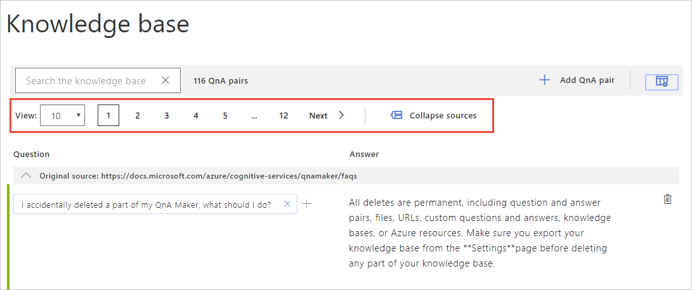

# Create knowledge base and manage settings

QnA Maker allows you to manage your knowledge bases by providing access to the knowledge base settings and data sources.

## Prerequisites

> [!div class="checklist"]
> * If you don't have an Azure subscription, [create a free account](https://azure.microsoft.com/free/?WT.mc_id=A261C142F) before you begin.
> * A [QnA Maker resource](https://ms.portal.azure.com/#create/Microsoft.CognitiveServicesQnAMaker) created in the Azure portal. Remember your Azure Active Directory ID, Subscription, QnA resource name you selected when you created the resource.

## Create a knowledge base

1. Sign in to the [QnAMaker.ai](https://QnAMaker.ai) portal with your Azure credentials.

1. In the QnA Maker portal, select **Create a knowledge base**.

1. On the **Create** page, skip **Step 1** if you already have your QnA Maker resource.

    If you haven't created the resource yet, select **Create a QnA service**. You are directed to the [Azure portal](https://ms.portal.azure.com/#create/Microsoft.CognitiveServicesQnAMaker) to set up a QnA Maker service in your subscription. Remember your Azure Active Directory ID, Subscription, QnA resource name you selected when you created the resource.

    When you are done creating the resource in the Azure portal, return to the QnA Maker portal, refresh the browser page, and continue to **Step 2**.

1. In **Step 3**, select your Active directory, subscription, service (resource), and the language for all knowledge bases created in the service.

   

1. In **Step 3**, name your knowledge base `My Sample QnA KB`.

1. In **Step 4**, configure the settings with the following table:

    |Setting|Value|
    |--|--|
    |**Enable multi-turn extraction from URLs, .pdf or .docx files.**|Checked|
    |**Default answer text**| `Quickstart - default answer not found.`|
    |**+ Add URL**|`https://docs.microsoft.com/azure/cognitive-services/qnamaker/troubleshooting`|
    |**Chit-chat**|Select **Professional**|

1. In **Step 5**, Select **Create your KB**.

    The extraction process takes a few moments to read the document and identify questions and answers.

    After QnA Maker successfully creates the knowledge base, the **Knowledge base** page opens. You can edit the contents of the knowledge base on this page.

## Edit knowledge base

1.  Select **My knowledge bases** in the top navigation bar.

       You can see all the services you created or shared with you sorted in the descending order of the **last modified** date.

       

1. Select a particular knowledge base to make edits to it.

1.  Select **Settings**. The following list contains fields you can change.

       |Goal|Action|
       |--|--|
       |Add URL|You can add new URLs to add new FAQ content to Knowledge base by clicking **Manage knowledge base -> '+ Add URL'** link.|
       |Delete URL|You can delete existing URLs by selecting the delete icon, the trash can.|
       |Refresh content|If you want your knowledge base to crawl the latest content of existing URLs, select the **Refresh** checkbox. This will update the knowledge base with latest URL content once. This is not setting a regular schedule of updates.|
       |Add file|You can add a supported file document to be part of a knowledge base, by selecting **Manage knowledge base**, then selecting **+ Add File**|
    |Import|You can also import any existing knowledge base by selecting **Import Knowledge base** button. |
    |Update|Updating of knowledge base depends on **management pricing tier** used while creating QnA Maker service associated with your knowledge base. You can also update the management tier from Azure portal if necessary.

  1. Once you are done making changes to the knowledge base, select **Save and train** in the top-right corner of the page in order to persist the changes.

       

       >[!CAUTION]
       >If you leave the page before selecting **Save and train**, all changes will be lost.

## Manage large knowledge bases

* **Data source groups**: The QnAs are grouped by the data source from which they were extracted. You can expand or collapse the data source.

    

* **Search knowledge base**: You can search the knowledge base by typing in the text box at the top of the Knowledge Base table. Click enter to search on the question, answer, or metadata content. Click on the X icon to remove the search filter.

    

* **Pagination**: Quickly move through data sources to manage large knowledge bases

    

## Delete knowledge bases

Deleting a knowledge base (KB) is a permanent operation. It can't be undone. Before deleting a knowledge base, you should export the knowledge base from the **Settings** page of the QnA Maker portal.

If you share your knowledge base with collaborators,](collaborate-knowledge-base.md) then delete it, everyone loses access to the KB.

## Next steps

Learn about [managing the language](language-knowledge-base.md) of all knowledge bases in a resource.

* Edit QnA pairs
* Manage Azure resources used by QnA Maker