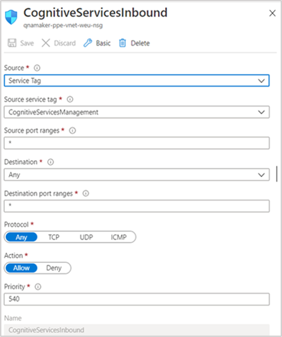

# Recommended settings for network isolation

You should follow the steps below to restrict public access to QnA Maker resources. Protect a Cognitive Services resource from public access by [configuring the virtual network](../../cognitive-services-virtual-networks.md?tabs=portal).

## Restrict access to App Service (QnA Runtime)

You can add IPs to App service allow list to restrict access or Configure App Service Environment to host QnA Maker App Service.

#### Add IPs to App Service allow list

1. Allow traffic only from Cognitive Services IPs. These are already included in Service Tag `CognitiveServicesManagement`. This is required for Authoring APIs (Create/Update KB) to invoke the app service and update Azure Search service accordingly. Check out [more information about service tags.](../../../virtual-network/service-tags-overview.md)
2. Make sure you also allow other entry points like Azure Bot Service, QnA Maker portal, etc. for prediction "GenerateAnswer" API access.
3. Please follow these steps to add the IP Address ranges to an allow list:

   1. Download [IP Ranges for all service tags](https://www.microsoft.com/download/details.aspx?id=56519).
   2. Select the IPs of "CognitiveServicesManagement".
   3. Navigate to the networking section of your App Service resource, and click on "Configure Access Restriction" option to add the IPs to an allow list.

We also have an automated script to do the same for your App Service. You can find the [PowerShell script to configure an allow list](https://github.com/pchoudhari/QnAMakerBackupRestore/blob/master/AddRestrictedIPAzureAppService.ps1) on GitHub. You need to input subscription id, resource group and actual App Service name as script parameters. Running the script will automatically add the IPs to App Service allow list.

#### Configure App Service Environment to host QnA Maker App Service
    
The App Service Environment(ASE) can be used to host QnA Maker App service. Please follow the steps below:

1. Create an App Service Environment and mark it as “external”. Please follow the [tutorial](../../../app-service/environment/create-external-ase.md) for instructions.
2.  Create an App service inside the App Service Environment.
    1. Check the configuration for the App service and add 'PrimaryEndpointKey' as an application setting. The value for 'PrimaryEndpointKey' should be set to “\<app-name\>-PrimaryEndpointKey”. The App Name is defined in the App service URL. For instance, if the App service URL is "mywebsite.myase.p.azurewebsite.net", then the app-name is "mywebsite". In this case, the value for 'PrimaryEndpointKey' should be set to “mywebsite-PrimaryEndpointKey”.
    2. Create an Azure search service.
    3. Ensure Azure Search and App Settings are appropriately configured. 
          Please follow this [tutorial](../reference-app-service.md?tabs=v1#app-service).
3.  Update the Network Security Group associated with the App Service Environment
    1. Update pre-created Inbound Security Rules as per your requirements.
    2. Add a new Inbound Security Rule with source as 'Service Tag' and source service tag as 'CognitiveServicesManagement'.
       
    

4.  Create a QnA Maker cognitive service instance (Microsoft.CognitiveServices/accounts) using Azure Resource Manager, where QnA Maker endpoint should be set to the App Service     Endpoint created above (https:// mywebsite.myase.p.azurewebsite.net).
    
---

## Restrict access to Cognitive Search Resource

# [QnA Maker GA (stable release)](#tab/v1)

Cognitive Search instance can be isolated via a Private Endpoint after the QnA Maker Resources have been created. Private Endpoint connections require a VNet through which the Search Service Instance can be accessed. 

If the QnA Maker App Service is restricted using an App Service Environment, use the same VNet to create a Private Endpoint connection to the Cognitive Search instance. Create a new DNS entry in the VNet to map the Cognitive Search endpoint to the Cognitive Search Private Endpoint IP address. 

If an App Service Environment is not used for the QnAMaker App Service, create a new VNet resource first and then create the Private Endpoint connection to the Cognitive Search instance. In this case, the QnA Maker App Service needs [to be integrated with the VNet](https://docs.microsoft.com/azure/app-service/web-sites-integrate-with-vnet) to connect to the Cognitive Search instance. 

#  [QnA Maker managed (preview release)](#tab/v2)

[Create Private endpoints](../reference-private-endpoint.md) to the Azure Search resource.

---
