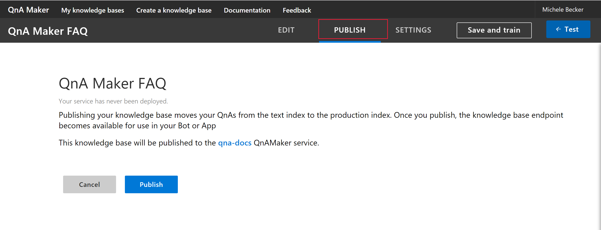
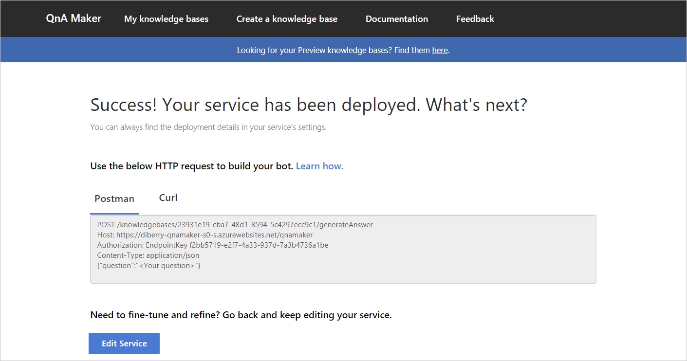

# Publish a knowledge base

Publishing your knowledge base is the final step in making your knowledge base available as a question-answering endpoint. 

When you publish a knowledge base, the QnA contents of your knowledge base moves from the test index to a production index in Azure search.

## Publish a knowledge base

1. Once done with the changes in your KB, select **Publish** in the top navigation bar. You can publish up to the allotted number of knowledge bases for the Azure Search. 

    

2. Select **Publish** again to see the endpoint details that can be used in your application or bot code.

    
	
## Next steps

> [!div class="nextstepaction"]
> [Get analytics on your knowledge base](./get-analytics-knowledge-base.md)
