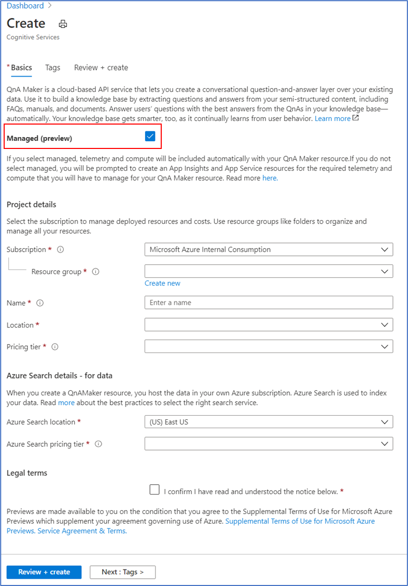
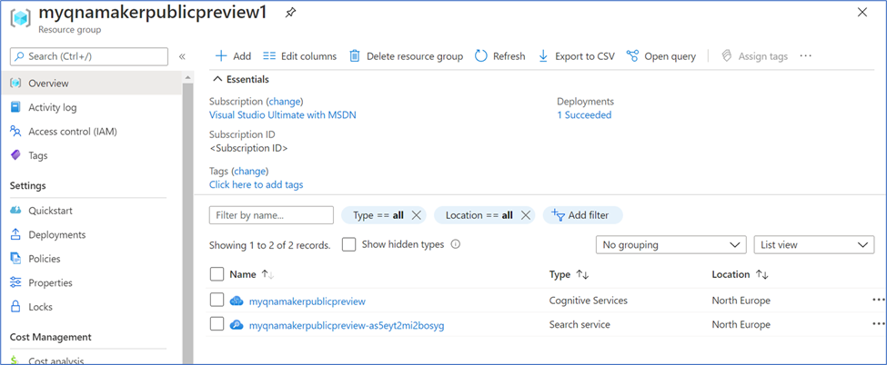
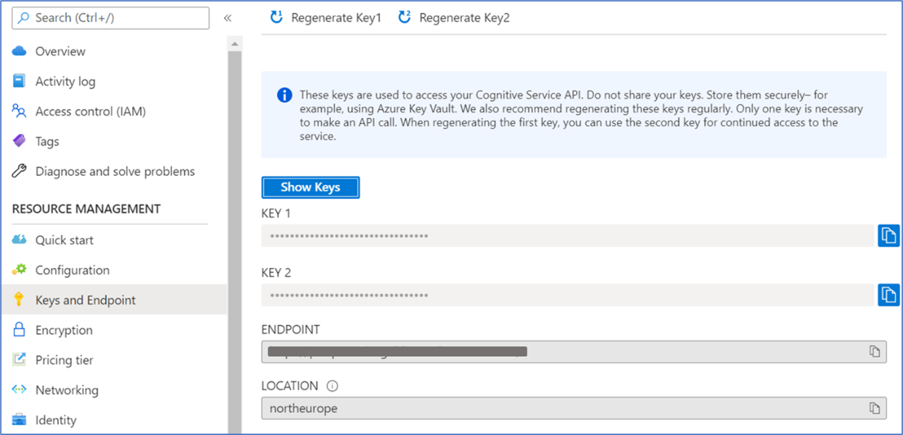
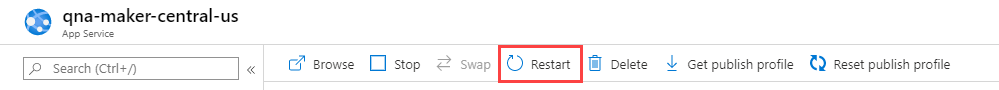
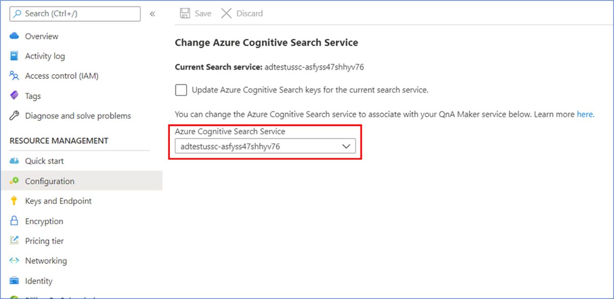

# Manage QnA Maker resources

Before you can create any QnA Maker knowledge bases, you must first set up a QnA Maker service in Azure. Anyone with authorization to create new resources in a subscription can set up a QnA Maker service.

A solid understanding of the following concepts is helpful before creating your resource:

* [QnA Maker resources](../Concepts/azure-resources.md)
* [Authoring and publishing keys](../Concepts/azure-resources.md#keys-in-qna-maker)

## Create a new QnA Maker service

# [QnA Maker GA (stable release)](#tab/v1)

This procedure creates the Azure resources needed to manage the knowledge base content. After you complete these steps, you'll find the _subscription_ keys on the **Keys** page for the resource in the Azure portal.

1. Sign in to the Azure portal and [create a QnA Maker](https://ms.portal.azure.com/#create/Microsoft.CognitiveServicesQnAMaker) resource.

1. Select **Create** after you read the terms and conditions:

    

1. In **QnA Maker**, select the appropriate tiers and regions:

    

    * In the **Name** field, enter a unique name to identify this QnA Maker service. This name also identifies the QnA Maker endpoint that your knowledge bases will be associated with.
    * Choose the **Subscription** under which the QnA Maker resource will be deployed.
    * Select the **Pricing tier** for the QnA Maker management services (portal and management APIs). See [more details about SKU pricing](https://aka.ms/qnamaker-pricing).
    * Create a new **Resource group** (recommended) or use an existing one in which to deploy this QnA Maker resource. QnA Maker creates several Azure resources. When you create a resource group to hold these resources, you can easily find, manage, and delete these resources by the resource group name.
    * Select a **Resource group location**.
    * Choose the **Search pricing tier** of the Azure Cognitive Search service. If the Free tier option is unavailable (appears dimmed), it means you already have a free service deployed through your subscription. In that case, you'll need to start with the Basic tier. See [Azure Cognitive Search pricing details](https://azure.microsoft.com/pricing/details/search/).
    * Choose the **Search location** where you want Azure Cognitive Search indexes to be deployed. Restrictions on where customer data must be stored will help determine the location you choose for Azure Cognitive Search.
    * In the **App name** field, enter a name for your Azure App Service instance.
    * By default, App Service defaults to the standard (S1) tier. You can change the plan after creation. Learn more about [App Service pricing](https://azure.microsoft.com/pricing/details/app-service/).
    * Choose the **Website location** where App Service will be deployed.

        > [!NOTE]
        > The **Search Location** can differ from the **Website Location**.

    * Choose whether or not you want to enable **Application Insights**. If **Application Insights** is enabled, QnA Maker collects telemetry on traffic, chat logs, and errors.
    * Choose the **App insights location** where the Application Insights resource will be deployed.
    * For cost savings measures, you can [share](#configure-qna-maker-to-use-different-cognitive-search-resource) some but not all Azure resources created for QnA Maker.

1. After all the fields are validated, select **Create**. The process can take a few minutes to complete.

1. After deployment is completed, you'll see the following resources created in your subscription:

   

    The resource with the _Cognitive Services_ type has your _subscription_ keys.

### Upgrade QnA Maker SKU

When you want to have more questions and answers in your knowledge base, beyond your current tier, upgrade your QnA Maker service pricing tier.

To upgrade the QnA Maker management SKU:

1. Go to your QnA Maker resource in the Azure portal, and select **Pricing tier**.

    

1. Choose the appropriate SKU and press **Select**.

    

### Upgrade App Service

 When your knowledge base needs to serve more requests from your client app, upgrade your App Service pricing tier.

You can [scale up](https://docs.microsoft.com/azure/app-service/manage-scale-up) or scale out App Service.

Go to the App Service resource in the Azure portal, and select the **Scale up** or **Scale out** option as required.

### Get the latest runtime updates

The QnAMaker runtime is part of the Azure App Service instance that's deployed when you [create a QnAMaker service](./set-up-qnamaker-service-azure.md) in the Azure portal. Updates are made periodically to the runtime. The QnA Maker App Service instance is in auto-update mode after the April 2019 site extension release (version 5+). This update is designed to take care of ZERO downtime during upgrades.

You can check your current version at https://www.qnamaker.ai/UserSettings. If your version is older than version 5.x, you must restart App Service to apply the latest updates:

1. Go to your QnAMaker service (resource group) in the [Azure portal](https://portal.azure.com).

    > [!div class="mx-imgBorder"]
    > 

1. Select the App Service instance and open the **Overview** section.

    > [!div class="mx-imgBorder"]
    > 

1. Restart App Service. The update process should finish in a couple of seconds. Any dependent applications or bots that use this QnAMaker service will be unavailable to end users during this restart period.

    

### Configure App service idle setting to avoid timeout

The app service, which serves the QnA Maker prediction runtime for a published knowledge base, has an idle timeout configuration, which defaults to automatically time out if the service is idle. For QnA Maker, this means your prediction runtime generateAnswer API occasionally times out after periods of no traffic.

In order to keep the prediction endpoint app loaded even when there is no traffic, set the idle to always on.

1. Sign in to the [Azure portal](https://portal.azure.com).
1. Search for and select your QnA Maker resource's app service. It will have the same name as the QnA Maker resource but it will have a different **type** of App Service.
1. Find **Settings** then select **Configuration**.
1. On the Configuration pane, select **General settings**, then find **Always on**, and select **On** as the value.

    > [!div class="mx-imgBorder"]
    > 

1. Select **Save** to save the configuration.
1. You are asked if you want to restart the app to use the new setting. Select **Continue**.

Learn more about how to configure the App Service [General settings](../../../app-service/configure-common.md#configure-general-settings).

### Configure App Service Environment to host QnA Maker App Service
The App Service Environment can be used to host QnA Maker app service. If the App Service Environment is internal, then you need to follow these steps:
1. Create an App service and an Azure search service.
2. Expose the app service and allow QnA Maker availability as:
    * Publicly available - default
    * DNS service tag: `CognitiveServicesManagement`

### Network isolation for App Service

QnA Maker Cognitive Service uses the service tag: `CognitiveServicesManagement`. Please follow these steps to add the IP Address ranges to an allowlist:

* Download [IP Ranges for all service tags](https://www.microsoft.com/download/details.aspx?id=56519).
* Select the IPs of "CognitiveServicesManagement".
* Navigate to the networking section of your App Service resource, and click on "Configure Access Restriction" option to add the IPs to an allowlist.

We also have an automated script to do the same for your App Service. You can find the [PowerShell script to configure an allowlist](https://github.com/pchoudhari/QnAMakerBackupRestore/blob/master/AddRestrictedIPAzureAppService.ps1) on GitHub. You need to input subscription id, resource group and actual App Service name as script parameters. Running the script will automatically add the IPs to App Service allowlist.
    
1. Create a QnA Maker cognitive service instance (Microsoft.CognitiveServices/accounts) using Azure Resource Manager, where QnA Maker endpoint should be set to App Service Environment.

### Business continuity with traffic manager

The primary objective of the business continuity plan is to create a resilient knowledge base endpoint, which would ensure no down time for the Bot or the application consuming it.

> [!div class="mx-imgBorder"]
> 

The high-level idea as represented above is as follows:

1. Set up two parallel [QnA Maker services](set-up-qnamaker-service-azure.md) in [Azure paired regions](https://docs.microsoft.com/azure/best-practices-availability-paired-regions).

1. [Backup](../../../app-service/manage-backup.md) your primary QnA Maker App service and [restore](../../../app-service/web-sites-restore.md) it in the secondary setup. This will ensure that both setups work with the same hostname and keys.

1. Keep the primary and secondary Azure search indexes in sync. Use the GitHub sample [here](https://github.com/pchoudhari/QnAMakerBackupRestore) to see how to backup-restore Azure indexes.

1. Back up the Application Insights using [continuous export](../../../application-insights/app-insights-export-telemetry.md).

1. Once the primary and secondary stacks have been set up, use [traffic manager](../../../traffic-manager/traffic-manager-overview.md) to configure the two endpoints and set up a routing method.

1. You would need to create a Transport Layer Security (TLS), previously known as Secure Sockets Layer (SSL), certificate for your traffic manager endpoint. [Bind the TLS/SSL certificate](../../../app-service/configure-ssl-bindings.md) in your App services.

1. Finally, use the traffic manager endpoint in your Bot or App.

# [QnA Maker managed (preview release)](#tab/v2)

This procedure creates the Azure resources needed to manage the knowledge base content. After you complete these steps, you'll find the *subscription* keys on the **Keys** page for the resource in the Azure portal.

1. Sign in to the Azure portal and [create a QnA Maker](https://ms.portal.azure.com/#create/Microsoft.CognitiveServicesQnAMaker) resource.

1. Select **Create** after you read the terms and conditions:

    

1. In **QnA Maker**, check the Managed (preview) checkbox and select the appropriate tiers and regions:

    

    * Choose the **Subscription** under which the QnA Maker resource will be deployed.
    * Create a new **Resource group** (recommended) or use an existing one in which to deploy this QnA Maker managed (Preview) resource. QnA Maker managed (Preview) creates few Azure resources. When you create a resource group to hold these resources, you can easily find, manage, and delete these resources by the resource group name.
    * In the **Name** field, enter a unique name to identify this QnA Maker managed (Preview) service. 
    * Choose the **Location** where you want the QnA Maker managed (Preview) service to be deployed. The management APIs and service endpoint will be hosted in this location. 
    * Select the **Pricing tier** for the QnA Maker managed (Preview) service (free for preview). See [more details about SKU pricing](https://aka.ms/qnamaker-pricing).
    * Choose the **Search location** where you want Azure Cognitive Search indexes to be deployed. Restrictions on where customer data must be stored will help determine the location you choose for Azure Cognitive Search.
    * Choose the **Search pricing tier** of the Azure Cognitive Search service. If the Free tier option is unavailable (appears dimmed), it means you already have a free service deployed through your subscription. In that case, you'll need to start with the Basic tier. See [Azure Cognitive Search pricing details](https://azure.microsoft.com/pricing/details/search/).

1. After all the fields are validated, select **Review + Create**. The process can take a few minutes to complete.

1. After deployment is completed, you'll see the following resources created in your subscription:

    

    The resource with the _Cognitive Services_ type has your _subscription_ keys.

---

## Find authoring keys in the Azure portal

# [QnA Maker GA (stable release)](#tab/v1)

You can view and reset your authoring keys from the Azure portal, where you created the QnA Maker resource. These keys may be referred to as subscription keys.

1. Go to the QnA Maker resource in the Azure portal and select the resource that has the _Cognitive Services_ type:

    

2. Go to **Keys**:

    

## Find query endpoint keys in the QnA Maker portal

The endpoint is in the same region as the resource because the endpoint keys are used to make a call to the knowledge base.

Endpoint keys can be managed from the [QnA Maker portal](https://qnamaker.ai).

1. Sign in to the [QnA Maker portal](https://qnamaker.ai), go to your profile, and then select **Service settings**:

    

2. View or reset your keys:

    > [!div class="mx-imgBorder"]
    > 

    >[!NOTE]
    >Refresh your keys if you think they've been compromised. This may require corresponding changes to your client application or bot code.

# [QnA Maker managed (preview release)](#tab/v2)

You can view and reset your authoring keys from the Azure portal, where you created the QnA Maker managed (Preview) resource. These keys may be referred to as subscription keys.

1. Go to the QnA Maker managed (Preview) resource in the Azure portal and select the resource that has the *Cognitive Services* type:

    

2. Go to **Keys and Endpoint**:

    

### Update the resources

Learn how to upgrade the resources used by your knowledge base. QnA Maker managed (Preview) is **free** while in preview. 

---

## Upgrade the Azure Cognitive Search service

# [QnA Maker GA (stable release)](#tab/v1)

If you plan to have many knowledge bases, upgrade your Azure Cognitive Search service pricing tier.

Currently, you can't perform an in-place upgrade of the Azure search SKU. However, you can create a new Azure search resource with the desired SKU, restore the data to the new resource, and then link it to the QnA Maker stack. To do this, follow these steps:

1. Create a new Azure search resource in the Azure portal, and select the desired SKU.

    

1. Restore the indexes from your original Azure search resource to the new one. See the [backup restore sample code](https://github.com/pchoudhari/QnAMakerBackupRestore).

1. After the data is restored, go to your new Azure search resource, select **Keys**, and write down the **Name** and the **Admin key**:

    

1. To link the new Azure search resource to the QnA Maker stack, go to the QnA Maker App Service instance.

    

1. Select **Application settings** and modify the settings in the **AzureSearchName** and **AzureSearchAdminKey** fields from step 3.

    

1. Restart the App Service instance.

    

### Cognitive Search consideration

Cognitive Search, as a separate resource, has some different configurations you should be aware of.

### Configure QnA Maker to use different Cognitive Search resource

If you create a QnA service and its dependencies (such as Search) through the portal, a Search service is created for you and linked to the QnA Maker service. After these resources are created, you can update the App Service setting to use a previously existing Search service and remove the one you just created.

QnA Maker's **App Service** resource uses the Cognitive Search resource. In order to change the Cognitive Search resource used by QnA Maker, you need to change the setting in the Azure portal.

1. Get the **Admin key** and **Name** of the Cognitive Search resource you want QnA Maker to use.

1. Sign in to the [Azure portal](https://portal.azure.com) and find the **App Service** associated with your QnA Maker resource. Both with have the same name.

1. Select **Settings**, then **Configuration**. This will display all existing settings for the QnA Maker's App Service.

    > [!div class="mx-imgBorder"]
    > 

1. Change the values for the following keys:

    * **AzureSearchAdminKey**
    * **AzureSearchName**

1. To use the new settings, you need to restart the App service. Select **Overview**, then select **Restart**.

    > [!div class="mx-imgBorder"]
    > 

If you create a QnA service through Azure Resource Manager templates, you can create all resources and control the App Service creation to use an existing Search service.

Learn more about how to configure the App Service [Application settings](../../../app-service/configure-common.md#configure-app-settings).

### Configuring Cognitive Search as a private endpoint inside a VNET

When a Search instance is created during the creation of a QnA Maker resource, you can force Cognitive Search to support a private endpoint configuration created entirely within a customer’s VNet.

All resources must be created in the same region to use a private endpoint.

* QnA Maker resource
* new Cognitive Search resource
* new Virtual Network resource

Complete the following steps in the [Azure portal](https://portal.azure.com):

1. Create a [QnA Maker resource](https://ms.portal.azure.com/#create/Microsoft.CognitiveServicesQnAMaker).
1. Create a new Cognitive Search resource with Endpoint connectivity (data) set to _Private_. Create the resource in the same region as the QnA Maker resource created in step 1. Learn more about [creating a Cognitive Search resource](../../../search/search-create-service-portal.md), then use this link to go directly to the [creation page of the resource](https://ms.portal.azure.com/#create/Microsoft.Search).
1. Create a new [Virtual Network resource](https://ms.portal.azure.com/#create/Microsoft.VirtualNetwork-ARM).
1. Configure the VNET on the App service resource created in step 1 of this procedure.
    1. Create a new DNS entry in the VNET for new Cognitive Search resource created in step 2. to the Cognitive Search IP address.
1. [Associate the App service to the new Cognitive Search resource](#configure-qna-maker-to-use-different-cognitive-search-resource) created in step 2. Then, you can delete the original Cognitive Search resource created in step 1.

In the [QnA Maker portal](https://www.qnamaker.ai/), create your first knowledge base.

### Inactivity policy for free Search resources

If you are not using a QnA maker resource, you should remove all the resources. If you don't remove unused resources, your Knowledge base will stop working if you created a free Search resource.

Free Search resources are deleted after 90 days without receiving an API call.

# [QnA Maker managed (preview release)](#tab/v2)

If you plan to have many knowledge bases, upgrade your Azure Cognitive Search service pricing tier.

Currently, you can't perform an in-place upgrade of the Azure search SKU. However, you can create a new Azure search resource with the desired SKU, restore the data to the new resource, and then link it to the QnA Maker stack. To do this, follow these steps:

1. Create a new Azure search resource in the Azure portal, and select the desired SKU.

    

1. Restore the indexes from your original Azure search resource to the new one. See the [backup restore sample code](https://github.com/pchoudhari/QnAMakerBackupRestore).

1. To link the new Azure search resource to the QnA Maker managed (Preview) service, see the below topic.

### Configure QnA Maker managed (Preview) service to use different Cognitive Search resource

If you create a QnA service managed (Preview) and its dependencies (such as Search) through the portal, a Search service is created for you and linked to the QnA Maker managed (Preview) service. After these resources are created, you can update the Search service in the **Configuration** tab.

1. Go to your QnA Maker managed (Preview) service in the Azure portal.

1. Select **Configuration** and select the Azure Cognitive Search service you want to link with your QnA Maker managed (Preview) service.

    

1. Click **Save**.

> [!NOTE]
> If you change the Azure Search service associated with QnA Maker, you will lose access to all the knowledge bases already present in it. Make sure you export the existing knowledge bases before you change the Azure Search service.
### Inactivity policy for free Search resources

If you are not using a QnA maker resource, you should remove all the resources. If you don't remove unused resources, your Knowledge base will stop working if you created a free Search resource.

Free Search resources are deleted after 90 days without receiving an API call.

---

## Delete Azure resources

If you delete any of the Azure resources used for your QnA Maker knowledge bases, the knowledge bases will no longer function. Before deleting any resources, make sure you export your knowledge bases from the **Settings** page.

## Next steps

Learn more about the [App service](../../../app-service/index.yml) and [Search service](../../../search/index.yml).

> [!div class="nextstepaction"]
> [Learn how to author with others](../how-to/collaborate-knowledge-base.md)
