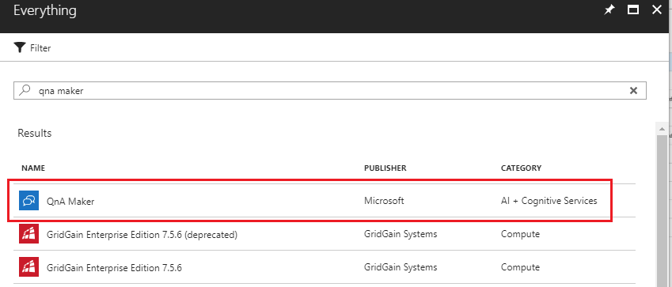
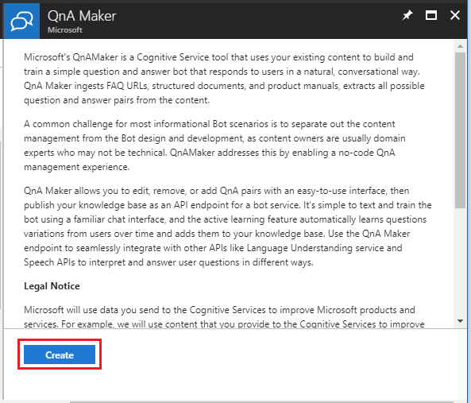
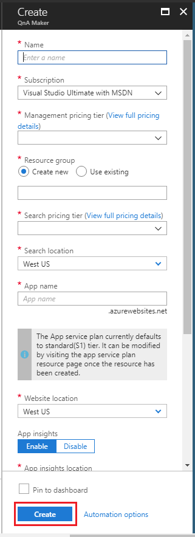
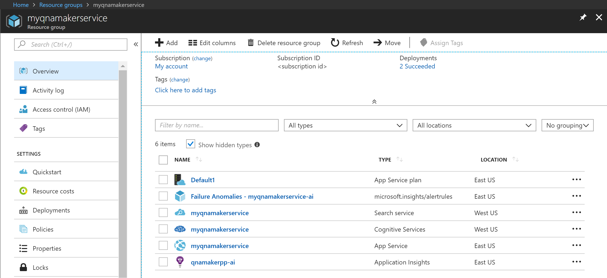

# Create a QnA Maker service

Before you can create any QnA Maker knowledge bases, you must first set up a QnA Maker service in Azure. Anyone with authorization to create new resources in a subscription can set up a QnA Maker service.

This setup deploys a few Azure resources. Together, these resources manage the knowledge base content and provide question-answering capabilities though an endpoint.

1. Log in to the [Azure portal](<https://portal.azure.com>).

2.  Click on **Add new resource**, and type "qna maker" in search, and select the QnA Maker resource

    

3.  Click on **Create** after reading the terms and conditions.

    

4. In **QnA Maker**, select the appropriate tiers and regions.

    

    * Fill the **Name** with a unique name to identify this QnA Maker service. This name also identifies the QnA Maker endpoint to which your knowledge bases will be associated.
    * Choose the **Subscription** in which the QnA Maker resource will be deployed.
    * Select the **Management pricing tier** for the QnA Maker management services (portal and management APIs). See [here](https://aka.ms/qnamaker-pricing) for details on the pricing of the SKUs.
    * Create a new **Resource Group** (recommended) or use an existing one in which to deploy this QnA Maker resource.
    * Choose the **Search pricing tier** of the Azure Search service. If you see the Free tier option greyed out, it means you already have a Free Azure Search tier deployed in your subscription. In that case, you will need to start with the Basic Azure Search tier. See details of Azure search pricing [here](https://azure.microsoft.com/pricing/details/search/).
    * Choose the **Search Location** where you want Azure Search data to be deployed. Restrictions in where customer data must be stored will inform the location you choose for Azure Search.
    * Give a name to your App service in **App name**.
    * By default the App service defaults to the standard (S1) tier. You can change the plan after creation. See more details of App service pricing [here](https://azure.microsoft.com/en-in/pricing/details/app-service/).
    * Choose the **Website location** where the App Service will be deployed.

        > [!NOTE]
	    > The Search Location can be different from the Website Location.

    * Choose whether you want to enable **Application Insights** or not. If **Application Insights** is enabled, QnA Maker collects telemetry on traffic, chat logs, and errors.
    * Choose the **App insights location** where Application Insights resource will be deployed.

5. Once all the fields are validated, you can click on **Create** to start deployment of these services in your subscription. It will take a few minutes to complete.

6.  Once the deployment is done, you will see the following resources created in your subscription.

    

## Next steps

> [!div class="nextstepaction"]
> [Create and publish a knowledge base](../Quickstarts/create-publish-knowledge-base.md)