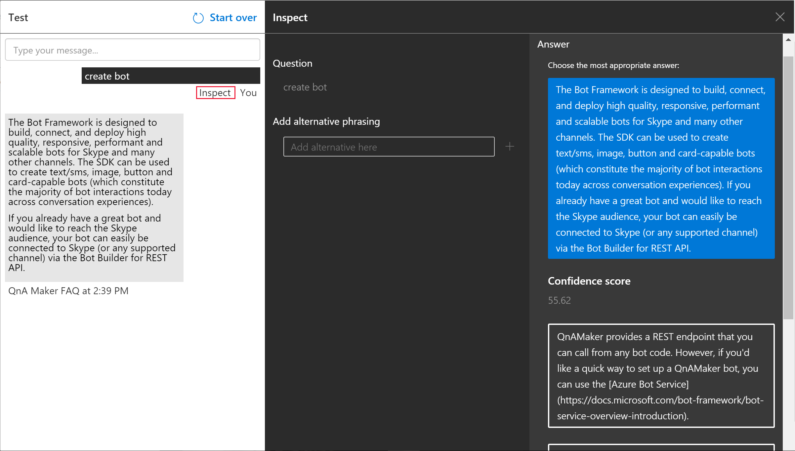
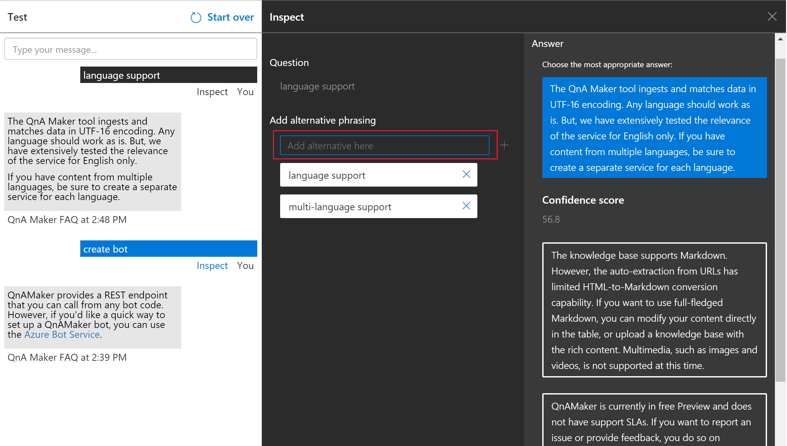
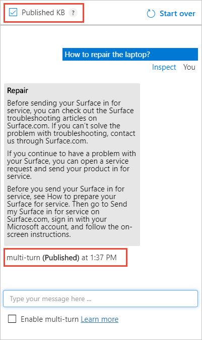

# Test your knowledge base in QnA Maker

Testing your QnA Maker knowledge base is an important part of an iterative process to improve the accuracy of the responses being returned. You can test the knowledge base through an enhanced chat interface that also allows you make edits.

## Interactively test in QnA Maker portal

1. Access your knowledge base by selecting its name on the **My knowledge bases** page.
1. To access the Test slide-out panel, select **Test** in your application's top panel.
1. Enter a query in the text box and select Enter.
1. The best-matched answer from the knowledge base is returned as the response.

### Clear test panel

To clear all the entered test queries and their results from the test console, select **Start over** at the upper-left corner of the Test panel.

### Close test panel

To close the Test panel, select the **Test** button again. While the Test panel is open, you cannot edit the Knowledge Base contents.

### Inspect score

You inspect details of the test result in the Inspect panel.

1.  With the Test slide-out panel open, select **Inspect** for more details on that response.

    

2.  The Inspection panel appears. The panel includes the top scoring intent as well as any identified entities. The panel shows the result of the selected utterance.

### Correct the top scoring answer

If the top scoring answer is incorrect, select the correct answer from the list and select **Save and Train**.

### Add alternate questions

You can add alternate forms of a question to a given answer. Type the alternate answers in the text box and click enter to add them. Select **Save and Train** to store the updates.

### Add a new answer

You can add a new answer if any of the existing answers that were matched are incorrect or the answer does not exist in the knowledge base (no good match found in the KB).

At the bottom of the answers list, use the text box to enter a new answer and press enter to add it.

Select **Save and Train** to persist this answer. A new question-answer pair has now been added to your knowledge base.

> [!NOTE]
> All edits to your knowledge base only get saved when you press the **Save and Train** button.

### Test the published knowledge base

You can test the published version of knowledge base in the test pane. Once you have published the KB, select the **Published KB** box and send a query to get results from the published KB.

## Batch test with tool

Use the batch testing tool when you want to:

* determine top answer and score for a set of questions
* validate expected answer for set of questions

Read the batch testing [tutorial](../Quickstarts/batch-testing.md) for step-by-step instructions.

Batch testing is provided with the batch testing tool. This tool is available as an [zipped executable](https://aka.ms/qnamakerbatchtestingtool) for download or as [C# source code](https://github.com/Azure-Samples/cognitive-services-qnamaker-csharp/tree/master/documentation-samples/batchtesting).

[Reference documentation about the tool](../reference-tsv-format-batch-testing.md) includes:

* the command-line example of the tool
* the format for TSV input and outfile files

## Next steps

> [!div class="nextstepaction"]
> [Publish a knowledge base](./publish-knowledge-base.md)
